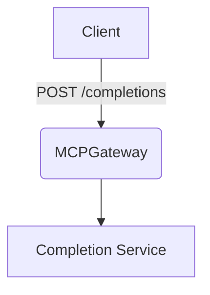

<!--
💡 Tip: When suggesting a feature, provide a high-level epic and concrete user stories.
Include markdown examples, Mermaid diagrams, and MCP standards where appropriate.

Feel free to include feature requests to develop new components, MCP servers, tools, integrations, etc.
-->

### 🧭 Type of Feature

Please select the most appropriate category:

- [ ] Enhancement to existing functionality
- [ ] New feature or capability
- [ ] New MCP-compliant server
- [ ] New component or integration
- [ ] Developer tooling or test improvement
- [ ] Packaging, automation and deployment (ex: pypi, docker, quay.io, kubernetes, terraform)
- [ ] Other (please describe below)

### 🧭 Epic

**Title:** <High-level feature or capability>
**Goal:** What is the big-picture objective of this feature set?
**Why now:** Why is this needed? Who benefits?

---

### 🙋♂️ User Story 1

**As a:** <type of user>
**I want:** <some goal>
**So that:** <some reason / value>

#### ✅ Acceptance Criteria
```gherkin
Scenario: First scenario title
  Given some starting state
  When an action occurs
  Then a result should happen

Scenario: Second scenario title
  Given another state
  When something else happens
  Then another result occurs
```

---

### 🙋♂️ User Story 2

**As a:** <another type of user>
**I want:** <a different goal>
**So that:** <a different reason>

#### ✅ Acceptance Criteria
```gherkin
Scenario: Third scenario title
  Given a specific setup
  When a user performs an action
  Then something meaningful happens
```

---

### 📐 Design Sketch (optional)

Include a diagram, sketch, or flow (use [Mermaid](https://mermaid.js.org/) if desired):



---

### 🔗 MCP Standards Check

- [ ] Change adheres to current [MCP specifications](https://developer.ibm.com/tutorials/awb-handle-remote-tool-calling-model-context-protocol/)
- [ ] No breaking changes to existing MCP-compliant integrations
- [ ] If deviations exist, please describe them below:

---

### 🔄 Alternatives Considered

List any alternative designs, existing workarounds, or rejected ideas.

---

### 📓 Additional Context

Include related issues, links to discussions, issues, etc.
