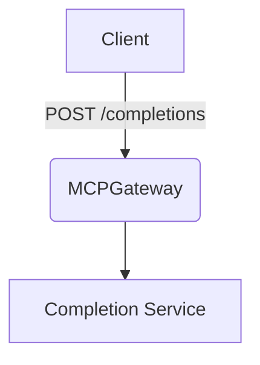

# ✨ Feature / Enhancement PR

## 🔗 Epic / Issue
_Link to the epic or parent issue:_
Closes #

---

## 🚀 Summary (1-2 sentences)
_What does this PR add or change?_

---

## 🧪 Checks

- [ ] `make lint` passes
- [ ] `make test` passes
- [ ] CHANGELOG updated (if user-facing)

---

## 📓 Notes (optional)
_Design sketch, screenshots, or extra context._

If the change introduces or alters an architectural decision, add or update an ADR in **`docs/docs/adr/`** and link it here._

