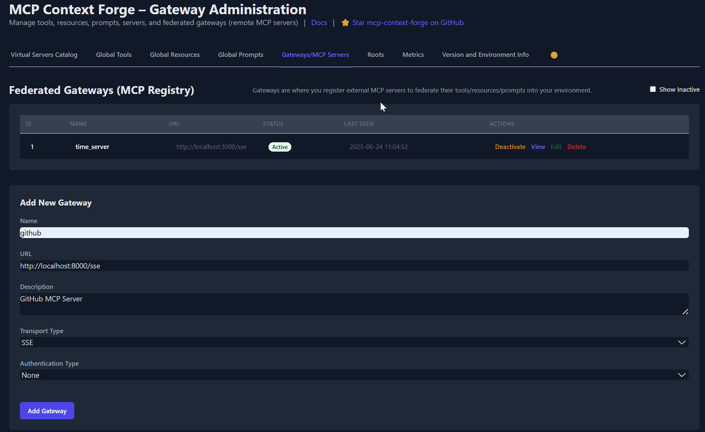
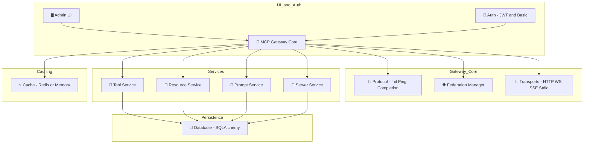

# MCP Gateway

[](https://github.com/IBM/mcp-context-forge/actions/workflows/codeql.yml) [](https://github.com/IBM/mcp-context-forge/actions/workflows/bandit.yml) [](https://github.com/IBM/mcp-context-forge/actions/workflows/python-package.yml) [](https://github.com/IBM/mcp-context-forge/actions/workflows/docker-image.yml) [](https://github.com/IBM/mcp-context-forge/actions/workflows/dependency-review.yml) [](https://github.com/IBM/mcp-context-forge/actions/workflows/ibm-cloud-code-engine.yml)

A flexible feature-rich FastAPI-based gateway for the Model Context Protocol (MCP) that unifies and federates tools, resources, prompts, servers and peer gateways, wraps any REST API as MCP-compliant tools or virtual servers, and exposes everything over HTTP/JSON-RPC, WebSocket, Server-Sent Events (SSE) and stdio transports—all manageable via a rich, interactive Admin UI and packaged as a container with support for any SQLAlchemy supported database.


---

## Overview & Goals

MCP Gateway builds on the MCP spec by sitting **in front of** MCP Server or REST API to:

* **Act as a true gateway**, centralizing tool, resource and prompt registries while preserving the official MCP 2025-03-26 protocol
* **Federate** multiple MCP servers into one unified endpoint—auto-discover peers (mDNS or explicit), health-check them, and merge their capabilities
* **Virtualize** non-MCP services as “virtual servers” so you can register any REST API or function endpoint and expose it under MCP semantics
* **Adapt** arbitrary REST/HTTP APIs into MCP tools with JSON-Schema input validation, retry/rate-limit policies and transparent JSON-RPC invocation
* **Simplify** deployments with a full admin UI, rich transports, pre-built DX pipelines and production-grade observability



---

## Features

### Core

* **Full MCP 2025-03-26**: initialize, ping, notify, completion, sampling (SSE), plus JSON-RPC fallback
* **Gateway Layer**: sits alongside or in front of MCP servers, enforcing MCP rules and consolidating multiple backends
* **Multi-Transport**: HTTP/JSON-RPC, WebSocket (ping/pong), SSE (one-way + backchannel), stdio
* **Federation**:

  * Auto-discover or configure peer gateways
  * Periodic health checks with fail-over
  * Transparent merging of remote registries into one catalog
* **Virtual Servers**: wrap any non-MCP endpoint (REST, gRPC, function) as a managed MCP server with minimal config
* **REST-to-MCP Adapter**: register any REST API as an MCP tool—automatic schema extraction, auth headers, retry/rate limits
* **Resources**: templated URIs, LRU+TTL caching, MIME detection, real-time SSE subscriptions
* **Prompts**: Jinja2 templates, JSON-Schema enforcement, multimodal blocks, versioning & rollback
* **Tools**: MCP-native or REST-based; input validation, retry logic, rate-limit/concurrency controls

### Extras

* **Admin UI** (HTMX + Alpine.js + Tailwind): full CRUD for servers, tools, resources, prompts, gateways, roots & metrics
* **Authentication & Authorization**: Basic, JWT Bearer, custom header schemes, per-endpoint DI
* **Persistence & Migrations**: async SQLAlchemy ORM (SQLite, Postgres, MySQL, etc.), Alembic auto-migrations
* **Event System**: uniform event envelopes on WS/SSE fan-out, server-side filters, backchannel hooks
* **Observability & Health**: structured JSON logs, `/health` latency metrics decorator on every handler
* **Developer Experience**: Makefile targets, pre-commit (`ruff`, `black`, `mypy`, `isort`), live-reload, 400+ tests, CI badges

---

## Quick Start (Pre-built Image)

If you just want to run the gateway using the official image from GitHub Container Registry:

```bash
docker run -d --name mcpgateway \
  -p 4444:4444 \
  -e HOST=0.0.0.0 \
  -e JWT_SECRET_KEY=my-secret-key \
  -e BASIC_AUTH_USER=admin \
  -e BASIC_AUTH_PASSWORD=changeme \
  -e AUTH_REQUIRED=true \
  -e DATABASE_URL=sqlite:///./mcp.db \
  ghcr.io/ibm/mcp-context-forge:latest

docker logs mcpgateway
```

> 💡 You can also use `--env-file .env` if you have a config file already. See the provided [.env.example](.env.example)

### Optional: Mount a local volume for persistent SQLite storage

```bash
-v $(pwd)/data:/app
```

### Generate a token for API access

```bash
export MCPGATEWAY_BEARER_TOKEN=$(docker exec mcpgateway python3 -m mcpgateway.utils.create_jwt_token --username admin --exp 10080 --secret my-test-key)
```

### Smoke-test the running container

```bash
curl -s -H "Authorization: Bearer $MCPGATEWAY_BEARER_TOKEN" \
     http://localhost:4444/health
curl -s -H "Authorization: Bearer $MCPGATEWAY_BEARER_TOKEN" \
     http://localhost:4444/tools | jq
```

### Running the mcpgateway-wrapper

The mcpgateway-wrapper lets you connect to the gateway over stdio.

```bash
docker run -i --name mcpgateway-wrapper \
  --entrypoint uv \
  -e UV_CACHE_DIR=/tmp/uv-cache \
  -e MCP_SERVER_CATALOG_URLS=http://host.docker.internal:4444 \
  -e MCP_AUTH_TOKEN=$MCPGATEWAY_BEARER_TOKEN \
  ghcr.io/ibm/mcp-context-forge:latest \
  run --directory mcpgateway-wrapper mcpgateway-wrapper
```

### Running from a MCP Client

```json
{
  "servers": {
    "mcpgateway-wrapper": {
      "command": "docker",
      "args": [
        "run",
        "--rm",
        "-i",
        "-e",
        "MCP_SERVER_CATALOG_URLS=http://host.docker.internal:4444/servers/1",
        "-e",
        "MCP_AUTH_TOKEN=${MCPGATEWAY_BEARER_TOKEN}",
        "--entrypoint",
        "uv",
        "ghcr.io/ibm/mcp-context-forge:latest",
        "run",
        "--directory",
        "mcpgateway-wrapper",
        "mcpgateway-wrapper"
      ],
      "env": {
        "MCPGATEWAY_BEARER_TOKEN": "${MCPGATEWAY_BEARER_TOKEN}"
      }
    }
  }
}
```
---

## Quick Start (manual install)

### Prerequisites

* **Python ≥ 3.10**
* **GNU Make** (all common workflows are Make targets)
* Optional: **Docker / Podman** for containerised runs

### One-liner (dev)

```bash
make venv install serve
```

What it does:

1. Creates / activates a `.venv` in the project root
2. Installs the gateway and necessary dependencies
3. Launches **Gunicorn** (Uvicorn workers) on [http://localhost:4444](http://localhost:4444)

For development, you can use:

```bash
make install-dev # Install development dependencies, ex: linters and test harness
make lint          # optional: run style checks (ruff, mypy, etc.)
```

### Containerised (self-signed TLS)

```bash
make podman            # build production image
make podman-run-ssl    # run at https://localhost:4444
```

### Generate an admin JWT

```bash
python -m mcpgateway.utils.create_jwt_token \
       -u admin \
       -e 10080 | tee token.txt   # 7 days (minutes)

export MCPGATEWAY_BEARER_TOKEN=$(cat token.txt)
```

### Smoke-test the API

```bash
curl -k -sX GET \
     -H "Authorization: Bearer $MCPGATEWAY_BEARER_TOKEN" \
     https://localhost:4444/tools | jq
```

You should receive `[]` until you register a tool.

---

## Installation

### Via Make

```bash
make venv install          # create .venv + install deps
make serve                 # gunicorn on :4444
```

### UV (alternative)

```bash
uv venv && source .venv/bin/activate
uv pip install -e .[dev]
```

### pip (alternative)

```bash
python -m venv .venv && source .venv/bin/activate
pip install -e ".[dev]"
```

### Optional (PostgreSQL adapter)

You can configure the gateway with SQLite, PostgreSQL (or any other compatible database) in .env.

When using PostgreSQL, you need to install `psycopg2` driver.

```bash
uv pip install psycopg2-binary   # dev convenience
# or
uv pip install psycopg2          # production build
```

#### Quick Postgres container

```bash
docker run --name mcp-postgres \
  -e POSTGRES_USER=postgres \
  -e POSTGRES_PASSWORD=mysecretpassword \
  -e POSTGRES_DB=mcp \
  -p 5432:5432 -d postgres
```

---

## Configuration (`.env` or env vars)

> ⚠️ If any required `.env` variable is missing or invalid, the gateway will fail fast at startup with a validation error via Pydantic.

You can get started by copying the provided `.env.examples` to `.env` and making the necessary edits to fit your environment.

### Basic

| Setting         | Description                              | Default                | Options                |
| --------------- | ---------------------------------------- | ---------------------- | ---------------------- |
| `APP_NAME`      | Gateway / OpenAPI title                  | `MCP Gateway`          | string                 |
| `HOST`          | Bind address for the app                 | `0.0.0.0`              | IPv4/IPv6              |
| `PORT`          | Port the server listens on               | `4444`                 | 1–65535                |
| `DATABASE_URL`  | SQLAlchemy connection URL                | `sqlite:///./mcp.db`   | any SQLAlchemy dialect |
| `APP_ROOT_PATH` | Subpath prefix for app (e.g. `/gateway`) | (empty)                | string                 |
| `TEMPLATES_DIR` | Path to Jinja2 templates                 | `mcpgateway/templates` | path                   |
| `STATIC_DIR`    | Path to static files                     | `mcpgateway/static`    | path                   |

> 💡 Use `APP_ROOT_PATH=/foo` if reverse-proxying under a subpath like `https://host.com/foo/`.

### Authentication

| Setting               | Description                                                      | Default       | Options    |
| --------------------- | ---------------------------------------------------------------- | ------------- | ---------- |
| `BASIC_AUTH_USER`     | Username for Admin UI login and HTTP Basic authentication        | `admin`       | string     |
| `BASIC_AUTH_PASSWORD` | Password for Admin UI login and HTTP Basic authentication        | `changeme`    | string     |
| `AUTH_REQUIRED`       | Require authentication for all API routes                        | `true`        | bool       |
| `JWT_SECRET_KEY`      | Secret key used to **sign JWT tokens** for API access            | `my-test-key` | string     |
| `JWT_ALGORITHM`       | Algorithm used to sign the JWTs (`HS256` is default, HMAC-based) | `HS256`       | PyJWT algs |
| `TOKEN_EXPIRY`        | Expiry of generated JWTs in minutes                              | `10080`       | int > 0    |
| `AUTH_ENCRYPTION_SECRET` | Passphrase used to derive AES key for encrypting tool auth headers | `my-test-salt` | string |

> 🔐 `BASIC_AUTH_USER`/`PASSWORD` are used for:
>
> * Logging into the web-based Admin UI
> * Accessing APIs via Basic Auth (`curl -u admin:changeme`)
>
> 🔑 `JWT_SECRET_KEY` is used to:
>
> * Sign JSON Web Tokens (`Authorization: Bearer <token>`)
> * Generate tokens via:
>
>   ```bash
>   python -m mcpgateway.utils.create_jwt_token -u admin -e 10080 > token.txt
>   export MCPGATEWAY_BEARER_TOKEN=$(cat token.txt)
>   ```
> * Tokens allow non-interactive API clients to authenticate securely.
>
> 🧪 Set `AUTH_REQUIRED=false` during development if you want to disable all authentication (e.g. for local testing or open APIs) or clients that don't support SSE authentication.
> In production, you should use the SSE to stdio `mcpgateway-wrapper` for such tools that don't support authenticated SSE, while still ensuring the gateway uses authentication.
>
> 🔐 `AUTH_ENCRYPTION_SECRET` is used to encrypt and decrypt tool authentication credentials (`auth_value`).
> You must set the same value across environments to decode previously stored encrypted auth values.
> Recommended: use a long, random string.

### UI Features

| Setting                        | Description                            | Default | Options |
| ------------------------------ | -------------------------------------- | ------- | ------- |
| `MCPGATEWAY_UI_ENABLED`        | Enable the interactive Admin dashboard | `true`  | bool    |
| `MCPGATEWAY_ADMIN_API_ENABLED` | Enable API endpoints for admin ops     | `true`  | bool    |

> 🖥️ Set both to `false` to disable management UI and APIs in production.

### Security

| Setting           | Description                    | Default                                        | Options    |
| ----------------- | ------------------------------ | ---------------------------------------------- | ---------- |
| `SKIP_SSL_VERIFY` | Skip upstream TLS verification | `false`                                        | bool       |
| `ALLOWED_ORIGINS` | CORS allow‐list                | `["http://localhost","http://localhost:4444"]` | JSON array |
| `CORS_ENABLED`    | Enable CORS                    | `true`                                         | bool       |

> Note: do not quote the ALLOWED_ORIGINS values, this needs to be valid JSON, such as: `ALLOWED_ORIGINS=["http://localhost", "http://localhost:4444"]`

### Logging

| Setting      | Description       | Default | Options            |
| ------------ | ----------------- | ------- | ------------------ |
| `LOG_LEVEL`  | Minimum log level | `INFO`  | `DEBUG`…`CRITICAL` |
| `LOG_FORMAT` | Log format        | `json`  | `json`, `text`     |
| `LOG_FILE`   | Log output file   | (none)  | path or empty      |

### Transport

| Setting                   | Description            | Default | Options                         |
| ------------------------- | ---------------------- | ------- | ------------------------------- |
| `TRANSPORT_TYPE`          | Enabled transports     | `all`   | `http`,`ws`,`sse`,`stdio`,`all` |
| `WEBSOCKET_PING_INTERVAL` | WebSocket ping (secs)  | `30`    | int > 0                         |
| `SSE_RETRY_TIMEOUT`       | SSE retry timeout (ms) | `5000`  | int > 0                         |

### Federation

| Setting                    | Description            | Default | Options    |
| -------------------------- | ---------------------- | ------- | ---------- |
| `FEDERATION_ENABLED`       | Enable federation      | `true`  | bool       |
| `FEDERATION_DISCOVERY`     | Auto‐discover peers    | `false` | bool       |
| `FEDERATION_PEERS`         | Comma-sep peer URLs    | `[]`    | JSON array |
| `FEDERATION_TIMEOUT`       | Gateway timeout (secs) | `30`    | int > 0    |
| `FEDERATION_SYNC_INTERVAL` | Sync interval (secs)   | `300`   | int > 0    |

### Resources

| Setting               | Description           | Default    | Options    |
| --------------------- | --------------------- | ---------- | ---------- |
| `RESOURCE_CACHE_SIZE` | LRU cache size        | `1000`     | int > 0    |
| `RESOURCE_CACHE_TTL`  | Cache TTL (seconds)   | `3600`     | int > 0    |
| `MAX_RESOURCE_SIZE`   | Max resource bytes    | `10485760` | int > 0    |
| `ALLOWED_MIME_TYPES`  | Acceptable MIME types | see code   | JSON array |

### Tools

| Setting                 | Description                    | Default | Options |
| ----------------------- | ------------------------------ | ------- | ------- |
| `TOOL_TIMEOUT`          | Tool invocation timeout (secs) | `60`    | int > 0 |
| `MAX_TOOL_RETRIES`      | Max retry attempts             | `3`     | int ≥ 0 |
| `TOOL_RATE_LIMIT`       | Tool calls per minute          | `100`   | int > 0 |
| `TOOL_CONCURRENT_LIMIT` | Concurrent tool invocations    | `10`    | int > 0 |

### Prompts

| Setting                 | Description                      | Default  | Options |
| ----------------------- | -------------------------------- | -------- | ------- |
| `PROMPT_CACHE_SIZE`     | Cached prompt templates          | `100`    | int > 0 |
| `MAX_PROMPT_SIZE`       | Max prompt template size (bytes) | `102400` | int > 0 |
| `PROMPT_RENDER_TIMEOUT` | Jinja render timeout (secs)      | `10`     | int > 0 |

### Health Checks

| Setting                 | Description                   | Default | Options |
| ----------------------- | ----------------------------- | ------- | ------- |
| `HEALTH_CHECK_INTERVAL` | Health poll interval (secs)   | `60`    | int > 0 |
| `HEALTH_CHECK_TIMEOUT`  | Health request timeout (secs) | `10`    | int > 0 |
| `UNHEALTHY_THRESHOLD`   | Fail-count before unhealthy   | `3`     | int > 0 |

### Database

| Setting           | Description                     | Default | Options |
| ----------------- | ------------------------------- | ------- | ------- |
| `DB_POOL_SIZE`    | SQLAlchemy connection pool size | `200`   | int > 0 |
| `DB_MAX_OVERFLOW` | Extra connections beyond pool   | `10`    | int ≥ 0 |
| `DB_POOL_TIMEOUT` | Wait for connection (secs)      | `30`    | int > 0 |
| `DB_POOL_RECYCLE` | Recycle connections (secs)      | `3600`  | int > 0 |

### Cache Backend

| Setting        | Description                | Default  | Options                  |
| -------------- | -------------------------- | -------- | ------------------------ |
| `CACHE_TYPE`   | Backend (`memory`/`redis`) | `memory` | `none`, `memory`,`redis` |
| `REDIS_URL`    | Redis connection URL       | (none)   | string or empty          |
| `CACHE_PREFIX` | Key prefix                 | `mcpgw:` | string                   |

> 🧠 `none` disables caching entirely. Use `memory` for dev, `database` for persistence, or `redis` for distributed caching.

### Development

| Setting    | Description            | Default | Options |
| ---------- | ---------------------- | ------- | ------- |
| `DEV_MODE` | Enable dev mode        | `false` | bool    |
| `RELOAD`   | Auto-reload on changes | `false` | bool    |
| `DEBUG`    | Debug logging          | `false` | bool    |

---

## Running

### Makefile

```bash
 make serve               # Run production Gunicorn server on
 make serve-ssl           # Run Gunicorn behind HTTPS on :4444 (uses ./certs)
```

### Script helper

To run the development (uvicorn) server:

```bash
make dev
# or
./run.sh --reload --log debug --workers 2
```

> `run.sh` is a wrapper around `uvicorn` that loads `.env`, supports reload, and passes arguments to the server.

Key flags:

| Flag             | Purpose          | Example            |
| ---------------- | ---------------- | ------------------ |
| `-e, --env FILE` | load env-file    | `--env prod.env`   |
| `-H, --host`     | bind address     | `--host 127.0.0.1` |
| `-p, --port`     | listen port      | `--port 8080`      |
| `-w, --workers`  | gunicorn workers | `--workers 4`      |
| `-r, --reload`   | auto-reload      | `--reload`         |

### Manual (Uvicorn)

```bash
uvicorn mcpgateway.main:app --host 0.0.0.0 --port 4444 --workers 4
```

---

## Authentication examples

```bash
# Generate a JWT token using JWT_SECRET_KEY and export it as MCPGATEWAY_BEARER_TOKEN
export MCPGATEWAY_BEARER_TOKEN=$(JWT_SECRET_KEY=my-test-key python3 mcpgateway/utils/create_jwt_token.py)

# Use the JWT token in an API call
curl -H "Authorization: Bearer $MCPGATEWAY_BEARER_TOKEN" http://localhost:4444/tools
```

---

## ☁️ AAWS / Azure / OpenShift

Deployment details can be found in the GitHub Pages.

## ☁️ IBM Cloud Code Engine Deployment

This project supports deployment to [IBM Cloud Code Engine](https://cloud.ibm.com/codeengine) using the **ibmcloud** CLI and the IBM Container Registry.

---

### 🔧 Prerequisites

- Podman **or** Docker installed locally
- IBM Cloud CLI (use `make ibmcloud-cli-install` to install)
- An [IBM Cloud API key](https://cloud.ibm.com/iam/apikeys) with access to Code Engine & Container Registry
- Code Engine and Container Registry services **enabled** in your IBM Cloud account

---

### 📦 Environment Variables

Create a **`.env`** file (or export the variables in your shell).
The first block is **required**; the second provides **tunable defaults** you can override:

```bash
# ── Required ─────────────────────────────────────────────
IBMCLOUD_REGION=us-south
IBMCLOUD_RESOURCE_GROUP=default
IBMCLOUD_PROJECT=my-codeengine-project
IBMCLOUD_CODE_ENGINE_APP=mcpgateway
IBMCLOUD_IMAGE_NAME=us.icr.io/myspace/mcpgateway:latest
IBMCLOUD_IMG_PROD=mcpgateway/mcpgateway
IBMCLOUD_API_KEY=your_api_key_here   # Optional – omit to use interactive `ibmcloud login --sso`

# ── Optional overrides (sensible defaults provided) ──────
IBMCLOUD_CPU=1                       # vCPUs for the app
IBMCLOUD_MEMORY=4G                   # Memory allocation
IBMCLOUD_REGISTRY_SECRET=my-regcred  # Name of the Container Registry secret
```

> ✅ **Quick check:** `make ibmcloud-check-env`

---

### 🚀 Make Targets

| Target                      | Purpose                                                                   |
| --------------------------- | ------------------------------------------------------------------------- |
| `make ibmcloud-cli-install` | Install IBM Cloud CLI and required plugins                                |
| `make ibmcloud-login`       | Log in to IBM Cloud (API key or SSO)                                      |
| `make ibmcloud-ce-login`    | Select the Code Engine project & region                                   |
| `make ibmcloud-tag`         | Tag the local container image                                             |
| `make ibmcloud-push`        | Push the image to IBM Container Registry                                  |
| `make ibmcloud-deploy`      | **Create or update** the Code Engine application (uses CPU/memory/secret) |
| `make ibmcloud-ce-status`   | Show current deployment status                                            |
| `make ibmcloud-ce-logs`     | Stream logs from the running app                                          |
| `make ibmcloud-ce-rm`       | Delete the Code Engine application                                        |

---

### 📝 Example Workflow

```bash
make ibmcloud-check-env
make ibmcloud-cli-install
make ibmcloud-login
make ibmcloud-ce-login
make ibmcloud-tag
make ibmcloud-push
make ibmcloud-deploy
make ibmcloud-ce-status
make ibmcloud-ce-logs
```

---

## API Endpoints

### Protocol APIs (MCP)

```bash
# Initialize MCP session
curl -X POST -u admin:changeme \
     -H "Content-Type: application/json" \
     -d '{
           "protocol_version":"2025-03-26",
           "capabilities":{},
           "client_info":{"name":"MyClient","version":"1.0.0"}
         }' \
     http://localhost:4444/protocol/initialize

# Ping (JSON-RPC style)
curl -X POST -u admin:changeme \
     -H "Content-Type: application/json" \
     -d '{"jsonrpc":"2.0","id":1,"method":"ping"}' \
     http://localhost:4444/protocol/ping

# Completion for prompt/resource arguments
curl -X POST -u admin:changeme \
     -H "Content-Type: application/json" \
     -d '{
           "ref":{"type":"ref/prompt","name":"example_prompt"},
           "argument":{"name":"topic","value":"py"}
         }' \
     http://localhost:4444/protocol/completion/complete

# Sampling (streaming)
curl -N -X POST -u admin:changeme \
     -H "Content-Type: application/json" \
     -d '{
           "messages":[{"role":"user","content":{"type":"text","text":"Hello"}}],
           "maxTokens":16
         }' \
     http://localhost:4444/protocol/sampling/createMessage
```

---

### JSON-RPC Utility Endpoint

```bash
# Generic JSON-RPC calls (tools, gateways, roots, etc.)
curl -X POST -u admin:changeme \
     -H "Content-Type: application/json" \
     -d '{"jsonrpc":"2.0","id":1,"method":"list_tools"}' \
     http://localhost:4444/rpc
```

Handles any method name: `list_tools`, `list_gateways`, `prompts/get`, or invokes a tool if method matches a registered tool name .

---

### Tool Management (`/tools`)

```bash
# Register a new tool
curl -X POST -u admin:changeme \
     -H "Content-Type: application/json" \
     -d '{
           "name":"clock_tool",
           "url":"http://localhost:9000/rpc",
           "description":"Returns current time",
           "input_schema":{
             "type":"object",
             "properties":{"timezone":{"type":"string"}},
             "required":[]
           }
         }' \
     http://localhost:4444/tools

# List tools
curl -u admin:changeme http://localhost:4444/tools

# Get tool by ID
curl -u admin:changeme http://localhost:4444/tools/1

# Update tool
curl -X PUT -u admin:changeme \
     -H "Content-Type: application/json" \
     -d '{ "description":"Updated desc" }' \
     http://localhost:4444/tools/1

# Toggle active status
curl -X POST -u admin:changeme \
     http://localhost:4444/tools/1/toggle?activate=false

# Delete tool
curl -X DELETE -u admin:changeme http://localhost:4444/tools/1
```

---

### Gateway Management (`/gateways`)

```bash
# Register a peer gateway
curl -X POST -u admin:changeme \
     -H "Content-Type: application/json" \
     -d '{"name":"peer_gateway","url":"http://peer:4444"}' \
     http://localhost:4444/gateways

# List gateways
curl -u admin:changeme http://localhost:4444/gateways

# Get gateway by ID
curl -u admin:changeme http://localhost:4444/gateways/1

# Update gateway
curl -X PUT -u admin:changeme \
     -H "Content-Type: application/json" \
     -d '{"description":"New description"}' \
     http://localhost:4444/gateways/1

# Toggle active status
curl -X POST -u admin:changeme \
     http://localhost:4444/gateways/1/toggle?activate=false

# Delete gateway
curl -X DELETE -u admin:changeme http://localhost:4444/gateways/1
```

---

### Resource Management (`/resources`)

```bash
# Register resource
curl -X POST -u admin:changeme \
     -H "Content-Type: application/json" \
     -d '{
           "uri":"config://app/settings",
           "name":"App Settings",
           "content":"key=value"
         }' \
     http://localhost:4444/resources

# List resources
curl -u admin:changeme http://localhost:4444/resources

# Read a resource
curl -u admin:changeme http://localhost:4444/resources/config://app/settings

# Update resource
curl -X PUT -u admin:changeme \
     -H "Content-Type: application/json" \
     -d '{"content":"new=value"}' \
     http://localhost:4444/resources/config://app/settings

# Delete resource
curl -X DELETE -u admin:changeme http://localhost:4444/resources/config://app/settings

# Subscribe to updates (SSE)
curl -N -u admin:changeme http://localhost:4444/resources/subscribe/config://app/settings
```

---

### Prompt Management (`/prompts`)

```bash
# Create prompt template
curl -X POST -u admin:changeme \
     -H "Content-Type: application/json" \
     -d '{
           "name":"greet",
           "template":"Hello, {{ user }}!",
           "argument_schema":{
             "type":"object",
             "properties":{"user":{"type":"string"}},
             "required":["user"]
           }
         }' \
     http://localhost:4444/prompts

# List prompts
curl -u admin:changeme http://localhost:4444/prompts

# Get prompt (with args)
curl -X POST -u admin:changeme \
     -H "Content-Type: application/json" \
     -d '{"user":"Alice"}' \
     http://localhost:4444/prompts/greet

# Get prompt (no args)
curl -u admin:changeme http://localhost:4444/prompts/greet

# Update prompt
curl -X PUT -u admin:changeme \
     -H "Content-Type: application/json" \
     -d '{"template":"Hi, {{ user }}!"}' \
     http://localhost:4444/prompts/greet

# Toggle active
curl -X POST -u admin:changeme \
     http://localhost:4444/prompts/5/toggle?activate=false

# Delete prompt
curl -X DELETE -u admin:changeme http://localhost:4444/prompts/greet
```

---

### Root Management (`/roots`)

```bash
# List roots
curl -u admin:changeme http://localhost:4444/roots

# Add root
curl -X POST -u admin:changeme \
     -H "Content-Type: application/json" \
     -d '{"uri":"/data","name":"Data Root"}' \
     http://localhost:4444/roots

# Remove root
curl -X DELETE -u admin:changeme http://localhost:4444/roots/%2Fdata

# Subscribe to root changes (SSE)
curl -N -u admin:changeme http://localhost:4444/roots/changes
```

---

### Server Management (`/servers`)

```bash
# List servers
curl -u admin:changeme http://localhost:4444/servers

# Get server
curl -u admin:changeme http://localhost:4444/servers/1

# Create server
curl -X POST -u admin:changeme \
     -H "Content-Type: application/json" \
     -d '{"name":"db","description":"Database"}' \
     http://localhost:4444/servers

# Update server
curl -X PUT -u admin:changeme \
     -H "Content-Type: application/json" \
     -d '{"description":"Updated"}' \
     http://localhost:4444/servers/1

# Toggle active
curl -X POST -u admin:changeme \
     http://localhost:4444/servers/1/toggle?activate=false
```

---

### Metrics (`/metrics`)

```bash
# Get aggregated metrics
curl -u admin:changeme http://localhost:4444/metrics

# Reset metrics (all or per-entity)
curl -X POST -u admin:changeme http://localhost:4444/metrics/reset
curl -X POST -u admin:changeme http://localhost:4444/metrics/reset?entity=tool&id=1
```

---

### Event Streaming & Health

```bash
# SSE: all events
curl -N -u admin:changeme http://localhost:4444/events

# WebSocket
wscat -c ws://localhost:4444/ws \
      -H "Authorization: Basic $(echo -n admin:changeme|base64)"

# Health check
curl http://localhost:4444/health
```

Full Swagger UI at `/docs`.

---

## Sample Tool

```bash
uvicorn sample_tool.clock_tool:app --host 0.0.0.0 --port 9000
```

```bash
curl -X POST -H "Content-Type: application/json" \
     -d '{"jsonrpc":"2.0","id":1,"method":"get_time","params":{"timezone":"UTC"}}' \
     http://localhost:9000/rpc
```

---

## Testing

```bash
make tests           # Run unit tests
make lint            # Run lint tools
```

---

## Project Structure

```bash
.
├── Containerfile               # OCI image build for Docker and Podman
├── DEVELOPING.md               # Contributor guidelines, workflows, and style guide
├── dictionary.dic              # Custom dictionary for spell-checker and linters
├── gunicorn.config.py          # Production Gunicorn settings (workers, logging, timeouts)
├── LICENSE                     # Apache License 2.0
├── Makefile                    # Development & deployment targets: venv, install, tests, serve, podman, etc.
├── mcp.db                      # Default SQLite database file (auto-created on first run)
├── mcpgateway                  # ← main application package
│   ├── __init__.py             # Package metadata and version constant
│   ├── admin.py                # FastAPI routers and controllers for the Admin UI
│   ├── cache
│   │   ├── __init__.py         # Cache package initializer
│   │   └── resource_cache.py   # In-memory LRU+TTL cache implementation for resources
│   ├── config.py               # Pydantic Settings loader (env, .env parsing)
│   ├── db.py                   # SQLAlchemy ORM models, engine setup, and migrations
│   ├── federation
│   │   ├── __init__.py         # Federation package initializer
│   │   ├── discovery.py        # Peer gateway discovery (mDNS, explicit lists)
│   │   ├── forward.py          # RPC forwarding logic to peer gateways
│   │   └── manager.py          # Federation orchestration, health checks, capability aggregation
│   ├── handlers
│   │   ├── __init__.py         # Handlers package initializer
│   │   └── sampling.py         # MCP streaming sampling request handler
│   ├── main.py                 # FastAPI app factory, startup/shutdown events
│   ├── schemas.py              # Shared Pydantic DTOs for requests and responses
│   ├── services
│   │   ├── __init__.py         # Services package initializer
│   │   ├── completion_service.py  # Prompt and resource argument completion logic
│   │   ├── gateway_service.py     # Peer gateway registration and management
│   │   ├── logging_service.py     # Central logging helpers and middleware
│   │   ├── prompt_service.py      # Prompt template CRUD, validation, rendering
│   │   ├── resource_service.py    # Resource registration, retrieval, templates, subscriptions
│   │   ├── root_service.py        # File-system root registry and subscriptions
│   │   ├── server_service.py      # Server registry, health monitoring
│   │   └── tool_service.py        # Tool registration, invocation, metrics
│   ├── static                  # Tailwind CSS, JavaScript and other static assets for Admin UI
│   ├── templates
│   │   └── admin.html          # HTMX/Alpine.js Admin UI HTML template
│   ├── static
│   │   ├── admin.js            # JS functions for Admin UI
│   │   ├── admin.css           # Styles for Admin UI
│   ├── transports
│   │   ├── __init__.py         # Transports package initializer
│   │   ├── base.py             # Abstract Transport interface (connect, send, receive)
│   │   ├── sse_transport.py    # Server-Sent Events transport implementation
│   │   ├── stdio_transport.py  # stdio transport for subprocess embedding
│   │   └── websocket_transport.py  # WebSocket transport with ping/pong support
│   ├── types.py                # Core enums, type aliases, shared data classes
│   ├── utils
│   │   ├── create_jwt_token.py    # CLI & library for JWT generation and inspection
│   │   └── verify_credentials.py  # FastAPI deps for Basic and JWT authentication
│   └── validation
│       ├── __init__.py            # Validation package initializer
│       └── jsonrpc.py             # JSON-RPC 2.0 request and response validation
├── os_deps.sh                   # Script to install system-level dependencies
├── pdm.lock                     # PDM dependency lockfile
├── pyproject.toml               # Poetry/PDM configuration, dependencies, lint rules
├── run-gunicorn.sh              # Opinionated Gunicorn startup script
├── run.sh                       # Uvicorn shortcut script with argument parsing
├── TESTING.md                   # Testing strategy, fixtures and guidelines
├── test_readme.py               # CI check to ensure README stays in sync
└── tests
    ├── conftest.py              # Shared fixtures and pytest setup
    ├── e2e                      # End-to-end test scenarios
    ├── integration              # API-level integration tests
    └── unit                     # Pure unit tests for business logic
```

---

## API Documentation

* **Swagger UI** → [http://localhost:4444/docs](http://localhost:4444/docs)
* **ReDoc**    → [http://localhost:4444/redoc](http://localhost:4444/redoc)
* **Admin Panel** → [http://localhost:4444/admin](http://localhost:4444/admin)

---

## Makefile targets

This project offer the following Makefile targets. Type `make` in the project root to show all targets:

```bash
🐍 MCP CONTEXT FORGE  (An enterprise-ready Model Context Protocol Gateway)
🔧 SYSTEM-LEVEL DEPENDENCIES (DEV BUILD ONLY)
os-deps              - Install Graphviz, Pandoc, Trivy, SCC used for dev docs generation and security scan
🌱 VIRTUAL ENVIRONMENT & INSTALLATION
venv                 - Create a fresh virtual environment with uv & friends
activate             - Activate the virtual environment in the current shell
install              - Install project into the venv
install-dev          - Install project (incl. dev deps) into the venv
update               - Update all installed deps inside the venv
check-env            - Verify all required env vars in .env are present
▶️ SERVE & TESTING
serve                - Run production Gunicorn server on :4444
certs                - Generate self-signed TLS cert & key in ./certs (won't overwrite)
serve-ssl            - Run Gunicorn behind HTTPS on :4444 (uses ./certs)
dev                  - Run fast-reload dev server (uvicorn)
run                  - Execute helper script ./run.sh
test                 - Run unit tests with pytest
test-curl            - Smoke-test API endpoints with curl script
pytest-examples      - Run README / examples through pytest-examples
clean                - Remove caches, build artefacts, virtualenv, docs, certs, coverage, SBOM, etc.
📊 COVERAGE & METRICS
coverage             - Run tests with coverage, emit md/HTML/XML + badge
pip-licenses         - Produce dependency license inventory (markdown)
scc                  - Quick LoC/complexity snapshot with scc
scc-report           - Generate HTML LoC & per-file metrics with scc
📚 DOCUMENTATION & SBOM
docs                 - Build docs (graphviz + handsdown + images + SBOM)
images               - Generate architecture & dependency diagrams
🔍 LINTING & STATIC ANALYSIS
lint                 - Run the full linting suite (see targets below)
black                - Reformat code with black
autoflake            - Remove unused imports / variables with autoflake
isort                - Organise & sort imports with isort
flake8               - PEP-8 style & logical errors
pylint               - Pylint static analysis
mypy                 - Static type-checking with mypy
bandit               - Security scan with bandit
pydocstyle           - Docstring style checker
pycodestyle          - Simple PEP-8 checker
pre-commit           - Run all configured pre-commit hooks
ruff                 - Ruff linter + formatter
ty                   - Ty type checker from astral
pyright              - Static type-checking with Pyright
radon                - Code complexity & maintainability metrics
pyroma               - Validate packaging metadata
importchecker        - Detect orphaned imports
spellcheck           - Spell-check the codebase
fawltydeps           - Detect undeclared / unused deps
wily                 - Maintainability report
pyre                 - Static analysis with Facebook Pyre
depend               - List dependencies in ≈requirements format
snakeviz             - Profile & visualise with snakeviz
pstats               - Generate PNG call-graph from cProfile stats
spellcheck-sort      - Sort local spellcheck dictionary
tox                  - Run tox across multi-Python versions
sbom                 - Produce a CycloneDX SBOM and vulnerability scan
pytype               - Flow-sensitive type checker
check-manifest       - Verify sdist/wheel completeness
🕸️  WEBPAGE LINTERS & STATIC ANALYSIS (HTML/CSS/JS lint + security scans + formatting)
install-web-linters  - Install HTMLHint, Stylelint, ESLint, Retire.js & Prettier via npm
lint-web             - Run HTMLHint, Stylelint, ESLint, Retire.js and npm audit
format-web           - Format HTML, CSS & JS files with Prettier
📡 SONARQUBE ANALYSIS
sonar-deps-podman    - Install podman-compose + supporting tools
sonar-deps-docker    - Install docker-compose + supporting tools
sonar-up-podman      - Launch SonarQube with podman-compose
sonar-up-docker      - Launch SonarQube with docker-compose
sonar-submit-docker  - Run containerised Sonar Scanner CLI with Docker
sonar-submit-podman  - Run containerised Sonar Scanner CLI with Podman
pysonar-scanner      - Run scan with Python wrapper (pysonar-scanner)
sonar-info           - How to create a token & which env vars to export
🛡️ SECURITY & PACKAGE SCANNING
trivy                - Scan container image for CVEs (HIGH/CRIT). Needs podman socket enabled
dockle               - Lint the built container image via tarball (no daemon/socket needed)
hadolint             - Lint Containerfile/Dockerfile(s) with hadolint
pip-audit            - Audit Python dependencies for published CVEs
📦 DEPENDENCY MANAGEMENT
deps-update          - Run update-deps.py to update all dependencies in pyproject.toml and docs/requirements.txt
containerfile-update - Update base image in Containerfile to latest tag
🦭 PODMAN CONTAINER BUILD & RUN
podman-dev           - Build development container image
podman               - Build production container image
podman-run           - Run the container on HTTP  (port 4444)
podman-run-shell     - Run the container on HTTP  (port 4444) and start a shell
podman-run-ssl       - Run the container on HTTPS (port 4444, self-signed)
podman-stop          - Stop & remove the container
podman-test          - Quick curl smoke-test against the container
podman-logs          - Follow container logs (⌃C to quit)
podman-stats         - Show container resource stats (if supported)
podman-top           - Show live top-level process info in container
podman-shell         - Open an interactive shell inside the Podman container
🐋 DOCKER BUILD & RUN
docker-dev           - Build development Docker image
docker               - Build production Docker image
docker-run           - Run the container on HTTP  (port 4444)
docker-run-ssl       - Run the container on HTTPS (port 4444, self-signed)
docker-stop          - Stop & remove the container
docker-test          - Quick curl smoke-test against the container
docker-logs          - Follow container logs (⌃C to quit)
docker-stats         - Show container resource usage stats (non-streaming)
docker-top           - Show top-level process info in Docker container
docker-shell         - Open an interactive shell inside the Docker container
☁️ IBM CLOUD CODE ENGINE
ibmcloud-check-env          - Verify all required IBM Cloud env vars are set
ibmcloud-cli-install        - Auto-install IBM Cloud CLI + required plugins (OS auto-detected)
ibmcloud-login              - Login to IBM Cloud CLI using IBMCLOUD_API_KEY (--sso)
ibmcloud-ce-login           - Set Code Engine target project and region
ibmcloud-list-containers    - List deployed Code Engine apps
ibmcloud-tag                - Tag container image for IBM Container Registry
ibmcloud-push               - Push image to IBM Container Registry
ibmcloud-deploy             - Deploy (or update) container image in Code Engine
ibmcloud-ce-logs            - Stream logs for the deployed application
ibmcloud-ce-status          - Get deployment status
ibmcloud-ce-rm              - Delete the Code Engine application
```

## Contributing

1. Fork the repo, create a feature branch.
2. Run `make lint` and fix any issues.
3. Keep `make test` green and 100% coverage.
4. Open a PR – describe your changes clearly.

See [CONTRIBUTING.md](CONTRIBUTING.md) for more details.
---

## License

Licensed under the **Apache License 2.0** – see `LICENSE`.


## Authors

- Mihai Criveti - Distinguished Engineer, Agentic AI
