# 🔐 Security Policy

## Multi-layered Defense Strategy

The MCP Gateway project implements a comprehensive, multi-layered security approach designed to protect against vulnerabilities at every stage of the development lifecycle. Our security strategy is built on the principle of "defense in depth," and "secure by design", incorporating Static Application Security Testing (SAST), Dynamic Application Security Testing (DAST), Software Composition Analysis (SCA), Interactive Application Security Testing (IAST), fuzz testing, mutation testing, chaos engineering, mandatory code reviews and continuous monitoring to ensure the highest security standards.

### Security Philosophy

As a gateway service that handles Model Context Protocol (MCP) communications and potentially sensitive data flows, security is paramount to our design philosophy. We recognize that modern software security requires proactive measures rather than reactive responses - an a "secure by design" mindset. Our approach combines industry-standard security practices, and secure "defaults" with cutting-edge automated tooling to create a robust security posture.

Here's an expanded section for that part:

**Tools are not enough**: While our automated security tooling provides comprehensive coverage, we recognize that true security requires human expertise and collaborative oversight. Our security posture extends beyond automated scanning to include:

- **Manual Security Code Reviews**: Expert security engineers conduct thorough code reviews focusing on logic flaws, business logic vulnerabilities, and complex attack vectors that automated tools might miss
- **Threat Modeling & Risk Assessment**: Regular security assessments evaluate our attack surface, identify potential threat vectors, and validate our defense mechanisms against real-world attack scenarios
- **Community-Driven Security**: We actively engage with the security research community, maintain responsible disclosure processes, and leverage collective intelligence to identify and address emerging threats
- **Security Champion Program**: Developers across the project receive security training and act as security advocates within their teams, creating a culture of security awareness
- **Penetration Testing**: Regular security assessments by internal and external security professionals validate our defenses against sophisticated attack techniques
- **Security Architecture Review**: All major design decisions undergo security architecture review to ensure security considerations are embedded from the earliest stages.

This human-centered approach ensures that security is not just a technical implementation detail, but a fundamental aspect of how we design, build, and maintain the MCP Gateway service.

### Comprehensive Security Pipeline

Our security pipeline operates at multiple levels:

**Pre-commit Security Gates**: Before any code reaches our repository, it must pass through rigorous pre-commit hooks that include security scanners like Bandit, which identifies common security issues in Python code, along with type checking and code quality enforcement. Developers can run `make pre-commit` locally to execute these same security checks before pushing code.

**Continuous Integration Security**: Our GitHub Actions workflows implement automated security scanning on every pull request and commit, with **24+ security scans** triggering automatically on every PR, including CodeQL semantic analysis for vulnerability detection, dependency vulnerability scanning, and container security assessment.

**Code Review Security**: All code changes undergo mandatory peer review with security-focused review criteria, ensuring that security considerations are evaluated by human experts in addition to automated tooling.

**Supply Chain Security**: We maintain strict oversight of our software supply chain through automated dependency vulnerability scanning, Software Bill of Materials (SBOM) generation, and license compliance checking to ensure all components meet security standards.

**Container Security Hardening**: Our containerized deployments follow security best practices including multi-stage builds, minimal base images (UBI Micro) with the latest updates, non-root user execution, read-only filesystems, and comprehensive container scanning with tools like Trivy, Dockle, and OSV-Scanner.

**Runtime Security Monitoring**: Beyond build-time security, we implement runtime monitoring and security policies to detect and respond to potential threats in production environments.

### Automated Security Toolchain

Our security toolchain includes **24+ different security and quality tools**, each serving a specific purpose in our defense strategy and executed on every pull request:

- **Static Analysis Security Testing (SAST)**: CodeQL, Bandit, and multiple type checkers
- **Dependency Vulnerability Scanning**: OSV-Scanner, Trivy, npm audit, and GitHub dependency review
- **Container Security**: Hadolint for Dockerfile linting, Dockle for container security, and Trivy for vulnerability scanning
- **Code Quality & Complexity**: Multiple linters ensuring code maintainability and reducing attack surface
- **Documentation Security**: Spellcheck and markdown validation to prevent information disclosure

### Developer Experience & Security

We believe that security should enhance rather than hinder the development process. Our comprehensive `make` targets provide developers with easy access to the full security suite, allowing them to run the same checks locally that will be executed in CI/CD:

- `make pre-commit` - Run all pre-commit hooks locally (includes security scanning)
- `make lint` - Comprehensive linting and security checking (24+ tools)
- `make test` - Full test suite with coverage analysis and security validation
- `make bandit` - Security scanner for Python code vulnerabilities
- `make trivy` - Container vulnerability scanning
- `make dockle` - Container security and best practices analysis
- `make hadolint` - Dockerfile linting for security issues
- `make osv-scan` - Open Source Vulnerability database scanning
- `make pip-audit` - Python dependency vulnerability scanning
- `make sbom` - Software Bill of Materials generation and vulnerability assessment
- `make lint-web` - Frontend security validation (HTML, CSS, JS vulnerability scanning)

**Local-First Security**: Developers are encouraged to run `make pre-commit` and `make test` before every commit, ensuring that security issues are caught and resolved locally before code reaches the repository. This "shift-left" approach means security problems are identified early in the development process, reducing the time and cost of remediation.

**CI/CD Security Enforcement**: Even with local testing, our CI/CD pipeline runs the complete security suite on every pull request, with 24+ security scans executed automatically. This dual-layer approach ensures no security issues slip through, while the local tooling provides rapid feedback to developers.

This approach ensures that security is integrated into daily development workflows rather than being an afterthought, while maintaining the aggressive response timelines our users expect.

### Continuous Improvement

Our security posture is continuously evolving. We regularly update our toolchain, review new security practices, and incorporate feedback from the security community. The comprehensive nature of our pipeline means that security vulnerabilities are caught early and addressed promptly, maintaining the integrity of the MCP Gateway service.

---

## Security Scanning Process

The following diagram illustrates our comprehensive security scanning pipeline:

```mermaid
flowchart TD
    A[Code Changes] --> B{Pre-commit Hooks}

    B --> C[Ruff - Python Linter/Formatter]
    B --> D[Black - Code Formatter]
    B --> E[isort - Import Sorter]
    B --> F[mypy - Type Checking]
    B --> G[Bandit - Security Scanner]

    C --> H[Pre-commit Success?]
    D --> H
    E --> H
    F --> H
    G --> H

    H -->|No| I[Fix Issues & Retry]
    I --> B

    H -->|Yes| J[Push to GitHub]

    J --> K[GitHub Actions Triggers]

    K --> L[Python Package Build]
    K --> M[CodeQL Analysis]
    K --> N[Bandit Security Scan]
    K --> O[Dependency Review]
    K --> P[Tests & Coverage]
    K --> Q[Lint & Static Analysis]
    K --> R[Docker Image Build]
    K --> S[Container Security Scan]

    L --> L1[Python Build Test]
    L --> L2[Package Installation Test]

    M --> M1[Semantic Code Analysis]
    M --> M2[Security Vulnerability Detection]
    M --> M3[Data Flow Analysis]

    N --> N1[Security Issue Detection]
    N --> N2[Common Security Patterns]
    N --> N3[Hardcoded Secrets Check]

    O --> O1[Dependency Vulnerability Check]
    O --> O2[License Compliance]
    O --> O3[Supply Chain Security]

    P --> P1[pytest Unit Tests]
    P --> P2[Coverage Analysis]
    P --> P3[Integration Tests]

    Q --> Q1[Multiple Linters]
    Q --> Q2[Static Analysis Tools]

    Q1 --> Q1A[flake8 - PEP8 Compliance]
    Q1 --> Q1B[pylint - Code Quality]
    Q1 --> Q1C[pycodestyle - Style Guide]
    Q1 --> Q1D[pydocstyle - Documentation]
    Q1 --> Q1E[markdownlint - Markdown Files]
    Q1 --> Q1F[yamllint - YAML Files]
    Q1 --> Q1G[jsonlint - JSON Files]
    Q1 --> Q1H[tomllint - TOML Files]

    Q2 --> Q2A[mypy - Type Checking]
    Q2 --> Q2B[pyright - Type Analysis]
    Q2 --> Q2C[pytype - Google Type Checker]
    Q2 --> Q2D[radon - Complexity Analysis]
    Q2 --> Q2E[pyroma - Package Metadata]
    Q2 --> Q2F[importchecker - Import Analysis]
    Q2 --> Q2G[fawltydeps - Dependency Analysis]
    Q2 --> Q2H[check-manifest - Package Completeness]

    R --> R1[Docker Build]
    R --> R2[Multi-stage Build Process]
    R --> R3[Security Hardening]

    S --> S1[Hadolint - Dockerfile Linting]
    S --> S2[Dockle - Container Security]
    S --> S3[Trivy - Vulnerability Scanner]
    S --> S4[OSV-Scanner - Open Source Vulns]

    T[Local Development] --> U[Make Targets]

    U --> V[make lint - Full Lint Suite]
    U --> W[Individual Security Tools]
    U --> X[make sbom - Software Bill of Materials]
    U --> Y[make lint-web - Frontend Security]

    V --> V1[All Python Linters]
    V --> V2[Code Quality Checks]
    V --> V3[Style Enforcement]

    W --> W1[make bandit - Security Scanner]
    W --> W2[make osv-scan - Vulnerability Check]
    W --> W3[make trivy - Container Security]
    W --> W4[make dockle - Image Analysis]
    W --> W5[make hadolint - Dockerfile Linting]
    W --> W6[make pip-audit - Dependency Scanning]

    X --> X1[CycloneDX SBOM Generation]
    X --> X2[Dependency Inventory]
    X --> X3[License Compliance Check]
    X --> X4[Vulnerability Assessment]

    Y --> Y1[htmlhint - HTML Validation]
    Y --> Y2[stylelint - CSS Security]
    Y --> Y3[eslint - JavaScript Security]
    Y --> Y4[retire.js - JS Library Vulnerabilities]
    Y --> Y5[npm audit - Package Vulnerabilities]

    Z[Additional Security Tools] --> Z1[SonarQube Analysis]
    Z --> Z2[WhiteSource Security Scanning]
    Z --> Z3[Spellcheck - Documentation]
    Z --> Z4[Pre-commit Hook Validation]

    AA[Container Security Pipeline] --> AA1[Multi-stage Build]
    AA --> AA2[Minimal Base Images]
    AA --> AA3[Security Hardening]
    AA --> AA4[Runtime Security]

    AA1 --> AA1A[Build Dependencies]
    AA1 --> AA1B[Runtime Dependencies]
    AA1 --> AA1C[Security Scanning]

    AA2 --> AA2A[UBI Micro Base]
    AA2 --> AA2B[Minimal Attack Surface]
    AA2 --> AA2C[No Shell Access]

    AA3 --> AA3A[Non-root User]
    AA3 --> AA3B[Read-only Filesystem]
    AA3 --> AA3C[Capability Dropping]

    AA4 --> AA4A[Runtime Monitoring]
    AA4 --> AA4B[Security Policies]
    AA4 --> AA4C[Vulnerability Patching]

    classDef security fill:#ff6b6b,stroke:#d63031,stroke-width:2px
    classDef linting fill:#74b9ff,stroke:#0984e3,stroke-width:2px
    classDef container fill:#00b894,stroke:#00a085,stroke-width:2px
    classDef process fill:#fdcb6e,stroke:#e17055,stroke-width:2px
    classDef success fill:#55a3ff,stroke:#2d3436,stroke-width:2px

    class G,M,N,O,W,W1,W2,W3,W4,Z1,Z2,AA security
    class C,D,E,F,Q,Q1,Q1A,Q1B,Q1C,Q1D,Q1E,Q1F,Q1G,Q1H,V linting
    class R,S,S1,S2,S3,S4,AA,AA1,AA2,AA3,AA4 container
    class B,H,K,L,P,T,U,V,W,X,Y,Z process
    class L1,L2,M1,M2,M3,N1,N2,N3,P1,P2,P3 success
```

<strong>🔍 Click to view the complete security scanning flowchart</strong>

---

## 📦 Supported Versions and Security Updates

All Container Images and Python dependencies are updated with every release (major or minor) or on CRITICAL/HIGH security vulnerabilities (triggering a minor release).
We currently support only the latest version of this project, and only through the REST API.
Admin UI / APIs are provided for developer convenience and should be disabled in production using the provided feature flags.
Older versions are not maintained or patched.

### Security Patching Policy

Our security patching strategy prioritizes rapid response to vulnerabilities while maintaining system stability:

**Critical and High-Severity Vulnerabilities**: Patches are released within 24 hours of discovery or vendor disclosure. These patches trigger immediate minor version releases and are deployed to all supported environments.

**Medium-Severity Vulnerabilities**: Patches are released within 5-7 days unless the vulnerability affects core security functions, in which case expedited patching procedures are triggered within 48 hours.

**Low-Severity Vulnerabilities**: Patches are included in regular maintenance releases and dependency updates, typically within 2 weeks.

**Zero-Day Vulnerabilities**: Emergency patching procedures are activated immediately upon discovery, with hotfixes deployed within 12 hours where possible.

### Automated Patch Management

Our automated systems continuously monitor for:
- Security advisories from Python Package Index (PyPI)
- Container base image security updates
- GitHub Security Advisories
- CVE database updates
- Dependency vulnerability disclosures

When vulnerabilities are detected, our CI/CD pipeline automatically:
1. Assesses the impact and severity
2. Generates updated dependency lockfiles
3. Triggers security testing and validation
4. Initiates the release process for critical/high-severity issues
5. Notifies maintainers and security team

### Patch Verification Process

All security patches undergo rigorous verification within compressed timelines:
- Automated security scanning to verify vulnerability remediation
- Regression testing to ensure no functionality is broken
- Container security scanning for image-based updates
- Integration testing with dependent services
- Performance impact assessment

This process ensures that security patches not only address vulnerabilities but maintain the reliability and performance characteristics of the MCP Gateway service, even under accelerated release schedules.

---

## 🛡️ Reporting a Vulnerability

If you discover a security vulnerability, please report it privately using [GitHub's built-in reporting feature](https://docs.github.com/en/code-security/security-advisories/guidance-on-reporting-and-writing-information-about-vulnerabilities/privately-reporting-a-security-vulnerability):

1. Navigate to Security. If you cannot see the "Security" tab, select the dropdown menu, and then click Security.
2. Click on **"Report a vulnerability"**.
3. Fill out the form with details about the vulnerability.

This process ensures that your report is handled confidentially and reaches the maintainers directly.

We work closely with security researchers and follow responsible disclosure practices to ensure vulnerabilities are addressed promptly while minimizing risk to users.

Thank you for helping to keep the project secure!
