# 🔐 Security Policy

**⚠️ Important**: MCP Gateway is an **OPEN SOURCE PROJECT** provided "as-is" with **NO OFFICIAL SUPPORT** from IBM or its affiliates. Community contributions and best-effort maintenance are provided by project maintainers and contributors.

**⚠️ Important**: MCP Gateway is not a standalone product - it is an open source component that can be integrated into your own solution architecture. If you choose to use it, you are responsible for evaluating its fit, securing the deployment, and managing its lifecycle.

## ⚠️ Early Beta Software Notice

**Current Version: 0.3.1 (Beta)**

MCP Gateway is currently in early beta and should be treated as such until the 1.0 release. While we implement comprehensive security measures and follow best practices, important limitations exist:

### Admin UI is Development-Only

**The Admin UI should never be exposed in production environments**. It is designed exclusively for:

- **Local development** on developer workstations
- **Localhost-only access** with trusted MCP servers
- **Single-user administration** without access controls

For production deployments:
- **Disable features not used by your application**: use feature flags to disable unused features (ex: roots, resources, prompts) as per [537](https://github.com/IBM/mcp-context-forge/issues/537)
- **Disable the Admin UI and APIs completely** (`MCPGATEWAY_UI_ENABLED=false` and `MCPGATEWAY_ADMIN_API_ENABLED=true` in `.env`)
- **Use only the REST API** with proper authentication
- **Build your own production-grade UI** with appropriate security controls

### 🚀 Deployment Recommendations


* **Disable unused features** using environment variables and feature flags (`MCPGATEWAY_ENABLE_PROMPTS=false`, etc.) as per [537](https://github.com/IBM/mcp-context-forge/issues/537)
* **Use the REST API only**, with strict input validation and authentication
* **Disable Admin UI and Admin API** in production (`MCPGATEWAY_UI_ENABLED=false`, `MCPGATEWAY_ADMIN_API_ENABLED=false`)
* **Run containers as non-root users**, with read-only filesystems and minimal base images
* **Harden network access** with firewalls, ingress policies, and internal-only endpoints
* **Set resource limits** (CPU, memory) to protect against denial-of-service risks
* **Always deploy the latest version** – there are **no backported security patches or long-term support branches**
* **Perform a security audit of the codebase yourself**, especially if deploying in regulated, multi-tenant, or production environments
* **Integrate as part of a comprehensive solution**:
  MCP Gateway is **not a standalone product**. It is designed to be one layer in a larger, secure system architecture. You should integrate it with complementary components such as:

  * API gateways or reverse proxies (for auth, rate-limiting, and routing)
  * Secrets and configuration management systems (e.g., Vault, SOPS)
  * Identity and access management (IAM) platforms
  * Logging, monitoring, and alerting tools
  * Runtime security, anomaly detection, and SIEM platforms
  * Additional UI or orchestration layers that provide tenant or team-level access controls

  Always consider your full deployment context and threat model when using MCP Gateway as part of a broader system.

#### 🔐 Environment Variable Security

* **Avoid storing secrets in environment variables** unless managed via a secure secrets manager
* **Never log environment variables or sensitive configs**
* **Restrict container permissions** so only the application process can read environment variables
* **Use `.env` files cautiously**, and avoid committing them to version control
* **Limit runtime shell access** to containers to prevent environment leaks

---

### Multi-Tenancy Considerations

**MCP Gateway is not yet multi-tenant ready**. If you're building a platform that serves multiple users or teams, you must implement the following in your own application layer:

- **User isolation and data segregation** - ensure users cannot access each other's configurations
- **Role-Based Access Control (RBAC)** - manage permissions per user/team/organization
- **Resource cleanup and lifecycle management** - handle orphaned resources and quota enforcement
- **Additional input validation** - enforce tenant-specific business rules and limits
- **Audit logging** - track actions per user for compliance and security
- **Team and organization management** - handle user groups and hierarchies

MCP Gateway should be deployed as a **single-tenant component** within your larger multi-tenant architecture. Many enterprise features including native RBAC, team management, and tenant isolation are planned - see our [Roadmap](https://ibm.github.io/mcp-context-forge/architecture/roadmap/) for upcoming releases.

### General Beta Limitations

- **Expect breaking changes** between minor versions
- **Validate all MCP servers** before connecting them to the gateway
- **Monitor security advisories** closely
- **Test thoroughly** in isolated environments before deployment
- **Review the codebase** to understand current capabilities and limitations

## Multi-layered Defense Strategy

The MCP Gateway project implements a comprehensive, multi-layered security approach designed to protect against vulnerabilities at every stage of the development lifecycle. Our security strategy is built on the principle of "defense in depth," and "secure by design", incorporating Static Application Security Testing (SAST), Dynamic Application Security Testing (DAST), Software Composition Analysis (SCA), Interactive Application Security Testing (IAST), fuzz testing, mutation testing, chaos engineering, mandatory code reviews and continuous monitoring to ensure the highest security standards.

### Security Philosophy

As a gateway service that handles Model Context Protocol (MCP) communications and potentially sensitive data flows, security is paramount to our design philosophy. We recognize that modern software security requires proactive measures rather than reactive responses - an a "secure by design" mindset. Our approach combines industry-standard security practices, and secure "defaults" with automated tooling to create a robust security posture.

Here's an expanded section for that part:

**Tools are not enough**: While our automated security tooling provides comprehensive coverage, we recognize that true security requires human expertise and collaborative oversight. Our security posture extends beyond automated scanning to include:

- **Manual Security Code Reviews**: Expert security engineers conduct thorough code reviews focusing on logic flaws, business logic vulnerabilities, and complex attack vectors that automated tools might miss
- **Threat Modeling & Risk Assessment**: Regular security assessments evaluate our attack surface, identify potential threat vectors, and validate our defense mechanisms against real-world attack scenarios
- **Community-Driven Security**: We actively engage with the security research community, maintain responsible disclosure processes, and leverage collective intelligence to identify and address emerging threats
- **Security Champion Program**: Developers across the project receive security training and act as security advocates within their teams, creating a culture of security awareness
- **Penetration Testing**: Regular security assessments
- **Security Architecture Review**: All major design decisions undergo security architecture review to ensure security considerations are embedded from the earliest stages.

This human-centered approach ensures that security is not just a technical implementation detail, but a fundamental aspect of how we design, build, and maintain the MCP Gateway service.

### Comprehensive Security Pipeline

Our security pipeline operates at multiple levels:

**Pre-commit Security Gates**: Before any code reaches our repository, it must pass through rigorous pre-commit hooks that include multiple security scanners like Bandit for common security issues, Semgrep for semantic pattern matching, and Dodgy for hardcoded secrets detection, along with type checking and code quality enforcement. Developers can run `make security-all` or `make pre-commit bandit semgrep dodgy lint` locally to execute these same security checks before pushing code.

**Continuous Integration Security**: Our GitHub Actions workflows implement automated security scanning on every pull request and commit, with **30+ security scans** triggering automatically on every PR, including CodeQL and Semgrep for semantic analysis, Gitleaks for secret detection, comprehensive dependency vulnerability scanning with pip-audit, and container security assessment.

**Code Review Security**: All code changes undergo mandatory peer review with security-focused review criteria, ensuring that security considerations are evaluated by human experts in addition to automated tooling.

**Supply Chain Security**: We maintain strict oversight of our software supply chain through automated dependency vulnerability scanning, Software Bill of Materials (SBOM) generation, and license compliance checking to ensure all components meet security standards.

**Container Security Hardening**: Our containerized deployments follow security best practices including multi-stage builds, minimal base images (UBI Micro) with the latest updates, non-root user execution, read-only filesystems, and comprehensive container scanning with tools like Trivy, Grype, Dockle, and OSV-Scanner.

**Runtime Security Monitoring**: Beyond build-time security, we implement runtime monitoring and security policies to detect and respond to potential threats in production environments.

### Automated Security Toolchain

Our security toolchain includes **30+ different security and quality tools**, each serving a specific purpose in our defense strategy and executed on every pull request:

- **Static Analysis Security Testing (SAST)**: CodeQL, Bandit, Semgrep, and multiple type checkers
- **Secret Detection**: Gitleaks for git history scanning, Dodgy for hardcoded secrets in code
- **Dependency Vulnerability Scanning**: OSV-Scanner, Trivy, Grype, pip-audit, npm audit, and GitHub dependency review
- **Container Security**: Hadolint for Dockerfile linting, Dockle for container security, and Trivy/Grype for vulnerability scanning
- **Code Quality & Best Practices**: Prospector comprehensive analysis, dlint for Python best practices, Interrogate for docstring coverage
- **Code Modernization**: pyupgrade for syntax modernization to latest Python versions
- **Documentation Security**: Spellcheck and markdown validation and gitleaks to prevent information disclosure

### Developer Experience & Security

We believe that security should enhance rather than hinder the development process. Our comprehensive `make` targets provide developers with easy access to the full security suite, allowing them to run the same checks locally that will be executed in CI/CD:

**Core Security Commands**:
- `make security-all` - Run all security tools in one command
- `make security-report` - Generate comprehensive security report
- `make security-fix` - Auto-fix security issues where possible

**Individual Security Tools**:
- `make pre-commit` - Run all pre-commit hooks locally (includes security scanning)
- `make lint` - Comprehensive linting and security checking (30+ tools)
- `make test` - Full test suite with coverage analysis and security validation
- `make bandit` - Security scanner for Python code vulnerabilities
- `make semgrep` - Advanced semantic code analysis for security patterns
- `make dodgy` - Detect hardcoded passwords, API keys, and secrets
- `make gitleaks` - Scan git history for accidentally committed secrets
- `make dlint` - Python security best practices enforcement
- `make interrogate` - Ensure comprehensive docstring coverage
- `make prospector` - Comprehensive code analysis combining multiple tools
- `make pyupgrade` - Modernize Python syntax for security improvements
- `make pip-audit` - Python dependency vulnerability scanning
- `make trivy` - Container vulnerability scanning
- `make grype-scan` - Container security audit and vulnerability scanning
- `make dockle` - Container security and best practices analysis
- `make hadolint` - Dockerfile linting for security issues
- `make osv-scan` - Open Source Vulnerability database scanning
- `make sbom` - Software Bill of Materials generation and vulnerability assessment
- `make lint-web` - Frontend security validation (HTML, CSS, JS vulnerability scanning)
- `make nodejsscan` - Run nodejsscan for JS security vulnerabilities

**Local-First Security**: Developers are encouraged to run `make pre-commit` and `make test` before every commit, ensuring that security issues are caught and resolved locally before code reaches the repository. This "shift-left" approach means security problems are identified early in the development process, reducing the time and cost of remediation.

**CI/CD Security Enforcement**: Even with local testing, our CI/CD pipeline runs the complete security suite on every pull request, with 24+ security scans executed automatically. This dual-layer approach ensures no security issues slip through, while the local tooling provides rapid feedback to developers.

This approach ensures that security is integrated into daily development workflows rather than being an afterthought, while maintaining the aggressive response timelines our users expect.

### Continuous Improvement

Our security posture is continuously evolving. We regularly update our toolchain, review new security practices, and incorporate feedback from the security community. The comprehensive nature of our pipeline means that security vulnerabilities are caught early and addressed promptly, maintaining the integrity of the MCP Gateway service.

---

## 🛡️ Data Validation and Secure Defaults

### Input Validation Framework

As of version 0.3.1, MCP Gateway implements comprehensive input validation across all API endpoints using Pydantic data models with strict validation rules:

- **Character restrictions** for names and identifiers to prevent injection attacks
- **URL scheme validation** blocking potentially dangerous protocols (`javascript:`, `data:`, `vbscript:`)
- **JSON nesting depth limits** to prevent resource exhaustion attacks
- **Field-specific length limits** to ensure predictable resource usage
- **MIME type validation** for content type security

These validation rules help prevent XSS injection when data from untrusted MCP servers is displayed in downstream UIs. However, **the gateway is only one layer of defense** - downstream applications should implement their own validation and sanitization appropriate to their specific use cases.

### Secure by Default Configuration

Starting with v0.3.1, MCP Gateway follows the principle of "secure by default":

- **Admin UI and API are disabled by default** - must be explicitly enabled via environment variables
- **Authentication is required** for all endpoints when enabled
- **Admin UI binds to localhost only** preventing external access
- **Minimal container images** with non-root execution
- **Read-only filesystems** in container deployments

To enable admin features for development:
```bash
MCPGATEWAY_UI_ENABLED=true        # Default: false
MCPGATEWAY_ADMIN_API_ENABLED=true # Default: false
```

**Important**: The Admin UI is provided for developer convenience only and should **never be enabled in production deployments**.

---

## 🔒 Defense in Depth Strategy

### Gateway as One Layer

The MCP Gateway provides important security controls but is designed to be **one component in a comprehensive defense-in-depth strategy**:

1. **Upstream validation**: All MCP servers should be validated and trusted before connection
2. **Gateway validation**: Input/output validation and sanitization at the gateway level
3. **Downstream validation**: Applications consuming gateway data must implement their own security controls
4. **Network isolation**: Use network policies and firewalls to restrict access
5. **Monitoring**: Implement logging and alerting for suspicious activities

### MCP Server Trust Model

Before connecting any MCP server to the gateway:

- **Verify server authenticity** and source code provenance
- **Review server permissions** and data access patterns
- **Test in isolation** before production deployment
- **Monitor server behavior** for anomalies
- **Implement rate limiting** for untrusted servers
- **Use authentication** when available (Basic Auth, Bearer tokens)

### Downstream Application Responsibilities

Applications consuming data from MCP Gateway should:

- **Never trust data implicitly** - validate all inputs
- **Implement context-appropriate sanitization** for their UI framework
- **Use Content Security Policy (CSP)** headers
- **Escape data appropriately** for the output context (HTML, JavaScript, SQL, etc.)
- **Implement their own authentication** and authorization
- **Monitor for security anomalies** in rendered content

---

## 📋 Security Checklist for Deployments

When deploying MCP Gateway in production:

- [ ] Disable features you are not using in production (`FEATURES_ROOTS_ENABLED=false`, `FEATURES_PROMPTS_ENABLED=false`, `FEATURES_RESOURCES_ENABLED=false`)
- [ ] Disable Admin UI and API in production (`MCPGATEWAY_UI_ENABLED=false` and `MCPGATEWAY_ADMIN_API_ENABLED=false`)
- [ ] Enable authentication for all endpoints using strong passwords / keys and a custom username.
- [ ] Configure TLS/HTTPS with valid certificates (never run HTTP in production)
- [ ] Validate and vet all connected MCP servers
- [ ] Implement network-level access controls and firewall rules
- [ ] Configure appropriate rate limits per endpoint and per client
- [ ] Set up comprehensive monitoring, alerting, and anomaly detection
- [ ] Review and customize validation rules for your use case
- [ ] Secure database connections (use TLS, strong passwords, restricted access)
- [ ] Secure Redis connections if using Redis (password, TLS, network isolation)
- [ ] Configure resource limits (CPU, memory) to prevent DoS attacks
- [ ] Implement proper secrets management (never hardcode credentials)
- [ ] Set up structured logging without exposing sensitive data
- [ ] Configure CORS policies appropriately for your clients
- [ ] Disable debug mode and verbose error messages in production
- [ ] Implement backup and disaster recovery procedures
- [ ] Document incident response procedures
- [ ] Set up log rotation and secure log storage
- [ ] Review container security settings (non-root, read-only filesystem)
- [ ] Ensure downstream applications implement their own security controls
- [ ] Keep the gateway updated to the latest version
- [ ] Regular security audits of connected MCP servers
- [ ] Implement session timeout and token rotation policies
- [ ] Monitor and limit concurrent connections per client
- [ ] Set up security scanning in your CI/CD pipeline
- [ ] Review and restrict environment variable access and use Secrets Management

Remember: Security is a shared responsibility across all components of your system. This checklist should be adapted based on your specific deployment environment and security requirements.
---

## 🔍 Security Scanning Process

The following diagram illustrates our comprehensive security scanning pipeline:

```mermaid
flowchart TD
    A[Code Changes] --> B{Pre-commit Hooks}

    B --> C[Ruff - Python Linter/Formatter]
    B --> D[Black - Code Formatter]
    B --> E[isort - Import Sorter]
    B --> F[mypy - Type Checking]
    B --> G[Bandit - Security Scanner]
    B --> G1[Semgrep - Semantic Security]
    B --> G2[Dodgy - Secret Detection]

    C --> H[Pre-commit Success?]
    D --> H
    E --> H
    F --> H
    G --> H
    G1 --> H
    G2 --> H

    H -->|No| I[Fix Issues & Retry]
    I --> B

    H -->|Yes| J[Push to GitHub]

    J --> K[GitHub Actions Triggers]

    K --> L[Python Package Build]
    K --> M[CodeQL Analysis]
    K --> N[Python Security Suite]
    K --> O[Dependency Review]
    K --> P[Tests & Coverage]
    K --> Q[Lint & Static Analysis]
    K --> R[Docker Image Build]
    K --> S[Container Security Scan]

    L --> L1[Python Build Test]
    L --> L2[Package Installation Test]

    M --> M1[Semantic Code Analysis]
    M --> M2[Security Vulnerability Detection]
    M --> M3[Data Flow Analysis]

    N --> N1[Bandit - Security Issues]
    N --> N2[Semgrep - Semantic Patterns]
    N --> N3[Dodgy - Hardcoded Secrets]
    N --> N4[Gitleaks - Git History Secrets]
    N --> N5[dlint - Best Practices]
    N --> N6[Prospector - Comprehensive Analysis]
    N --> N7[Interrogate - Docstring Coverage]

    O --> O1[Dependency Vulnerability Check]
    O --> O2[License Compliance]
    O --> O3[Supply Chain Security]
    O --> O4[pip-audit - Python CVEs]

    P --> P1[pytest Unit Tests]
    P --> P2[Coverage Analysis]
    P --> P3[Integration Tests]

    Q --> Q1[Multiple Linters]
    Q --> Q2[Static Analysis Tools]

    Q1 --> Q1A[flake8 - PEP8 Compliance]
    Q1 --> Q1B[pylint - Code Quality]
    Q1 --> Q1C[pycodestyle - Style Guide]
    Q1 --> Q1D[pydocstyle - Documentation]
    Q1 --> Q1E[markdownlint - Markdown Files]
    Q1 --> Q1F[yamllint - YAML Files]
    Q1 --> Q1G[jsonlint - JSON Files]
    Q1 --> Q1H[tomllint - TOML Files]

    Q2 --> Q2A[mypy - Type Checking]
    Q2 --> Q2B[pyright - Type Analysis]
    Q2 --> Q2C[pytype - Google Type Checker]
    Q2 --> Q2D[radon - Complexity Analysis]
    Q2 --> Q2E[pyroma - Package Metadata]
    Q2 --> Q2F[importchecker - Import Analysis]
    Q2 --> Q2G[fawltydeps - Dependency Analysis]
    Q2 --> Q2H[check-manifest - Package Completeness]
    Q2 --> Q2I[pyupgrade - Syntax Modernization]

    R --> R1[Docker Build]
    R --> R2[Multi-stage Build Process]
    R --> R3[Security Hardening]

    S --> S1[Hadolint - Dockerfile Linting]
    S --> S2[Dockle - Container Security]
    S --> S3[Trivy - Vulnerability Scanner]
    S --> S4[Grype - Security Audit]
    S --> S5[OSV-Scanner - Open Source Vulns]

    T[Local Development] --> U[Make Targets]

    U --> V[make lint - Full Lint Suite]
    U --> W[Security Make Targets]
    U --> X[make sbom - Software Bill of Materials]
    U --> Y[make lint-web - Frontend Security]

    V --> V1[All Python Linters]
    V --> V2[Code Quality Checks]
    V --> V3[Style Enforcement]

    W --> W1[make security-all - Run All Security Tools]
    W --> W2[make security-report - Generate Report]
    W --> W3[make security-fix - Auto-fix Issues]
    W --> W4[make bandit - Security Scanner]
    W --> W5[make semgrep - Semantic Analysis]
    W --> W6[make dodgy - Secret Detection]
    W --> W7[make gitleaks - Git History Scan]
    W --> W8[make dlint - Best Practices]
    W --> W9[make interrogate - Docstring Coverage]
    W --> W10[make prospector - Comprehensive Analysis]
    W --> W11[make pyupgrade - Modernize Syntax]
    W --> W12[make pip-audit - Dependency Scanning]
    W --> W13[make osv-scan - Vulnerability Check]
    W --> W14[make trivy - Container Security]
    W --> W15[make grype-scan - Container Vulnerability]
    W --> W16[make dockle - Image Analysis]
    W --> W17[make hadolint - Dockerfile Linting]

    X --> X1[CycloneDX SBOM Generation]
    X --> X2[Dependency Inventory]
    X --> X3[License Compliance Check]
    X --> X4[Vulnerability Assessment]

    Y --> Y1[htmlhint - HTML Validation]
    Y --> Y2[stylelint - CSS Security]
    Y --> Y3[eslint - JavaScript Security]
    Y --> Y4[retire.js - JS Library Vulnerabilities]
    Y --> Y5[npm audit - Package Vulnerabilities]

    Z[Additional Security Tools] --> Z1[SonarQube Analysis]
    Z --> Z2[WhiteSource Security Scanning]
    Z --> Z3[Spellcheck - Documentation]
    Z --> Z4[Pre-commit Hook Validation]

    AA[Container Security Pipeline] --> AA1[Multi-stage Build]
    AA --> AA2[Minimal Base Images]
    AA --> AA3[Security Hardening]
    AA --> AA4[Runtime Security]

    AA1 --> AA1A[Build Dependencies]
    AA1 --> AA1B[Runtime Dependencies]
    AA1 --> AA1C[Security Scanning]

    AA2 --> AA2A[UBI Micro Base]
    AA2 --> AA2B[Minimal Attack Surface]
    AA2 --> AA2C[No Shell Access]

    AA3 --> AA3A[Non-root User]
    AA3 --> AA3B[Read-only Filesystem]
    AA3 --> AA3C[Capability Dropping]

    AA4 --> AA4A[Runtime Monitoring]
    AA4 --> AA4B[Security Policies]
    AA4 --> AA4C[Vulnerability Patching]

    classDef security fill:#ff6b6b,stroke:#d63031,stroke-width:2px
    classDef linting fill:#74b9ff,stroke:#0984e3,stroke-width:2px
    classDef container fill:#00b894,stroke:#00a085,stroke-width:2px
    classDef process fill:#fdcb6e,stroke:#e17055,stroke-width:2px
    classDef success fill:#55a3ff,stroke:#2d3436,stroke-width:2px

    class G,G1,G2,M,N,O,W,W1,W2,W3,W4,W5,W6,W7,W8,W12,W13,Z1,Z2,AA,N1,N2,N3,N4,N5,N6,N7,O4 security
    class C,D,E,F,Q,Q1,Q1A,Q1B,Q1C,Q1D,Q1E,Q1F,Q1G,Q1H,V,W9,W10,W11,Q2I linting
    class R,S,S1,S2,S3,S4,S5,AA,AA1,AA2,AA3,AA4,W14,W15,W16,W17 container
    class B,H,K,L,P,T,U,V,W,X,Y,Z process
    class L1,L2,M1,M2,M3,P1,P2,P3 success
```

<details open>
<summary><strong>🔍 Click to view the complete security scanning flowchart</strong></summary>



</details>

---

## 📦 Supported Versions and Security Updates

**⚠️ Important**: MCP Gateway is an **OPEN SOURCE PROJECT** provided "as-is" with **NO OFFICIAL SUPPORT** from IBM or its affiliates. Community contributions and best-effort maintenance are provided by project contributors.

### Version Support Policy

* The **Admin UI** is intended for **localhost-only use** with trusted upstream MCP servers and is **disabled by default** (`MCPGATEWAY_UI_ENABLED=false`)
* Deployments should use **only the REST APIs**, with proper authentication, **strict input validation and sanitization**, and **downstream output sanitization** as appropriate
* The REST API is designed to be **accessed by internal services in a trusted environment**, not directly exposed to untrusted end-users
* Fixes and security improvements are applied **only to the latest `main` branch** - **no backports** are provided
* The Admin UI and Admin API are intended solely as development conveniences and **must be disabled in production**
* Bug fixes and security patches are provided on a **best-effort basis**, without SLAs
* Security hardening efforts prioritize the **REST API**; the Admin UI remains **unsupported**
* Currently, roots, resources and prompts are considered alpha, and require additional security hardening and resource limits. They should be disabled through feature flags as per [537](https://github.com/IBM/mcp-context-forge/issues/537)

### Security Update Process

All Container Images and Python dependencies are updated with every release (major or minor) or on CRITICAL/HIGH security vulnerabilities (triggering a minor release), subject to maintainer availability. However, since MCP Gateway is provided as-is, you are strongly encouraged to perform your own vulnerability scanning and apply security patches to your deployments, especially if you are customizing or extending base images or dependencies. Relying solely on upstream updates may not be sufficient for your production security posture.

### Community Support

- **GitHub Issues**: Report bugs and security issues via GitHub
- **Pull Requests**: Security fixes from the community are welcome
- **No Commercial Support**: This project has no commercial support options
- **Use at Your Own Risk**: Evaluate thoroughly before production use

### 🚨 Security Patching Policy

> **⚠️ Disclaimer**: All patching and response timelines below are provided on a **best-effort basis** with **no service-level agreements (SLAs), guarantees, or commercial support**. MCP Gateway is an open-source project maintained by the community without official backing from IBM or its affiliates.

Our security patching strategy prioritizes meaningful updates while maintaining overall system stability:

* **Critical and High-Severity Vulnerabilities**: Best-effort patches are typically released within **1 week** of discovery or disclosure. These updates usually result in a **minor version bump** (e.g., `0.3.1`).

* **Medium-Severity Vulnerabilities**: Addressed in the **next scheduled release**, usually within **2 weeks** of identification.

* **Low-Severity Vulnerabilities**: Included in **regular maintenance updates**, typically resolved across **1–2 upcoming releases** (~**2–4 weeks**), depending on impact and availability.

There are **no formal zero-day patch guarantees**; users are expected to evaluate risks and apply any necessary mitigations on their own infrastructure.

### ✅ Patch Verification Process

All security patches undergo best-effort verification:
- Automated security scanning to verify vulnerability remediation
- Regression testing to ensure no functionality is broken
- Container security scanning for image-based updates
- Integration testing with dependent services

This process ensures that security patches not only address vulnerabilities but maintain the reliability and performance characteristics of the MCP Gateway service.

---

## 🛡️ Reporting a Vulnerability

If you discover a security vulnerability, please report it privately using [GitHub's built-in reporting feature](https://docs.github.com/en/code-security/security-advisories/guidance-on-reporting-and-writing-information-about-vulnerabilities/privately-reporting-a-security-vulnerability):

1. Navigate to Security. If you cannot see the "Security" tab, select the dropdown menu, and then click Security.
2. Click on **"Report a vulnerability"**.
3. Fill out the form with details about the vulnerability.

This process ensures that your report is handled confidentially and reaches the maintainers directly.

We work closely with security researchers and follow responsible disclosure practices to ensure vulnerabilities are addressed promptly while minimizing risk to users.

Thank you for helping to keep the project secure!
