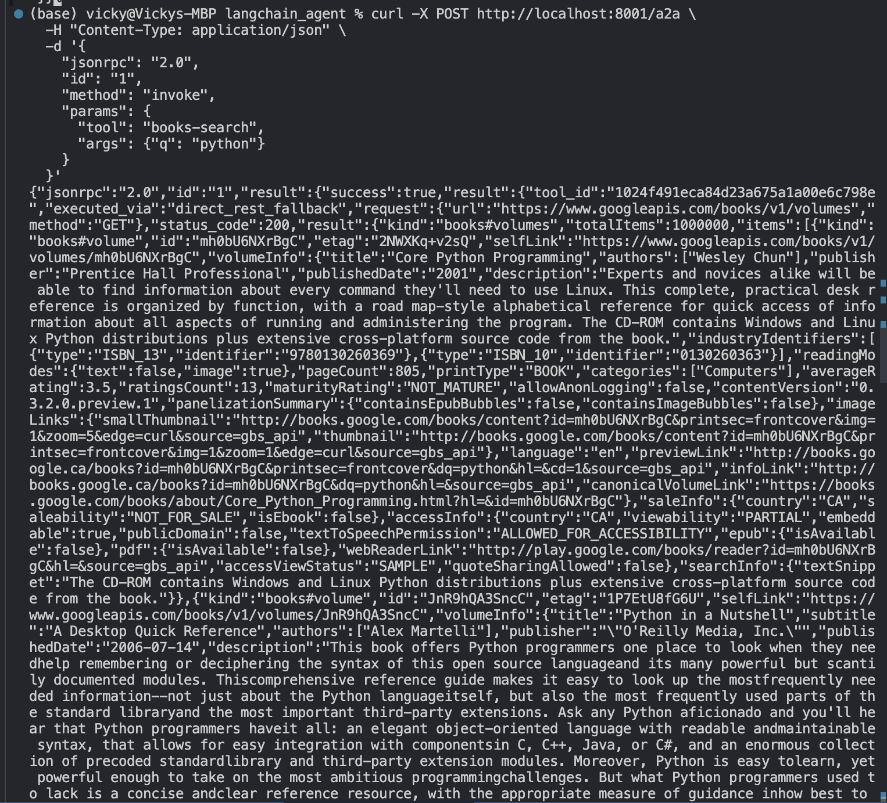

# MCP Langchain Agent
A configurable Langchain agent that supports MCP and integrates with the MCP Gateway via streamable HTTP + Auth.

Tools can be specified as a CSV list.

Exposes an OpenAI compatible API.

Endpoints for:

/health
/ready
/list_tools

etc. are provided.

## Features update (2025-Aug-17)
- **Dynamic Tool Discovery**: Automatically discovers tools from MCP Gateway (`GET /tools`)
- **OpenAI-Compatible API**: Standard `/v1/chat/completions` endpoint with streaming support
- **A2A Communication**: JSON-RPC `/a2a` endpoint for gateway-to-gateway communication
- **Langchain Integration**: Full Langchain agent with function calling support
- **Health Monitoring**: `/health`, `/ready`, `/list_tools` endpoints

## User Stories Implemented
[x] **Dynamic Tool Discovery** - Auto-discovers from gateway or uses allowlist
[x] **Dual Endpoint Exposure** - OpenAI + A2A JSON-RPC endpoints
[x] **Parameterised Tool Allow-List** - `TOOLS=` environment variable
[x] **Tool Schema Introspection** - JSON schema parsing and validation

Structure:
```
agent_runtimes/langchain_agent/
├── app.py                    # FastAPI application incl. /v1/chat/completions and /a2a
├── agent_langchain.py    # Core Langchain agent
├── mcp_client.py            # MCP Gateway client
├── models.py                # Pydantic models
├── config.py                # Configuration management
├── start_agent.py           # Startup script
├── requirements.txt         # Dependencies
└── README.md               # This file
```

### Configuration (env vars)
- OPENAI_API_KEY – required
- MCPGATEWAY_BEARER_TOKEN – JWT for the gateway


### Installation
Install dependencies:
```bash
cd agent_runtimes/langchain_agent
pip install -r requirements.txt
```


### Quick Start
1) Start the MCP Gateway (from project root):
```bash
make serve
```

2) Start the Langchain Agent (in another terminal):
```bash
# Set environment variables
export OPENAI_API_KEY=your-openai-api-key
export GATEWAY_BEARER_TOKEN=$(python3 -m mcpgateway.utils.create_jwt_token -u admin --secret my-test-key)

# Optional: Tool allowlist (if unset, all tools discovered)
export TOOLS="tool1,tool2,tool3" # Replace with actual tool names

python -m agent_runtimes.langchain_agent.start_agent
```

3) Test the agent (in new terminal):

Basic Health Checks
```bash
# Health check
curl http://localhost:8000/health

# Readiness check
curl http://localhost:8000/ready

# List available tools
curl http://localhost:8000/list_tools
```

Basic Health Checks
```bash
# Basic chat completion
curl -X POST http://localhost:8000/v1/chat/completions \
  -H "Content-Type: application/json" \
  -d '{
    "model": "gpt-4o-mini",
    "messages": [
      {"role": "user", "content": "What tools do you have available?"}
    ]
  }'

# Streaming chat completion
curl -X POST http://localhost:8000/v1/chat/completions \
  -H "Content-Type: application/json" \
  -d '{
    "model": "gpt-4o-mini",
    "messages": [
      {"role": "user", "content": "Hello!"}
    ],
    "stream": true
  }'
```

Test A2A communication with a working tool (books-search)
- Step 1: Find a tool to test
```bash
# Get your available tools and pick one
curl http://localhost:8000/list_tools | jq '.tools[0]'
```

- Step 2: Test A2A with your tool
```bash
# Replace "YOUR_TOOL_NAME" with an actual tool from step 1
curl -X POST http://localhost:8000/a2a \
  -H "Content-Type: application/json" \
  -d '{
    "jsonrpc": "2.0",
    "id": "1",
    "method": "invoke",
    "params": {
      "tool": "YOUR_TOOL_NAME",
      "args": {}
    }
  }'

# For tools that need parameters, check the tool schema:
curl -X POST http://localhost:8000/a2a \
  -H "Content-Type: application/json" \
  -d '{
    "jsonrpc": "2.0",
    "id": "1",
    "method": "invoke",
    "params": {
      "tool": "YOUR_TOOL_NAME",
      "args": {
        "param1": "value1",
        "param2": "value2"
      }
    }
  }'
```
Expected Success Response:
```json
{
  "jsonrpc": "2.0",
  "id": "1",
  "result": {
    "success": true,
    "result": {
      "tool_id": "your-tool-id",
      "executed_via": "direct_rest_fallback",
      "status_code": 200,
      "result": "...actual tool output..."
    }
  }
}
```

