# MCP Gateway Stack - Helm Chart

Deploy the full **MCP Gateway Stack**-MCP Context Forge gateway, PostgreSQL, Redis, and optional PgAdmin & Redis-Commander UIs-on any Kubernetes distribution with a single Helm release. The chart lives in [`charts/mcp-stack`](https://github.com/IBM/mcp-context-forge/tree/main/charts/mcp-stack).

---

## Table of Contents

1. [Architecture](#architecture)
2. [Prerequisites](#prerequisites)
3. [Quick Start](#quick-start)
4. [Verify Deployment](#verify-deployment)
5. [Customising `values.yaml`](#customising-valuesyaml)
6. [Upgrade & Rollback](#upgrade--rollback)
7. [Uninstall](#uninstall)
8. [CI/CD & OCI Push](#cicd--oci-push)
9. [Troubleshooting](#troubleshooting)
10. [Common Values Reference](#common-values-reference)
11. [Further Reading](#further-reading)
12. [Contributing](#contributing)

---

## Architecture

High-level architecture:

```
          ┌─────────────────────────────┐
          │      NGINX Ingress          │
          └──────────┬───────────┬──────┘
                     │/          │/
      ┌──────────────▼─────┐ ┌────▼───────────┐
      │  MCP Context Forge │ │ PgAdmin (opt.) │
      └─────────┬──────────┘ └────┬───────────┘
                │                 │
   ┌────────────▼──────┐ ┌────────▼────────────┐
   │    PostgreSQL     │ │ Redis Commander(opt)│
   └────────┬──────────┘ └────────┬────────────┘
            │                     │
      ┌─────▼────┐          ┌─────▼────┐
      │   PV     │          │  Redis   │
      └──────────┘          └──────────┘
```

Chart design:

```mermaid
graph TB
    %% External Access
    Ingress[🌐 NGINX Ingress<br/>gateway.local]

    %% Pre-deployment Job
    subgraph "Database Migration"
        MigrationJob[🔄 Migration Job<br/>Alembic upgrade head<br/>Runs before Gateway<br/>CPU: 100m-200m<br/>Memory: 256Mi-512Mi<br/>Restart: Never, Max 3 retries]
    end

    %% Application Tier
    subgraph "Application Layer"
        MCPGateway[🚪 MCP Gateway<br/>Replicas: 2<br/>Port: 4444<br/>CPU: 100m-200m<br/>Memory: 512Mi-1024Mi]
        FastTimeServer[⏰ Fast Time Server<br/>Replicas: 2<br/>Port: 8080<br/>CPU: 25m-50m<br/>Memory: 10Mi-64Mi]
        HPA{📈 Auto Scaling<br/>Min: 2, Max: 10<br/>CPU/Memory: 90%}
    end

    %% Management UIs
    subgraph "Management UIs - Optional"
        PgAdmin[📊 PgAdmin<br/>Postgres Web UI<br/>Port: 80<br/>CPU: 100m-200m<br/>Memory: 128Mi-256Mi]
        RedisCommander[🔧 Redis Commander<br/>Redis Web UI<br/>Port: 8081<br/>CPU: 50m-100m<br/>Memory: 128Mi-256Mi]
    end

    %% Configuration Management
    subgraph "Configuration"
        GatewayConfig[(📄 Gateway ConfigMap<br/>~40 app settings)]
        GatewaySecret[(🔐 Gateway Secret<br/>Auth & JWT keys)]
        PostgresConfig[(📄 Postgres ConfigMap<br/>Database name)]
        PostgresSecret[(🔐 Postgres Secret<br/>DB credentials)]
    end

    %% Data & State Management
    subgraph "Data & State"
        PostgreSQL[(🗄️ PostgreSQL 17<br/>Port: 5432<br/>CPU: 500m-1000m<br/>Memory: 64Mi-1Gi<br/>MCP Server configs)]
        Redis[(🔄 Redis<br/>Port: 6379<br/>CPU: 50m-100m<br/>Memory: 16Mi-256Mi<br/>Sessions & Cache)]
        PVC[(💾 Persistent Volume<br/>5Gi RWX Storage<br/>PostgreSQL data)]
    end

    %% Services Layer
    subgraph "Services (ClusterIP)"
        GatewaySvc[🔗 Gateway Service<br/>Port: 80]
        FastTimeSvc[🔗 Fast Time Service<br/>Port: 80]
        PostgresSvc[🔗 Postgres Service<br/>Port: 5432]
        RedisSvc[🔗 Redis Service<br/>Port: 6379]
        PgAdminSvc[🔗 PgAdmin Service<br/>Port: 80]
        RedisCommanderSvc[🔗 Redis Commander Service<br/>Port: 8081]
    end

    %% Network Connections
    Ingress --> GatewaySvc
    Ingress -.->|/fast-time| FastTimeSvc
    GatewaySvc --> MCPGateway
    FastTimeSvc --> FastTimeServer

    %% Migration Flow (Sequential)
    MigrationJob -->|Waits for DB ready| PostgresSvc
    MigrationJob -->|Runs before| MCPGateway

    %% Application to Services
    MCPGateway --> PostgresSvc
    MCPGateway --> RedisSvc
    PostgresSvc --> PostgreSQL
    RedisSvc --> Redis

    %% UI Connections
    PgAdminSvc --> PgAdmin
    RedisCommanderSvc --> RedisCommander
    PgAdmin --> PostgresSvc
    RedisCommander --> RedisSvc

    %% Configuration Injection
    GatewayConfig --> MCPGateway
    GatewaySecret --> MCPGateway
    PostgresConfig --> PostgreSQL
    PostgresSecret --> PostgreSQL
    PostgresSecret --> PgAdmin
    PostgresSecret --> MigrationJob

    %% Storage
    PostgreSQL --> PVC

    %% Auto Scaling
    HPA -.-> MCPGateway

    %% Health Checks (dotted lines)
    MCPGateway -.->|/health<br/>/ready| MCPGateway
    FastTimeServer -.->|/health| FastTimeServer
    PostgreSQL -.->|pg_isready| PostgreSQL
    Redis -.->|PING| Redis
    PgAdmin -.->|/misc/ping| PgAdmin
    RedisCommander -.->|HTTP root| RedisCommander
    MigrationJob -.->|db_isready.py| PostgreSQL

    %% Deployment Order (optional visual cue)
    PostgreSQL -.->|Must be ready first| MigrationJob
    MigrationJob -.->|Must complete first| MCPGateway

    %% Styling
    classDef app fill:#e3f2fd,stroke:#1976d2,stroke-width:2px
    classDef migration fill:#fff3e0,stroke:#ef6c00,stroke-width:3px
    classDef ui fill:#e8eaf6,stroke:#3f51b5,stroke-width:2px
    classDef config fill:#fff8e1,stroke:#f57c00,stroke-width:2px
    classDef data fill:#f1f8e9,stroke:#388e3c,stroke-width:2px
    classDef service fill:#e0f2f1,stroke:#00695c,stroke-width:2px
    classDef network fill:#fce4ec,stroke:#c2185b,stroke-width:2px

    class MCPGateway,FastTimeServer,HPA app
    class MigrationJob migration
    class PgAdmin,RedisCommander ui
    class GatewayConfig,GatewaySecret,PostgresConfig,PostgresSecret config
    class PostgreSQL,Redis,PVC data
    class GatewaySvc,FastTimeSvc,PostgresSvc,RedisSvc,PgAdminSvc,RedisCommanderSvc service
    class Ingress network
```



---

## Prerequisites

* **Kubernetes ≥ 1.23** - Minikube, kind, EKS, AKS, GKE, OpenShift ...
* **Helm 3** - Install via Homebrew, Chocolatey, or cURL script
* **kubectl** - Configured to talk to the target cluster
* **Ingress controller** - NGINX, Traefik, or cloud-native (or disable via values)
* **RWX StorageClass** - Required for PostgreSQL PVC unless `postgres.persistence.enabled=false`

### Pre-flight checklist

```bash
# Check current context and cluster
kubectl config current-context
kubectl cluster-info

# Verify permissions
kubectl auth can-i create namespace
kubectl auth can-i create deployment -n default
kubectl auth can-i create clusterrolebinding

# Ensure server version ≥ v1.23
kubectl version -o json | jq -r '.serverVersion.gitVersion'

# Confirm a RWX StorageClass exists
kubectl get sc

# Confirm an ingress controller is running
kubectl get pods -A | grep -E 'ingress|traefik|nginx' || echo "No ingress controller found"
```

---

## Quick Start

```bash
# Clone the repo and enter the chart directory
git clone https://github.com/IBM/mcp-context-forge.git
cd mcp-context-forge/charts/mcp-stack

# (Optional) customise values
cp values.yaml my-values.yaml
vim my-values.yaml

# Install / upgrade (idempotent)
helm upgrade --install mcp-stack . \
  --namespace mcp \
  --create-namespace \
  -f my-values.yaml \
  --wait --timeout 30m
```

If you are running locally, add the line below to `/etc/hosts` (or enable the Minikube *ingress-dns* addon):

```text
$(minikube ip)  gateway.local
```

---

## Verify Deployment

```bash
# All resources should be Running / Completed
kubectl get all -n mcp
helm status mcp-stack -n mcp

# Check ingress (if enabled)
kubectl get ingress -n mcp
curl http://gateway.local/health

# No ingress? Port-forward instead
kubectl port-forward svc/mcp-stack-app 8080:80 -n mcp
curl http://localhost:8080/health
```

---

## Customising `values.yaml`

Below is a minimal example. Copy the default file and adjust for your environment.

```yaml
mcpContextForge:
  image:
    repository: ghcr.io/ibm/mcp-context-forge
    tag: 0.7.0
  ingress:
    enabled: true
    host: gateway.local   # replace with real DNS
    className: nginx
  envFrom:
    - secretRef:
        name: mcp-gateway-secret
    - configMapRef:
        name: mcp-gateway-config

postgres:
  credentials:
    user: admin
    password: S3cuReP@ss   # use a Secret in production
  persistence:
    size: 10Gi

pgadmin:
  enabled: false

redisCommander:
  enabled: false

rbac:
  create: true
```

Validate your changes with:

```bash
helm lint .
```

---

## Upgrade & Rollback

```bash
# Upgrade only the gateway image
ahelm upgrade mcp-stack . -n mcp-private\
  --set mcpContextForge.image.tag=v1.2.3 \
  --wait

# Preview changes (requires helm-diff plugin)
helm plugin install https://github.com/databus23/helm-diff
helm diff upgrade mcp-stack . -n mcp-private-f my-values.yaml

# Roll back to revision 1
helm rollback mcp-stack 1 -n mcp
```

---

## Database Migration

The chart includes automatic database migration using **Alembic** that runs before the mcpgateway deployment starts. This ensures your database schema is always up-to-date.

### How It Works

1. **Migration Job** - Runs as a Kubernetes Job alongside other resources
2. **Database Readiness** - Waits for PostgreSQL using the built-in `db_isready.py` script
3. **Schema Migration** - Executes `alembic upgrade head` to apply any pending migrations
4. **Gateway Startup** - mcpgateway uses a startup probe to ensure database is ready before serving traffic

### Configuration

```yaml
migration:
  enabled: true                    # Enable/disable migrations (default: true)
  backoffLimit: 3                  # Retry attempts on failure
  activeDeadlineSeconds: 600       # Job timeout (10 minutes)

  image:
    repository: ghcr.io/ibm/mcp-context-forge
    tag: latest                    # Should match mcpContextForge.image.tag

  command:
    waitForDb: "python3 /app/mcpgateway/utils/db_isready.py --max-tries 30 --interval 2 --timeout 5"
    migrate: "alembic upgrade head || echo '⚠️ Migration check failed'"
---

## Uninstall

```bash
helm uninstall mcp-stack -n mcp

# Optional cleanup
akubectl delete pvc --all -n mcp
kubectl delete namespace mcp
```

---

## CI/CD & OCI Push

```bash
# Lint and package
helm lint .
helm package . -d dist/

# Push the package to GitHub Container Registry (only for mcp-context-forge release managers!)
helm push dist/mcp-stack-*.tgz oci://ghcr.io/ibm/mcp-context-forge
```

Use the OCI URL below in Argo CD or Flux:

```
oci://ghcr.io/ibm/mcp-context-forge
```

---

## Troubleshooting

| Symptom                  | Possible Cause                        | Quick Fix                                          |
| ------------------------ | ------------------------------------- | -------------------------------------------------- |
| `ImagePullBackOff`       | Image missing or private              | Check image tag & ensure pull secret is configured |
| Ingress 404 / no address | Controller not ready or host mismatch | `kubectl get ingress`, verify DNS / `/etc/hosts`   |
| `CrashLoopBackOff`       | Bad configuration / missing env vars  | `kubectl logs` and `kubectl describe pod ...`        |
| Env vars missing         | Secret/ConfigMap not mounted          | Confirm `envFrom` refs and resource existence      |
| RBAC access denied       | Roles/Bindings not created            | Set `rbac.create=true` or add roles manually       |

You can use the `helm template` and `yq` and check your templates. Example:

```bash
helm lint .
helm template . | yq '.spec.template.spec.containers[0] | {readinessProbe,livenessProbe}'
helm template mcp-stack . -f my-values.yaml > /tmp/all.yaml
```

---

## Common Values Reference

## Common Values Reference

| Key                               | Default         | Description                    |
| --------------------------------- | --------------- | ------------------------------ |
| `mcpContextForge.image.tag`       | `latest`        | Gateway image version          |
| `mcpContextForge.ingress.enabled` | `true`          | Create Ingress resource        |
| `mcpContextForge.ingress.host`    | `gateway.local` | External host                  |
| `mcpContextForge.hpa.enabled`     | `true`          | Enable Horizontal Pod Autoscaler |
| `migration.enabled`               | `true`          | Run database migrations        |
| `migration.backoffLimit`          | `3`             | Migration job retry attempts   |
| `postgres.credentials.user`       | `admin`         | DB username                    |
| `postgres.persistence.enabled`    | `true`          | Enable PVC                     |
| `postgres.persistence.size`       | `10Gi`          | PostgreSQL volume size         |
| `pgadmin.enabled`                 | `false`         | Deploy PgAdmin UI              |
| `redisCommander.enabled`          | `false`         | Deploy Redis-Commander UI      |
| `rbac.create`                     | `true`          | Auto-create Role & RoleBinding |

For every setting see the [full annotated `values.yaml`](https://github.com/IBM/mcp-context-forge/blob/main/charts/mcp-stack/values.yaml).

---

## Further Reading

* Helm: [https://helm.sh/docs/](https://helm.sh/docs/)
* Helm Diff plugin: [https://github.com/databus23/helm-diff](https://github.com/databus23/helm-diff)
* Helm OCI registries: [https://helm.sh/docs/topics/registries/](https://helm.sh/docs/topics/registries/)
* Kubernetes Ingress: [https://kubernetes.io/docs/concepts/services-networking/ingress/](https://kubernetes.io/docs/concepts/services-networking/ingress/)
* Network Policies: [https://kubernetes.io/docs/concepts/services-networking/network-policies/](https://kubernetes.io/docs/concepts/services-networking/network-policies/)
* Argo CD: [https://argo-cd.readthedocs.io/](https://argo-cd.readthedocs.io/)
* Flux: [https://fluxcd.io/](https://fluxcd.io/)

---

## Contributing

1. Fork the repo and create a feature branch.
2. Update templates or `values.yaml`.
3. Test with `helm lint` and `helm template`.
4. Open a pull request-thank you!

## Features

* 🗂️ Multi-service stack - Deploys MCP Gateway (`n` replicas), Fast-Time-Server (`n` replicas), Postgres 17, Redis, PGAdmin 4 and Redis-Commander out of the box.
* 🎛️ Idiomatic naming - All objects use helper templates (`mcp-stack.fullname`, chart labels) so release names and overrides stay collision-free.
* 🔐 Secrets & credentials - `mcp-stack-gateway-secret` (Basic-Auth creds, JWT signing key, encryption salt, ...) and `postgres-secret` (DB user / password / database name), both injected via `envFrom`.
* ⚙️ Config as code - `mcp-stack-gateway-config` (\~40 tunables) and `postgres-config` for the DB name.
* 🔗 Derived URLs - Pods build `DATABASE_URL` and `REDIS_URL` from explicit host/port/user/pass variables-no hard-coding.
* ❤️🩹 Health management - Readiness and liveness probes on every deployment; the Gateway also has a startupProbe.
* 🚦 Resource safeguards - CPU and memory requests/limits set for all containers.
* 💾 Stateful storage - PV + PVC for Postgres (`/var/lib/postgresql/data`), storage class selectable.
* 🌐 Networking & access - ClusterIP services, optional NGINX Ingress, and `NOTES.txt` with port-forward plus safe secret-fetch commands (password, bearer token, `JWT_SECRET_KEY`).
* 📈 Replicas & availability - Gateway (3) and Fast-Time-Server (2) provide basic HA; stateful components run single-instance.
* 📦 Helm best-practice layout - Clear separation of Deployments, Services, ConfigMaps, Secrets, PVC/PV and Ingress; chart version 0.7.0.
* ⚙️ Horizontal Pod Autoscaler (HPA) support for mcpgateway

---

## TODO / Future roadmap

1. 🔄 Post-deploy hook to register MCP Servers with MCP Gateway
2. ⏳ Add startup probes for slow-booting services
3. 🛡️ Implement Kubernetes NetworkPolicies to restrict internal traffic
4. 📊 Expose Prometheus metrics and add scrape annotations
5. 📈 Bundle Grafana dashboards via ConfigMaps (optional)
6. 🔐 Integrate External Secrets support (e.g., AWS Secrets Manager)
7. 🧪 Add Helm test hooks to validate deployments
8. 🔍 Add `values.schema.json` for values validation and better UX
9. 🧰 Move static configuration to templated `ConfigMaps` where possible
10. 📁 Include persistent storage toggle in `values.yaml` for easier local/dev setup
11. 🧼 Add Helm pre-delete hook for cleanup tasks (e.g., deregistering from external systems)
12. 🧩 Package optional CRDs if needed in the future (e.g., for custom integrations)

## Debug / start fresh (delete namespace)

```bash
# 0. Create and customize the values
cp values.yaml my-values.yaml

# 1. Verify the release name and namespace
helm list -A | grep mcp-stack

# 2. Uninstall the Helm release (removes Deployments, Services, Secrets created by the chart)
helm uninstall mcp-stack -n mcp-private

# 3. Delete any leftover PersistentVolumeClaims *if* you don't need the data
kubectl delete pvc --all -n mcp-private

# 4. Remove the namespace itself (skips if you want to keep it)
kubectl delete namespace mcp-private

# 5. Optional: confirm nothing is left
helm list -A | grep mcp-stack   # should return nothing
kubectl get ns | grep mcp-private  # should return nothing

# 6. Re-create the namespace (if you deleted it)
kubectl create namespace mcp-private

# 7. Re-install the chart with your values file
helm upgrade --install mcp-stack . \
  --namespace mcp-private \
  -f my-values.yaml \
  --wait --timeout 15m --debug

# 8. Check status
kubectl get all -n mcp-private
helm status mcp-stack -n mcp-private --show-desc
```

---

## Horizontal Pod Autoscaler (HPA) Guide

Because MCP Gateway traffic could spike unpredictably, the chart lets you turn on a **Horizontal Pod Autoscaler** that automatically adds or removes gateway pods based on CPU / memory load.

The feature is **off by default**. Switch `hpa` to `enabled: true` in the `mcpContextForge` section of `values.yaml` to enable.

| Key                                                     | Default | What happens when you change it                                                                                                            |
| ------------------------------------------------------- | ------- | ------------------------------------------------------------------------------------------------------------------------------------------ |
| `mcpContextForge.hpa.enabled`                           | `false` | `true` renders an `autoscaling/v2` HPA that targets **Deployment/mcpgateway**.                                                             |
| `mcpContextForge.hpa.minReplicas`                       | `3`     | ***Floor.*** Pods never drop below this even during quiet periods. Increase if you need more baseline capacity or faster cold-start times. |
| `mcpContextForge.hpa.maxReplicas`                       | `10`    | ***Ceiling.*** Upper safety-limit so runaway load cannot bankrupt the cluster.                                                             |
| `mcpContextForge.hpa.targetCPUUtilizationPercentage`    | `80`    | Lower the value to scale **up sooner** (more replicas at lower CPU); raise it to run hotter before adding pods.                            |
| `mcpContextForge.hpa.targetMemoryUtilizationPercentage` | *unset* | Optional second metric. If set, **either** CPU *or* memory breaching its threshold triggers scaling.                                       |

> **Tip** The starting replica count still comes from `mcpContextForge.replicaCount`, which also acts as a fallback if you later disable the HPA.

---

### Enabling or Tuning the HPA

#### 1 - Declaratively with Helm (recommended)

Make the change permanent by editing *values.yaml* or passing `--set` flags:

```bash
# First time enabling
helm upgrade --install mcp-stack charts/mcp-stack \
  --namespace mcp \
  --set mcpContextForge.hpa.enabled=true \
  --set mcpContextForge.hpa.minReplicas=2 \
  --set mcpContextForge.hpa.maxReplicas=15 \
  --set mcpContextForge.hpa.targetCPUUtilizationPercentage=70 \
  --wait

# Later: raise the ceiling & make scaling more aggressive
helm upgrade mcp-stack charts/mcp-stack \
  -n mcp-private\
  --reuse-values \
  --set mcpContextForge.hpa.maxReplicas=20 \
  --set mcpContextForge.hpa.targetCPUUtilizationPercentage=60 \
  --wait
```

*Helm edits the HPA in-place; no pod restarts are needed.*

#### 2 - Ad-hoc with kubectl (one-off tweaks)

Useful in emergencies or during load tests.

```bash
# Bump minReplicas from 3 → 5
kubectl patch hpa mcp-stack-mcpgateway -n mcp-private\
  --type merge \
  -p '{"spec":{"minReplicas":5}}'

# Drop the CPU target from 80 % → 65 % (scale up sooner)
kubectl patch hpa mcp-stack-mcpgateway -n mcp-private\
  --type json \
  -p '[{"op":"replace","path":"/spec/metrics/0/resource/target/averageUtilization","value":65}]'
```

> **Heads-up** Manual patches are overridden the next time you run `helm upgrade` unless you also update *values.yaml*.

---

### Verifying & Monitoring

| Task                   | Command                                               |
| ---------------------- | ----------------------------------------------------- |
| List all HPAs          | `kubectl get hpa -n mcp`                              |
| Watch live utilisation | `watch kubectl get hpa -n mcp`                        |
| Full details & events  | `kubectl describe hpa mcp-stack-mcpgateway -n mcp`    |
| Raw pod metrics        | `kubectl top pods -l app=mcp-stack-mcpgateway -n mcp` |

A healthy HPA shows something like:

```text
NAME                   TARGETS          MINPODS   MAXPODS   REPLICAS
mcp-stack-mcpgateway   55%/70%          2         15        4
```

### Check scaling events

```bash
# 1. Show the last few scale-up / scale-down events
kubectl describe hpa mcp-stack-mcpgateway -n mcp-private | tail -n 20

# 2. Stream HPA events as they happen
kubectl get events -n mcp-private \
  --field-selector involvedObject.kind=HorizontalPodAutoscaler,\
involvedObject.name=mcp-stack-mcpgateway \
  --watch

# 3. Watch target utilisation & replica count refresh every 2 s
watch -n2 kubectl get hpa mcp-stack-mcpgateway -n mcp-private

# 4. Live pod-level CPU / memory (confirm the numbers the HPA sees)
kubectl top pods -l app=mcp-stack-mcpgateway -n mcp-private --sort-by=cpu
```

---

### Prerequisites & Gotchas

* **Metrics API** - The cluster **must** run the Kubernetes *metrics-server* (or a Prometheus Adapter) so the control-plane can read CPU / memory stats.

  ```bash
  kubectl get deployment metrics-server -n kube-system
  ```
* **Resource requests** - The gateway deployment already sets `resources.requests.cpu` & `.memory`.
  Percentage-based HPAs need these values to compute utilisation.
* **RBAC** - Most distributions grant HPAs read-only access to metrics. Hardened clusters may require an additional `RoleBinding`.

---

### Troubleshooting

| Symptom                                | Checks                                                                                                                                                                   |
| -------------------------------------- | ------------------------------------------------------------------------------------------------------------------------------------------------------------------------ |
| `cpu: <unknown>` / `memory: <unknown>` | *metrics-server* missing or failing → `kubectl logs deployment/metrics-server -n kube-system`                                                                            |
| HPA exists but never scales            | - Is the workload actually under load? See `kubectl top pods ...`.<br>- Are limits **lower** than requests? Requests should reflect the typical baseline, not the ceiling. |
| No HPA rendered                        | Was the chart installed with `--set mcpContextForge.hpa.enabled=true`? Use `helm template` to confirm the YAML renders.                                                  |
