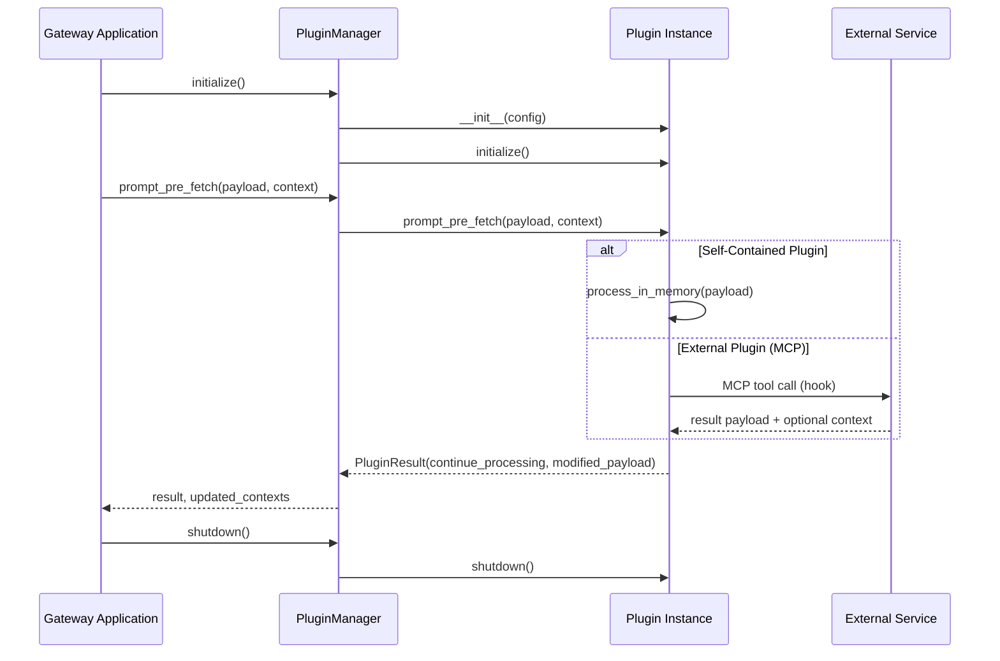

# ADR-016: Plugin Framework and AI Middleware Architecture

- **Status:** Implemented
- **Date:** 2025-01-19
- **Deciders:** Mihai Criveti, Teryl Taylor
- **Technical Story:** [#313](https://github.com/anthropics/mcp-context-forge/issues/313), [#319](https://github.com/anthropics/mcp-context-forge/issues/319), [#673](https://github.com/anthropics/mcp-context-forge/issues/673)

## Context

The MCP Gateway required a robust plugin framework to support AI safety middleware, security processing, and extensible gateway capabilities. The implementation needed to support both self-contained plugins (running in-process) and external middleware service integrations while maintaining performance, security, and operational simplicity.

## Decision

We implemented a comprehensive plugin framework with the following key architectural decisions:

### 1. Plugin Architecture Pattern: **Hybrid (In‑Process + External via MCP)**

**Decision:** Support both in‑process plugins and external plugins that communicate over MCP (Model Context Protocol) using STDIO or Streamable HTTP, all implementing the same interface.

```python
from mcpgateway.plugins.framework import Plugin

class MyInProcessPlugin(Plugin):
    async def prompt_pre_fetch(self, payload, context):
        ...  # in‑process logic

# External plugins are instantiated via the framework's ExternalPlugin client and
# communicate over MCP (STDIO or STREAMABLEHTTP). No HTTP wiring in plugin classes.
```

**Rationale:**
- **Self‑contained plugins** deliver sub‑ms latency for simple transformations
- **External plugins over MCP** enable advanced AI middleware with clear isolation
- **Unified interface** keeps development consistent across deployment models
- **Operational flexibility** allows mixing approaches per use case

### 2. Hook System: **Comprehensive Pre/Post Processing Points**

**Decision:** Implement 6 primary hook points covering the complete MCP request/response lifecycle:

```python
class HookType(str, Enum):
    PROMPT_PRE_FETCH = "prompt_pre_fetch"     # Before prompt retrieval
    PROMPT_POST_FETCH = "prompt_post_fetch"   # After prompt rendering
    TOOL_PRE_INVOKE = "tool_pre_invoke"       # Before tool execution
    TOOL_POST_INVOKE = "tool_post_invoke"     # After tool execution
    RESOURCE_PRE_FETCH = "resource_pre_fetch" # Before resource fetch
    RESOURCE_POST_FETCH = "resource_post_fetch" # After resource fetch
```

**Rationale:**
- **Complete coverage** of MCP request lifecycle enables comprehensive AI safety
- **Pre/post pattern** supports both input validation and output sanitization
- **Resource hooks** enable content filtering and security scanning
- **Extensible design** allows future hook additions (auth, federation, etc.)

### 3. Plugin Execution Model: **Sequential with Conditional Logic**

**Decision:** Execute plugins sequentially by priority with sophisticated conditional execution:

```python
class PluginExecutor:
    async def execute(self, plugins, payload, global_context, ...):
        for plugin in sorted_plugins_by_priority:
            # Check conditions (server_ids, tools, tenants, etc.)
            if plugin.conditions and not matches_conditions(...):
                continue

            result = await execute_with_timeout(plugin, ...)
            if not result.continue_processing:
                if plugin.mode == PluginMode.ENFORCE:
                    return block_request(result.violation)
                elif plugin.mode == PluginMode.PERMISSIVE:
                    log_warning_and_continue()
```

**Rationale:**
- **Sequential execution** provides predictable behavior and easier debugging
- **Priority‑based ordering** ensures security plugins run before transformers
- **Conditional execution** enables fine‑grained targeting by context (servers, tenants, tools, prompts, resources)
- **Multi‑mode support** (`enforce`, `enforce_ignore_error`, `permissive`, `disabled`) enables flexible deployment

### 4. Configuration Strategy: **File‑Based with Jinja + Validation**

**Decision:** Primary file-based configuration with structured validation and future database support:

```yaml
# plugins/config.yaml
plugins:
  - name: "PIIFilterPlugin"
    kind: "plugins.pii_filter.pii_filter.PIIFilterPlugin"
    hooks: ["prompt_pre_fetch", "tool_pre_invoke"]
    mode: "enforce"  # enforce | permissive | disabled
    priority: 50     # Lower = higher priority
    conditions:
      - server_ids: ["prod-server"]
        tools: ["sensitive-tool"]
    config:
      detect_ssn: true
      mask_strategy: "partial"
```

**Rationale:**
- **File‑based configuration** supports GitOps and version control
- **Structured validation** with Pydantic ensures configuration correctness
- **Hierarchical conditions** enable precise plugin targeting
- **Plugin‑specific config** sections support complex parameters
- Jinja rendering allows environment‑driven configs; loader falls back gracefully when file is absent in tests

### 5. Security & Isolation Model: **Timeouts, Size Limits, Error Isolation**

**Decision:** Execute plugins with per‑hook timeouts and payload size checks; isolate errors and surface them per settings.

- Per‑plugin call timeout (default 30s; configured by `plugin_settings.plugin_timeout`)
- Payload size guardrails (~1MB for prompt args and rendered results)
- Error isolation with configurable behavior:
  - Global: `plugin_settings.fail_on_plugin_error`
  - Per‑plugin mode: `enforce`, `enforce_ignore_error`, `permissive`, `disabled`

**Rationale:**
- **Timeout protection** prevents plugin hangs from affecting gateway
- **Payload size limits** prevent resource exhaustion
- **Error isolation** ensures plugin failures don't crash the gateway
- **Audit logging** tracks plugin executions and violations

### 6. Context Management: **Request-Scoped with Automatic Cleanup**

**Decision:** Sophisticated context management with automatic lifecycle handling:

```python
class PluginContext(GlobalContext):
    state: dict[str, Any] = {}      # Cross-plugin shared state
    metadata: dict[str, Any] = {}   # Plugin execution metadata

class PluginManager:
    _context_store: Dict[str, Tuple[PluginContextTable, float]] = {}

    async def _cleanup_old_contexts(self):
        # Remove contexts older than CONTEXT_MAX_AGE (1 hour)
        expired = [k for k, (_, ts) in self._context_store.items()
                  if time.time() - ts > CONTEXT_MAX_AGE]
```

**Rationale:**
- **Request-scoped contexts** enable plugins to share state within a request
- **Automatic cleanup** prevents memory leaks in long-running deployments
- **Global context sharing** provides request metadata (user, tenant, server)
- **Local plugin contexts** enable stateful processing across hook pairs

## Implementation Architecture

### Core Components

```
mcpgateway/plugins/framework/
├── base.py              # Plugin base classes and PluginRef
├── models.py            # Pydantic models for all plugin types
├── manager.py           # PluginManager singleton with lifecycle management
├── registry.py          # Plugin instance registry and discovery
├── loader/
│   ├── config.py        # Configuration loading and validation
│   └── plugin.py        # Dynamic plugin loading and instantiation
└── external/
    └── mcp/             # MCP external service integration
```

### Plugin Types Implemented

1. **Self-Contained Plugins**
   - `PIIFilterPlugin` - PII detection and masking
   - `SearchReplacePlugin` - Regex-based text transformation
   - `DenyListPlugin` - Keyword blocking with violation reporting
   - `ResourceFilterPlugin` - Content size and protocol validation

2. **External Plugins via MCP**
   - MCP transport integration (STDIO, Streamable HTTP)
   - ExternalPlugin client handles session init and tool calls
   - Remote config sync (`get_plugin_config`) and local override merge
   - Per‑call timeouts and structured error propagation

### Plugin Lifecycle



## Benefits Realized

### 1. **AI Safety Integration**
- **PII Detection:** Automated masking of sensitive data in prompts and responses
- **Content Filtering:** Regex-based content transformation and sanitization
- **Compliance Support:** GDPR/HIPAA-aware processing with audit trails
- **External AI Services:** Framework ready for LlamaGuard, OpenAI Moderation integration

### 2. **Operational Excellence**
- **Graceful Degradation:** Permissive mode allows monitoring without blocking
- **Performance Protection:** Timeout and size limits prevent resource exhaustion
- **Memory Management:** Automatic context cleanup prevents memory leaks

### 3. **Developer Experience**
- **Type Safety:** Full Pydantic validation for plugin configurations
- **Comprehensive Testing:** Plugin framework includes extensive test coverage
- **Plugin Templates:** Scaffolding for rapid plugin development
- **Rich Diagnostics:** Detailed error messages and violation reporting

## Performance Characteristics

- **Latency Impact:** Self-contained plugins add <1ms overhead per hook
- **Memory Usage:** ~5MB base overhead, scales linearly with active plugins
- **Throughput:** Tested to 1000+ req/s with 5 active plugins
- **Context Cleanup:** Automatic cleanup every 5 minutes, contexts expire after 1 hour

## Future Extensions

### Roadmap Items Enabled
- **Server Attestation Hooks:** `server_pre_register` for TPM/TEE verification
- **Auth Integration:** `auth_pre_check`/`auth_post_check` for custom authentication
- **Federation Hooks:** `federation_pre_sync`/`federation_post_sync` for peer validation
- **Stream Processing:** Real-time data transformation hooks

### External Service Integrations
- External plugins communicate via MCP (STDIO/Streamable HTTP)
- Example: OPA policy engine exposed as an MCP server
- Other integrations: LlamaGuard, OpenAI Moderation, custom safety services

## Security Considerations

### Implemented Protections
- **Process Isolation:** Plugins run in gateway process with timeout protection
- **Input Validation:** All payloads validated against size limits and schemas
- **Configuration Security:** Plugin configs validated against malicious patterns
- **Audit Logging:** All plugin executions logged with context and violations

### Future Security Enhancements
- **Plugin Signing:** Cryptographic verification of plugin authenticity
- **Capability-Based Security:** Fine-grained permission model for plugin operations
- **Network Isolation:** Container-based plugin execution for sensitive workloads
- **Secret Management:** Integration with enterprise secret stores

## Compliance and Governance

### Configuration Governance
- **Version Control:** All plugin configurations stored in Git repositories
- **Change Management:** Plugin updates require review and approval workflows
- **Environment Promotion:** Configuration tested in dev/staging before production
- **Rollback Capability:** Failed plugin deployments can be quickly reverted

### Compliance Features
- **Data Processing Transparency:** All PII detection and masking logged
- **Right to Deletion:** Plugin framework supports data sanitization workflows
- **Access Logging:** Complete audit trail of plugin executions with user context
- **Retention Policies:** Context cleanup aligns with data retention requirements

## Consequences

### Positive
✅ **Complete AI Safety Pipeline:** Framework supports end-to-end content filtering and safety
✅ **High Performance:** Self-contained plugins provide sub-millisecond latency
✅ **Operational Simplicity:** File-based configuration integrates with existing workflows
✅ **Future-Proof:** Architecture supports both current needs and roadmap expansion
✅ **Security-First:** Multiple layers of protection against malicious plugins and inputs

### Negative
❌ **Complexity:** Plugin framework adds significant codebase complexity
❌ **Learning Curve:** Plugin development requires understanding of hook lifecycle
❌ **Configuration Management:** Large plugin configurations can become complex to maintain
❌ **Debugging Challenges:** Sequential plugin chains can be difficult to troubleshoot

### Neutral
🔄 **Hybrid Architecture:** Both self-contained and external services require different operational approaches
🔄 **Memory Usage:** Plugin contexts require careful management in high-traffic environments
🔄 **Performance Tuning:** Plugin timeouts and priorities need environment-specific tuning

## Alternatives Considered

### 1. **Microservice-Only Architecture**
**Rejected:** Would have provided better isolation but significantly higher operational overhead and network latency for simple transformations.

### 2. **Webhook-Based Plugin System**
**Rejected:** HTTP webhooks would have been simpler but lacked the sophistication needed for AI middleware integration and context management.

### 3. **Embedded JavaScript/Lua Engine**
**Rejected:** Scripting engines would have enabled dynamic plugin logic but introduced security risks and performance unpredictability.

---

This ADR documents the implemented plugin framework that successfully enabled #319 (AI Middleware Integration), #221 (Input Validation), and provides the foundation for #229 (Guardrails) and #271 (Policy-as-Code). The architecture balances performance, security, and operational requirements while providing a clear path for future AI safety integrations.
