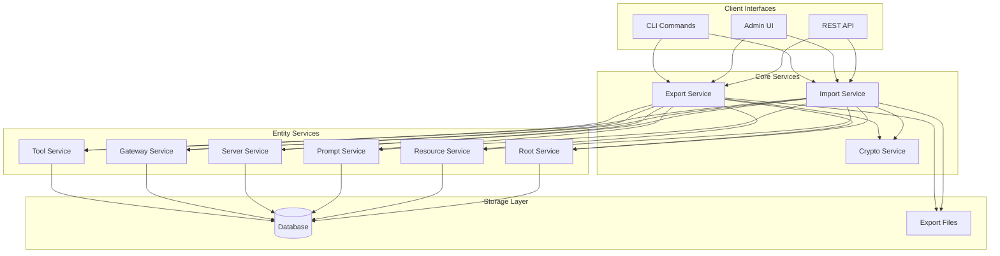
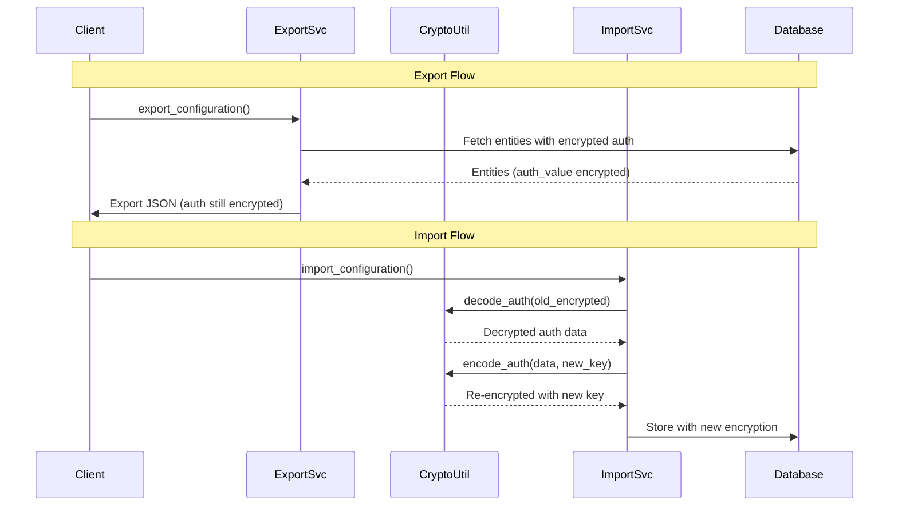
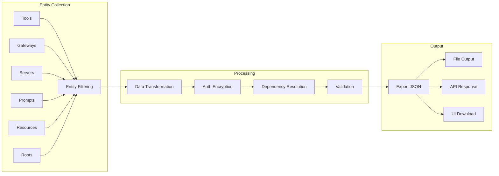
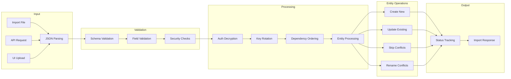
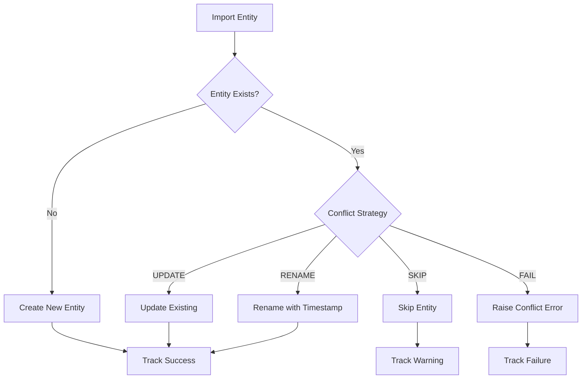

# Export/Import System Architecture

Technical architecture documentation for MCP Gateway's configuration export and import system.

---

## 🏗 System Overview

The export/import system provides comprehensive configuration management through multiple interfaces while maintaining security, data integrity, and operational efficiency.



---

## 🔧 Component Architecture

### Export Service (`mcpgateway.services.export_service`)

**Responsibilities:**
- Entity collection from all service layers
- Data transformation to export schema format
- Authentication data encryption using existing utilities
- Dependency resolution between entities
- Export data validation and schema compliance

**Key Methods:**
- `export_configuration()` - Complete configuration export
- `export_selective()` - Selective entity export
- `_export_tools()` - Tool-specific export logic
- `_extract_dependencies()` - Dependency mapping
- `_validate_export_data()` - Export validation

### Import Service (`mcpgateway.services.import_service`)

**Responsibilities:**
- Import data validation and schema compliance
- Entity creation and updates with conflict resolution
- Authentication data decryption and re-encryption
- Progress tracking and status reporting
- Cross-environment key rotation support

**Key Methods:**
- `import_configuration()` - Main import orchestration
- `validate_import_data()` - Schema validation
- `_process_entities()` - Entity processing pipeline
- `_rekey_auth_data()` - Authentication re-encryption
- `get_import_status()` - Progress tracking

### CLI Interface (`mcpgateway.cli_export_import`)

**Responsibilities:**
- Command-line argument parsing
- Authentication token management
- HTTP client for gateway API communication
- User-friendly progress reporting and error handling

**Key Functions:**
- `export_command()` - CLI export handler
- `import_command()` - CLI import handler
- `make_authenticated_request()` - API communication
- `create_parser()` - Argument parser setup

---

## 🔒 Security Architecture

### Authentication Data Handling



### Encryption Flow

1. **Export**: Authentication data remains encrypted with source environment's key
2. **Transport**: Export files contain encrypted auth values (safe to store/transmit)
3. **Import**: Auth data is decrypted with source key, re-encrypted with target key
4. **Storage**: Database stores auth data encrypted with target environment's key

### Key Rotation Process

```python
# During import with --rekey-secret
old_secret = settings.auth_encryption_secret  # Source environment key
new_secret = rekey_secret                     # Target environment key

# Decrypt with old key
decrypted_auth = decode_auth(auth_value, key=old_secret)

# Re-encrypt with new key
new_auth_value = encode_auth(decrypted_auth, key=new_secret)
```

---

## 📊 Data Flow Architecture

### Export Data Flow



### Import Data Flow



---

## 🎯 Entity Processing Order

Import processes entities in dependency order to ensure referential integrity:

```python
processing_order = [
    "roots",        # No dependencies
    "gateways",     # No dependencies
    "tools",        # No dependencies
    "resources",    # No dependencies
    "prompts",      # No dependencies
    "servers"       # Depends on tools, resources, prompts
]
```

This ensures that when servers are imported, their referenced tools, resources, and prompts already exist.

---

## 🔄 Conflict Resolution Architecture

### Conflict Detection

```python
class ConflictStrategy(str, Enum):
    SKIP = "skip"      # Skip conflicting entities
    UPDATE = "update"  # Overwrite existing entities
    RENAME = "rename"  # Add timestamp suffix
    FAIL = "fail"      # Raise error on conflict
```

### Resolution Flow



---

## 📈 Performance Considerations

### Export Performance

- **Parallel Collection**: Entity types are collected asynchronously
- **Streaming**: Large exports stream data to avoid memory issues
- **Filtering**: Early filtering reduces data processing overhead
- **Caching**: Entity services may cache frequently accessed data

### Import Performance

- **Batch Processing**: Entities processed in optimized batches
- **Dependency Ordering**: Minimizes constraint violation retries
- **Progress Tracking**: Lightweight status updates don't block processing
- **Error Handling**: Failed entities don't stop processing of others

### Optimization Strategies

```python
# Export optimizations
- Use specific entity type filters: --types tools,gateways
- Filter by tags for relevant subsets: --tags production
- Exclude unnecessary data: --exclude-types metrics

# Import optimizations
- Use selective imports: --include "tools:critical_tool"
- Process in stages: Import tools first, then servers
- Use update strategy: Faster than delete/recreate
```

---

## 🛠 Extension Points

### Custom Export Formats

The system is designed to support additional export formats:

```python
class ExportService:
    async def export_configuration(self, format: str = "json"):
        if format == "json":
            return self._export_json()
        elif format == "yaml":
            return self._export_yaml()  # Future extension
        elif format == "terraform":
            return self._export_terraform()  # Future extension
```

### Plugin Integration

Export/import operations can be extended with plugins:

```python
# Plugin hooks for export/import operations
@plugin_hook("pre_export")
async def validate_export_permissions(context: ExportContext):
    # Validate user permissions before export
    pass

@plugin_hook("post_import")
async def notify_import_completion(context: ImportContext):
    # Send notifications after successful import
    pass
```

### Custom Validation

Additional validation can be plugged into the import pipeline:

```python
class CustomImportValidator:
    async def validate_entity(self, entity_type: str, entity_data: dict):
        # Custom business logic validation
        pass
```

---

## 🧪 Testing Architecture

### Unit Test Coverage

- **Export Service**: Entity collection, filtering, validation
- **Import Service**: Conflict resolution, validation, progress tracking
- **CLI Interface**: Argument parsing, API communication
- **API Endpoints**: Request/response handling, error cases

### Integration Test Coverage

- **End-to-End Workflows**: Complete export → import cycles
- **Cross-Environment**: Key rotation and migration scenarios
- **Error Handling**: Network failures, invalid data, auth errors
- **Performance**: Large configuration handling

### Test Data Management

```python
@pytest.fixture
def sample_export_data():
    return {
        "version": "2025-03-26",
        "entities": {"tools": [...], "gateways": [...]},
        "metadata": {"entity_counts": {...}}
    }

@pytest.fixture
def mock_services():
    # Mock all entity services for isolated testing
    pass
```

---

## 📊 Monitoring & Observability

### Metrics Tracked

- **Export Operations**: Count, duration, size, entity types
- **Import Operations**: Count, duration, success/failure rates
- **Conflict Resolution**: Strategy usage, conflict rates
- **Performance**: Processing times per entity type

### Logging

All export/import operations are logged with structured data:

```json
{
  "timestamp": "2025-01-15T10:30:00Z",
  "level": "INFO",
  "message": "Configuration export completed",
  "export_id": "exp_abc123",
  "user": "admin",
  "entity_counts": {"tools": 15, "gateways": 3},
  "duration_ms": 1250,
  "size_bytes": 45678
}
```

### Health Checks

The system provides health indicators for export/import functionality:

```bash
# Check export service health
curl http://localhost:4444/health

# Monitor active imports
curl -H "Authorization: Bearer $TOKEN" \
     http://localhost:4444/import/status
```

---

## 🔮 Future Enhancements

### Planned Features

1. **Incremental Exports**: Export only changed entities since last export
2. **Delta Imports**: Import only differences between configurations
3. **Backup Scheduling**: Built-in cron-like scheduling for automated exports
4. **Multi-Format Support**: YAML, Terraform, Helm chart exports
5. **Compression**: Automatic compression for large export files
6. **Encryption at Rest**: Additional encryption layer for export files

### API Evolution

The export/import API is versioned and extensible:

```json
{
  "version": "2025-03-26",
  "api_version": "v1",
  "backward_compatible": true,
  "schema_url": "https://gateway.com/schemas/export/v1.json"
}
```

---

## 🔧 Implementation Details

### File Locations

```
mcpgateway/
├── services/
│   ├── export_service.py      # Core export logic
│   └── import_service.py      # Core import logic
├── cli_export_import.py       # CLI interface
├── main.py                    # REST API endpoints
└── admin.py                   # Admin UI endpoints

tests/
├── unit/mcpgateway/services/
│   ├── test_export_service.py
│   └── test_import_service.py
└── integration/
    └── test_export_import_api.py
```

### Dependencies

- **FastAPI**: REST API framework
- **Pydantic**: Data validation and serialization
- **SQLAlchemy**: Database ORM for entity services
- **aiohttp**: HTTP client for CLI operations
- **argparse**: CLI argument parsing

### Integration Points

- **Authentication**: Uses existing JWT/basic auth system
- **Encryption**: Leverages existing `encode_auth`/`decode_auth` utilities
- **Validation**: Integrates with existing security validators
- **Logging**: Uses shared logging service infrastructure
- **Error Handling**: Follows established error response patterns

---

This architecture provides a solid foundation for configuration management while maintaining compatibility with existing MCP Gateway systems and allowing for future enhancements.
