# Multi-Tenancy Architecture

The MCP Gateway implements a comprehensive multi-tenant architecture that provides secure isolation, flexible resource sharing, and granular access control. This document describes the complete multi-tenancy design, user lifecycle, team management, and resource scoping mechanisms.

## Overview

The multi-tenancy system is built around **teams as the primary organizational unit**, with users belonging to one or more teams, and all resources scoped to teams with configurable visibility levels.

### Core Principles

1. **Team-Centric**: Teams are the fundamental organizational unit for resource ownership and access control
2. **User Flexibility**: Users can belong to multiple teams with different roles in each team
3. **Resource Isolation**: Resources are scoped to teams with explicit sharing controls
4. **Invitation-Based**: Team membership is controlled through invitation workflows
5. **Role-Based Access**: Users have roles (Owner, Member) within teams that determine their capabilities
6. **Platform Administration**: Separate platform-level administration for system management

---

## User Lifecycle & Authentication

### User Authentication Flow


### User Creation & Personal Teams

Every user gets an automatically created **Personal Team** upon registration:


---

## Team Architecture & Management

### Team Structure & Roles


### Team Visibility & Access Model


#### Team Membership Levels (Design)

**Note**: These are team membership levels, separate from RBAC roles. A user can have both a membership level and RBAC role assignments within the same team.

- **Owner** (Team Membership Level):
  - Manage team settings (name, description, visibility) and lifecycle (cannot delete personal teams).
  - Manage membership (invite, accept, change roles, remove members).
  - Full control over team resources (create/update/delete), subject to platform policies.

- **Member** (Team Membership Level):
  - Access and use team resources; can create resources by default unless policies restrict it.
  - Cannot manage team membership or team‑level settings.

**Platform Admin** is a global RBAC role (not a team membership level) with system‑wide oversight.

### Team Invitation Workflow


---

## Visibility Semantics

This section clarifies what Private and Public mean for teams, and what Private/Team/Public mean for resources across the system.

### Team Visibility (Design)

- Private:
  - Discoverability: Not listed to non‑members; only visible to members/owner.
  - Membership: By invitation from a team owner (request‑to‑join is not exposed to non‑members).
  - API/UI: Team shows up only in the current user's teams list; direct deep links require membership.

- Public:
  - Discoverability: Listed in public team discovery views for all authenticated users.
  - Membership: Still requires an invitation or explicit approval of a join request.
  - API/UI: Limited metadata may be visible without membership; all management and resource operations still require membership.

Note: Platform Admin is a global role and is not a team role. Admins can view/manage teams for operational purposes irrespective of team visibility.

### Resource Visibility (Design)

Applies to Tools, Servers, Resources, Prompts, and A2A Agents. All resources are owned by a team (team_id) and created by a user (owner_email).

- Private:
  - Who sees it: Only the resource owner (owner_email).
  - Team members cannot see or use it unless they are the owner.
  - Mutations: Owner and Platform Admin can update/delete; team owners may be allowed by policy (see Enhancements).

- Team:
  - Who sees it: All members of the owning team (owners and members).
  - Mutations: Owner can update/delete; team owners can administratively manage; Platform Admin can override.

- Public:
  - Who sees it: All authenticated users across the platform (cross‑team visibility).
  - Mutations: Only the resource owner, team owners, or Platform Admins can modify/delete.

Enforcement summary:
- Listing queries include resources where (a) owner_email == user.email, (b) team_id ∈ user_teams with visibility ∈ {team, public}, and (c) visibility == public.
- Read follows the same rules as list; write operations require ownership or delegated/team administrative rights.

---

## Resource Scoping & Visibility

### Resource Architecture

All resources in the MCP Gateway are scoped to teams with three visibility levels:


### Resource Visibility Matrix


### Resource Access Control Logic


---

## Platform Administration

## Role-Based Access Control (RBAC)

The MCP Gateway implements a comprehensive RBAC system with four built-in roles that are automatically created during system bootstrap. These roles provide granular permission management across different scopes.

### System Roles

The following roles are created automatically when the system starts:

#### 1. Platform Admin (Global Scope)
- **Permissions**: `*` (all permissions)
- **Scope**: Global
- **Description**: Platform administrator with all system-wide permissions
- **Use Case**: System administrators who manage the entire platform

#### 2. Team Admin (Team Scope)
- **Permissions**:
  - `teams.read` - View team information
  - `teams.update` - Modify team settings
  - `teams.manage_members` - Add/remove team members
  - `tools.read` - View tools
  - `tools.execute` - Execute tools
  - `resources.read` - View resources
  - `prompts.read` - View prompts
- **Scope**: Team
- **Description**: Team administrator with team management permissions
- **Use Case**: Team leaders who manage team membership and resources

#### 3. Developer (Team Scope)
- **Permissions**:
  - `tools.read` - View tools
  - `tools.execute` - Execute tools
  - `resources.read` - View resources
  - `prompts.read` - View prompts
- **Scope**: Team
- **Description**: Developer with tool and resource access
- **Use Case**: Team members who need to use tools and access resources

#### 4. Viewer (Team Scope)
- **Permissions**:
  - `tools.read` - View tools
  - `resources.read` - View resources
  - `prompts.read` - View prompts
- **Scope**: Team
- **Description**: Read-only access to resources
- **Use Case**: Team members who only need to view resources without executing them

### Permission Categories

The RBAC system defines permissions across multiple resource categories:

#### User Management
- `users.create`, `users.read`, `users.update`, `users.delete`, `users.invite`

#### Team Management
- `teams.create`, `teams.read`, `teams.update`, `teams.delete`, `teams.manage_members`

#### Tool Management
- `tools.create`, `tools.read`, `tools.update`, `tools.delete`, `tools.execute`

#### Resource Management
- `resources.create`, `resources.read`, `resources.update`, `resources.delete`, `resources.share`

#### Prompt Management
- `prompts.create`, `prompts.read`, `prompts.update`, `prompts.delete`, `prompts.execute`

#### Server Management
- `servers.create`, `servers.read`, `servers.update`, `servers.delete`, `servers.manage`

#### Token Management
- `tokens.create`, `tokens.read`, `tokens.revoke`, `tokens.scope`

#### Admin Functions
- `admin.system_config`, `admin.user_management`, `admin.security_audit`

### Role Assignment and Scope

Roles are assigned to users within specific scopes:

- **Global Scope**: Platform-wide permissions (platform_admin only)
- **Team Scope**: Team-specific permissions (team_admin, developer, viewer)
- **Personal Scope**: Individual user permissions (future use)

### Administrator Hierarchy


### Administrator Assignment Flow

```mermaid
sequenceDiagram
    participant U as New User
    participant G as Gateway
    participant SSO as SSO Provider
    participant DB as Database
    participant A as Platform Admin

    Note over U,A: SSO Registration with Domain Check
    U->>G: SSO Login (user@company.com)
    G->>SSO: OAuth flow
    SSO-->>G: User profile

    G->>G: Check SSO_AUTO_ADMIN_DOMAINS
    Note right of G: company.com in whitelist?

    alt Auto-Admin Domain
        G->>DB: Create user with is_admin=true
        G-->>U: Admin access granted
    else Trusted Domain
        G->>DB: Create user with is_admin=false
        G->>DB: Auto-approve user
        G-->>U: Regular user access
    else Unknown Domain
        G->>DB: Create pending user
        G->>A: Admin approval required
        A->>G: Approve/deny + admin assignment
        alt Approved as Admin
            G->>DB: Set is_admin=true
            G-->>U: Admin access granted
        else Approved as User
            G->>DB: Set is_admin=false
            G-->>U: Regular user access
        else Denied
            G-->>U: Access denied
        end
    end
```



## Password Management

### Changing Platform Admin Password

The platform admin password can be changed using several methods:

#### Method 1: Admin UI (Easiest)
Use the web interface to change passwords:

1. Navigate to [http://localhost:4444/admin/#users](http://localhost:4444/admin/#users)
2. Click "Edit" on the user account
3. Enter a new password in the "New Password" field (leave empty to keep current password)
4. Confirm the password in the "Confirm New Password" field
5. Click "Update User"

**Note**: Both password fields must match for the update to succeed. The form will prevent submission if passwords don't match.

#### Method 2: API Endpoint
Use the `/auth/email/change-password` endpoint after authentication:

```bash
# First, get a JWT token by logging in
curl -X POST "http://localhost:4444/auth/email/login" \
  -H "Content-Type: application/json" \
  -d '{
    "email": "admin@example.com",
    "password": "current_password"
  }'

# Use the returned JWT token to change password
curl -X POST "http://localhost:4444/auth/email/change-password" \
  -H "Authorization: Bearer " \
  -H "Content-Type: application/json" \
  -d '{
    "old_password": "current_password",
    "new_password": "new_secure_password"
  }'
```

#### Method 3: Environment Variable + Migration
1. Update `PLATFORM_ADMIN_PASSWORD` in your `.env` file
2. Run database migration to apply the change:
   ```bash
   alembic upgrade head
   ```

**Note**: This method only works during initial setup. After the admin user exists, the environment variable is ignored.

#### Method 4: Direct Database Update
For emergency password resets, you can update the database directly:

```bash
# Using the application's password service
python3 -c "
from mcpgateway.services.argon2_service import Argon2PasswordService
from mcpgateway.db import SessionLocal
from mcpgateway.models import EmailUser

service = Argon2PasswordService()
hashed = service.hash_password('new_password')

with SessionLocal() as db:
    user = db.query(EmailUser).filter(EmailUser.email == 'admin@example.com').first()
    if user:
        user.password_hash = hashed
        db.commit()
        print('Password updated successfully')
    else:
        print('Admin user not found')
"
```

### Password Security Requirements
- Minimum 8 characters (enforced by application)
- Uses Argon2id hashing algorithm for secure storage
- Password change events are logged in the audit trail
- Failed login attempts are tracked and can trigger account lockout

### Role-Based UI Experience

The user interface adapts based on the user's assigned roles:

#### Platform Admin Experience
- **Full System Access**: Can view and manage all teams, users, and resources across the platform
- **Global Configuration**: Access to system-wide settings, SSO configuration, and platform management
- **Cross-Team Management**: Can manage resources in any team regardless of membership
- **User Management**: Can create, modify, and delete user accounts and role assignments

#### Team Admin Experience
- **Team Management**: Can modify team settings, manage team membership (invite/remove members)
- **Resource Control**: Full access to create, modify, and delete team resources
- **Member Oversight**: Can view and manage all team members and their access
- **Limited to Assigned Teams**: Only sees teams where they have the team_admin role

#### Developer Experience
- **Tool Access**: Can view and execute tools within their teams
- **Resource Usage**: Can access and use team resources and prompts
- **No Management Rights**: Cannot manage team membership or team settings
- **Create Resources**: Can create new tools, resources, and prompts within their teams

#### Viewer Experience
- **Read-Only Access**: Can view tools, resources, and prompts but cannot execute or modify them
- **No Creation Rights**: Cannot create new resources or tools
- **No Management Access**: Cannot manage team membership or settings
- **Limited Interaction**: Primarily for reviewing and consuming existing resources

### Default Visibility & Sharing

- Default on create: New resources (including MCP Servers, Tools, Resources, Prompts, and A2A Agents) default to `visibility="private"` unless a different value is explicitly provided by an allowed actor. For servers created via the UI, the visibility is enforced to `private` by default.
- Team assignment: When a user creates a server and does not specify `team_id`, the server is automatically assigned to the user's personal team.
- Sharing workflow:
  - Private → Team: Make the resource visible to the owning team by setting `visibility="team"`.
  - Private/Team → Public: Make the resource visible to all authenticated users by setting `visibility="public"`.
  - Cross-team: To have a resource under a different team, create it in that team or move/clone it per policy; cross-team "share" is by visibility, not multi-team ownership.

---

## Complete Multi-Tenancy Flow

### End-to-End Resource Access


### Team-Based Resource Filtering


---

## Database Schema Design

### Complete Multi-Tenant Schema


---

## API Design Patterns

### Team-Scoped Endpoints

All resource endpoints follow consistent team-scoping patterns:


### Resource Creation Flow


---

## Configuration & Environment

### Multi-Tenancy Configuration

```bash
#####################################
# Multi-Tenancy Configuration
#####################################

# Team Settings
AUTO_CREATE_PERSONAL_TEAMS=true
PERSONAL_TEAM_PREFIX=personal
MAX_TEAMS_PER_USER=50
MAX_MEMBERS_PER_TEAM=100

# Team Invitation Settings
INVITATION_EXPIRY_DAYS=7
REQUIRE_EMAIL_VERIFICATION_FOR_INVITES=true

# Visibility
# NOTE: Resources default to 'private' (not configurable via env today)
# Allowed visibility values: private | team | public

# Platform Administration
PLATFORM_ADMIN_EMAIL=admin@company.com
PLATFORM_ADMIN_PASSWORD=changeme
PLATFORM_ADMIN_FULL_NAME="Platform Administrator"

# SSO (enable + trust and admin mapping)
SSO_ENABLED=true
SSO_TRUSTED_DOMAINS=["company.com","trusted-partner.com"]
SSO_AUTO_ADMIN_DOMAINS=["company.com"]
SSO_GITHUB_ADMIN_ORGS=["your-org"]
SSO_GOOGLE_ADMIN_DOMAINS=["your-google-workspace-domain.com"]
SSO_REQUIRE_ADMIN_APPROVAL=false

# Public team self-join flows are planned; no env toggles yet
```

---

## Security Considerations

### Multi-Tenant Security Model


### RBAC Access Control Matrix

| RBAC Role | Scope | Team Access | Resource Creation | Member Management | Team Settings | Platform Admin |
|-----------|-------|-------------|-------------------|-------------------|---------------|----------------|
| Platform Admin | Global | All teams | All resources | All teams | All settings | Full access |
| Team Admin | Team | Assigned teams | Team resources | Team members | Team settings | No access |
| Developer | Team | Member teams | Team resources | No access | No access | No access |
| Viewer | Team | Member teams | No access | No access | No access | No access |

**Note**: Team Owner/Member roles from the team management system work alongside RBAC roles. A user can have both team membership status (Owner/Member) and RBAC role assignments (Team Admin/Developer/Viewer) within the same team.

---

## Implementation Verification

### Key Requirements Checklist

- [x] **User Authentication**: Email and SSO authentication implemented
- [x] **Personal Teams**: Auto-created for every user
- [x] **Team Roles**: Owner and Member roles (platform Admin is global)
- [x] **Team Visibility**: Private and Public team types
- [x] **Resource Scoping**: All resources scoped to teams with visibility controls
- [x] **Invitation System**: Email-based invitations with token management
- [x] **Platform Administration**: Separate admin role with domain restrictions
- [x] **Access Control**: Team-based filtering for all resources
- [x] **Database Design**: Complete multi-tenant schema
- [x] **API Patterns**: Consistent team-scoped endpoints

### Critical Implementation Points

1. **Team ID Validation**: Every resource operation must validate team membership
2. **Visibility Enforcement**: Resource visibility (private/team/public) strictly enforced; team visibility (private/public) per design
3. **Owner Permissions**: Only team owners can manage members and settings
4. **Personal Team Protection**: Personal teams cannot be deleted or transferred
5. **Invitation Security**: Invitation tokens with expiration and single-use
6. **Platform Admin Isolation**: Platform admin access separate from team access
7. **Cross-Team Access**: Public resources accessible across team boundaries
8. **Audit Trail**: Permission checks and auth events audited; extended operation audit planned

---

## Gaps & Issues

- Team roles: Owner and Member only (platform Admin is global) — consistent across ERD, APIs, and UI.
- Team visibility: Private and Public.
- Resource visibility: `private|team|public` — enforced as designed.
- Public team discovery/join: Join‑request/self‑join flows to be implemented.
- Default resource visibility: Defaults to "private"; not configurable via env.
- SSO admin mapping: Domain/org lists supported; provider‑specific org checks may require provider API calls in production.

---

## Enhancements & Roadmap (Part of the Design)

- Public Team Discovery & Join Requests:
  - Add endpoints and UI to request membership on public teams; owner approval workflow; optional auto‑approve policy.
  - Admin toggles/policies to restrict who can create public teams and who can approve joins.

- Unified Operation Audit:
  - System‑wide audit log for create/update/delete across teams, tools, servers, resources, prompts, agents with export/reporting.

- Role Automation:
  - Auto‑assign default RBAC roles on resource creation (e.g., owner gets manager role in team scope; members get viewer).
  - Optional per‑team policies defining who may create public resources.

- ABAC for Virtual Servers:
  - Attribute‑based conditions layered on top of RBAC (tenant tags, data classifications, environment, time windows, client IP).

- Team/Resource Quotas and Policies:
  - Per‑team limits (tools/servers/resources/agents); per‑team defaults for resource visibility and creation rights.

- Public Resource Access Controls:
  - Fine‑grained cross‑tenant rate limits and opt‑in masking for metadata shown to non‑members.

This architecture provides a robust, secure, and scalable multi-tenant system that supports complex organizational structures while maintaining strict data isolation and flexible resource sharing capabilities.
