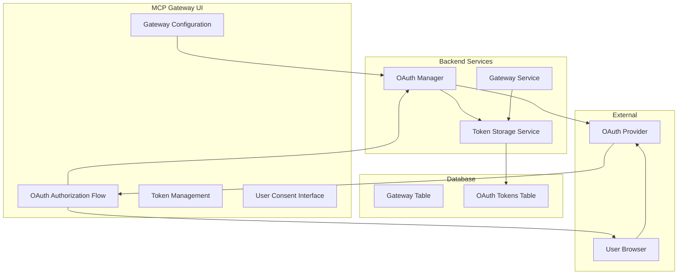
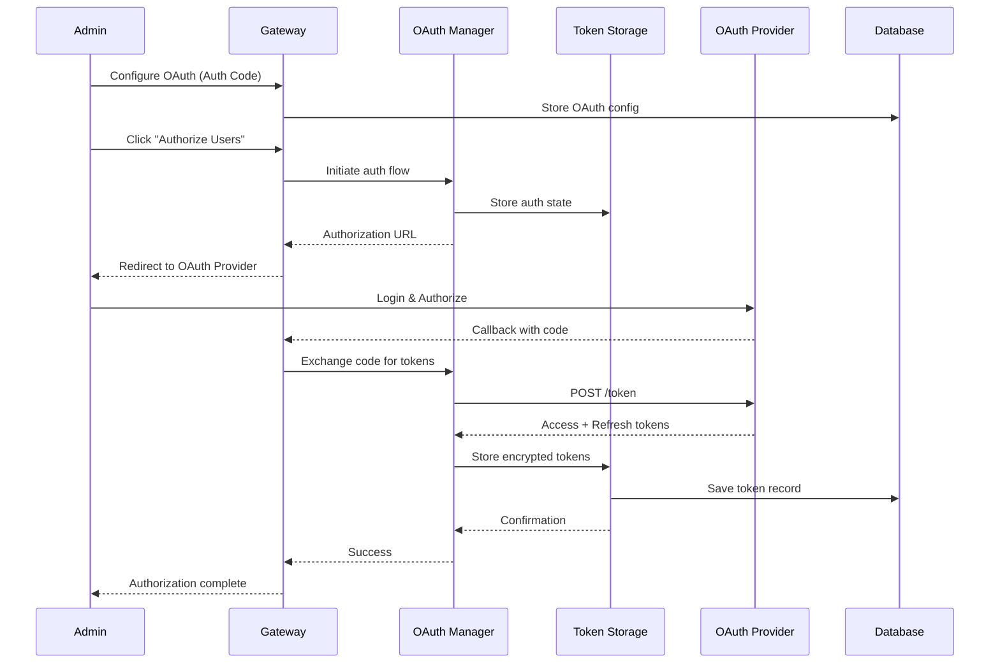
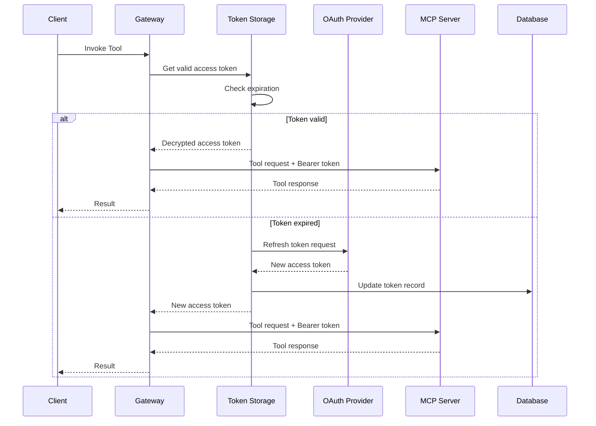

# OAuth 2.0 Authorization Code Flow UI Implementation Design

**Version**: 1.0
**Status**: Design Document
**Date**: December 2024
**Related**: [OAuth Design Document](./oauth-design.md)

## Executive Summary

This document outlines the design for implementing OAuth 2.0 Authorization Code flow with user consent in the MCP Gateway UI. The implementation will extend the existing OAuth infrastructure to support user delegation flows, token storage, and automatic token refresh, enabling agents to act on behalf of users with proper consent and scoped permissions.

## Current State Analysis

### Existing Implementation
- ✅ OAuth Manager service with Client Credentials flow
- ✅ Basic Authorization Code flow support in OAuth Manager
- ✅ OAuth configuration fields in Gateway creation UI
- ✅ OAuth callback endpoint (`/oauth/callback`)
- ✅ Database schema with `oauth_config` JSON field
- ✅ Client secret encryption/decryption

### Current Limitations
- ❌ No token storage mechanism for Authorization Code flow
- ❌ No refresh token handling
- ❌ Incomplete UI flow for user consent
- ❌ No token expiration management
- ❌ Limited error handling for OAuth flows

## Architecture Overview



## Database Schema Changes

### New OAuth Tokens Table

```sql
CREATE TABLE oauth_tokens (
    id VARCHAR(36) PRIMARY KEY DEFAULT (uuid()),
    gateway_id VARCHAR(36) NOT NULL,
    user_id VARCHAR(255) NOT NULL,  -- OAuth provider user ID
    access_token TEXT NOT NULL,
    refresh_token TEXT,
    token_type VARCHAR(50) DEFAULT 'Bearer',
    expires_at TIMESTAMP,
    scopes JSON,
    created_at TIMESTAMP DEFAULT CURRENT_TIMESTAMP,
    updated_at TIMESTAMP DEFAULT CURRENT_TIMESTAMP ON UPDATE CURRENT_TIMESTAMP,

    FOREIGN KEY (gateway_id) REFERENCES gateways(id) ON DELETE CASCADE,
    UNIQUE KEY unique_gateway_user (gateway_id, user_id)
);

-- Index for efficient token lookup
CREATE INDEX idx_oauth_tokens_gateway_user ON oauth_tokens(gateway_id, user_id);
CREATE INDEX idx_oauth_tokens_expires ON oauth_tokens(expires_at);
```

### Modified Gateway Table

```sql
-- Add new fields to existing oauth_config JSON structure
ALTER TABLE gateways
MODIFY COLUMN oauth_config JSON COMMENT 'OAuth 2.0 configuration including grant_type, client_id, encrypted client_secret, URLs, scopes, and token management settings';

-- Updated oauth_config structure:
{
  "grant_type": "client_credentials|authorization_code",
  "client_id": "string",
  "client_secret": "encrypted_string",
  "authorization_url": "string",
  "token_url": "string",
  "redirect_uri": "string",
  "scopes": ["scope1", "scope2"],
  "token_management": {
    "store_tokens": true,
    "auto_refresh": true,
    "refresh_threshold_seconds": 300
  }
}
```

## Core Components

### 1. Token Storage Service

**Location**: `mcpgateway/services/token_storage_service.py`

```python
from datetime import datetime, timedelta
from typing import Optional, Dict, Any, List
from sqlalchemy.orm import Session
from mcpgateway.db import OAuthToken, DbGateway
from mcpgateway.utils.oauth_encryption import get_oauth_encryption

class TokenStorageService:
    """Manages OAuth token storage and retrieval."""

    def __init__(self, db: Session):
        self.db = db
        self.encryption = get_oauth_encryption()

    async def store_tokens(
        self,
        gateway_id: str,
        user_id: str,
        access_token: str,
        refresh_token: Optional[str],
        expires_in: int,
        scopes: List[str]
    ) -> OAuthToken:
        """Store OAuth tokens for a gateway-user combination."""

        # Encrypt sensitive tokens
        encrypted_access = self.encryption.encrypt_secret(access_token)
        encrypted_refresh = None
        if refresh_token:
            encrypted_refresh = self.encryption.encrypt_secret(refresh_token)

        # Calculate expiration
        expires_at = datetime.utcnow() + timedelta(seconds=expires_in)

        # Create or update token record
        token_record = self.db.query(OAuthToken).filter(
            OAuthToken.gateway_id == gateway_id,
            OAuthToken.user_id == user_id
        ).first()

        if token_record:
            # Update existing record
            token_record.access_token = encrypted_access
            token_record.refresh_token = encrypted_refresh
            token_record.expires_at = expires_at
            token_record.scopes = scopes
            token_record.updated_at = datetime.utcnow()
        else:
            # Create new record
            token_record = OAuthToken(
                gateway_id=gateway_id,
                user_id=user_id,
                access_token=encrypted_access,
                refresh_token=encrypted_refresh,
                expires_at=expires_at,
                scopes=scopes
            )
            self.db.add(token_record)

        self.db.commit()
        return token_record
```

    async def get_valid_token(
        self,
        gateway_id: str,
        user_id: str
    ) -> Optional[str]:
        """Get a valid access token, refreshing if necessary."""

        token_record = self.db.query(OAuthToken).filter(
            OAuthToken.gateway_id == gateway_id,
            OAuthToken.user_id == user_id
        ).first()

        if not token_record:
            return None

        # Check if token is expired or near expiration
        if self._is_token_expired(token_record):
            if token_record.refresh_token:
                # Attempt to refresh token
                new_token = await self._refresh_access_token(token_record)
                if new_token:
                    return new_token
            return None

        # Decrypt and return valid token
        return self.encryption.decrypt_secret(token_record.access_token)

    async def _refresh_access_token(self, token_record: OAuthToken) -> Optional[str]:
        """Refresh an expired access token using refresh token."""
        # Implementation for token refresh
        pass

    def _is_token_expired(self, token_record: OAuthToken, threshold_seconds: int = 300) -> bool:
        """Check if token is expired or near expiration."""
        return datetime.utcnow() + timedelta(seconds=threshold_seconds) >= token_record.expires_at
```

### 2. Enhanced OAuth Manager

**Location**: `mcpgateway/services/oauth_manager.py`

```python
class OAuthManager:
    """Enhanced OAuth Manager with token storage support."""

    def __init__(self, token_storage: TokenStorageService):
        self.token_storage = token_storage

    async def initiate_authorization_code_flow(
        self,
        gateway_id: str,
        credentials: Dict[str, Any]
    ) -> Dict[str, str]:
        """Initiate Authorization Code flow and return authorization URL."""

        # Generate state parameter for CSRF protection
        state = self._generate_state(gateway_id)

        # Store state in session/cache for validation
        await self._store_authorization_state(gateway_id, state)

        # Generate authorization URL
        auth_url, _ = self._create_authorization_url(credentials, state)

        return {
            'authorization_url': auth_url,
            'state': state,
            'gateway_id': gateway_id
        }
```

    async def complete_authorization_code_flow(
        self,
        gateway_id: str,
        code: str,
        state: str,
        credentials: Dict[str, Any]
    ) -> Dict[str, Any]:
        """Complete Authorization Code flow and store tokens."""

        # Validate state parameter
        if not await self._validate_authorization_state(gateway_id, state):
            raise OAuthError("Invalid state parameter")

        # Exchange code for tokens
        token_response = await self._exchange_code_for_tokens(credentials, code)

        # Extract user information from token response
        user_id = self._extract_user_id(token_response, credentials)

        # Store tokens
        token_record = await self.token_storage.store_tokens(
            gateway_id=gateway_id,
            user_id=user_id,
            access_token=token_response['access_token'],
            refresh_token=token_response.get('refresh_token'),
            expires_in=token_response.get('expires_in', 3600),
            scopes=token_response.get('scope', '').split()
        )

        return {
            'success': True,
            'user_id': user_id,
            'expires_at': token_record.expires_at.isoformat()
        }

    async def get_access_token_for_user(
        self,
        gateway_id: str,
        user_id: str
    ) -> Optional[str]:
        """Get valid access token for a specific user."""
        return await self.token_storage.get_valid_token(gateway_id, user_id)
```

### 3. OAuth Callback Handler

**Location**: `mcpgateway/routers/oauth_router.py`

```python
from fastapi import APIRouter, Depends, Request, HTTPException
from fastapi.responses import RedirectResponse, HTMLResponse

oauth_router = APIRouter(prefix="/oauth", tags=["oauth"])

@oauth_router.get("/authorize/{gateway_id}")
async def initiate_oauth_flow(
    gateway_id: str,
    request: Request,
    db: Session = Depends(get_db)
) -> RedirectResponse:
    """Initiate OAuth Authorization Code flow."""

    # Get gateway configuration
    gateway = db.query(DbGateway).filter(DbGateway.id == gateway_id).first()
    if not gateway or not gateway.oauth_config:
        raise HTTPException(status_code=404, detail="Gateway not found or not configured for OAuth")

    # Initiate OAuth flow
    oauth_manager = OAuthManager(TokenStorageService(db))
    auth_data = await oauth_manager.initiate_authorization_code_flow(
        gateway_id, gateway.oauth_config
    )

    # Redirect user to OAuth provider
    return RedirectResponse(url=auth_data['authorization_url'])
```

@oauth_router.get("/callback")
async def oauth_callback(
    code: str,
    state: str,
    gateway_id: str,
    request: Request,
    db: Session = Depends(get_db)
) -> HTMLResponse:
    """Handle OAuth callback and complete authorization."""

    try:
        # Complete OAuth flow
        oauth_manager = OAuthManager(TokenStorageService(db))
        gateway = db.query(DbGateway).filter(DbGateway.id == gateway_id).first()

        result = await oauth_manager.complete_authorization_code_flow(
            gateway_id, code, state, gateway.oauth_config
        )

        # Return success page with option to return to admin
        return HTMLResponse(content=f"""
        <!DOCTYPE html>
        <html>
        <head><title>OAuth Authorization Successful</title></head>
        <body>
            <h1>✅ OAuth Authorization Successful</h1>
            <p>Gateway: {gateway.name}</p>
            <p>User: {result['user_id']}</p>
            <p>Expires: {result['expires_at']}</p>
            <a href="/admin#gateways">Return to Admin Panel</a>
        </body>
        </html>
        """)

    except Exception as e:
        return HTMLResponse(content=f"""
        <!DOCTYPE html>
        <html>
        <head><title>OAuth Authorization Failed</title></head>
        <body>
            <h1>❌ OAuth Authorization Failed</h1>
            <p>Error: {str(e)}</p>
            <a href="/admin#gateways">Return to Admin Panel</a>
        </body>
        </html>
        """, status_code=400)
```

## UI Implementation

### 1. Enhanced Gateway Creation Form

**File**: `mcpgateway/templates/admin.html`

```html
<!-- OAuth Configuration Fields -->
<div id="auth-oauth-fields-gw" style="display: none">
  <div class="space-y-4">
    <div>
      <label class="block text-sm font-medium text-gray-700 dark:text-gray-300">
        Grant Type
      </label>
      <select
        name="oauth_grant_type"
        id="oauth-grant-type-gw"
        onchange="toggleOAuthFields()"
        class="mt-1 block w-full rounded-md border border-gray-300 dark:border-gray-700 shadow-sm focus:border-indigo-500 focus:ring-indigo-500 dark:bg-gray-900 dark:placeholder-gray-300 dark:text-gray-300"
      >
        <option value="client_credentials">Client Credentials (Machine-to-Machine)</option>
        <option value="authorization_code">Authorization Code (User Delegation)</option>
      </select>
    </div>

    <!-- Common OAuth fields -->
    <div>
      <label class="block text-sm font-medium text-gray-700 dark:text-gray-300">
        Client ID
      </label>
      <input
        type="text"
        name="oauth_client_id"
        class="mt-1 block w-full rounded-md border border-gray-300 dark:border-gray-700 shadow-sm focus:border-indigo-500 focus:ring-indigo-500 dark:bg-gray-900 dark:placeholder-gray-300 dark:text-gray-300"
        placeholder="Your OAuth client ID"
      />
    </div>
```

    <!-- Authorization Code specific fields -->
    <div id="oauth-auth-code-fields-gw" style="display: none">
      <div>
        <label class="block text-sm font-medium text-gray-700 dark:text-gray-300">
          Authorization URL
        </label>
        <input
          type="url"
          name="oauth_authorization_url"
          class="mt-1 block w-full rounded-md border border-gray-300 dark:border-gray-700 shadow-sm focus:border-indigo-500 focus:ring-indigo-500 dark:bg-gray-900 dark:placeholder-gray-300 dark:text-gray-300"
          placeholder="https://oauth.example.com/authorize"
        />
      </div>

      <div>
        <label class="block text-sm font-medium text-gray-700 dark:text-gray-300">
          Redirect URI
        </label>
        <input
          type="url"
          name="oauth_redirect_uri"
          class="mt-1 block w-full rounded-md border border-gray-300 dark:border-gray-700 shadow-sm focus:border-indigo-500 focus:ring-indigo-500 dark:bg-gray-900 dark:placeholder-gray-300 dark:text-gray-300"
          placeholder="https://gateway.example.com/oauth/callback"
        />
        <p class="mt-1 text-sm text-gray-500">
          This must match the redirect URI configured in your OAuth application
        </p>
      </div>

      <div>
        <label class="block text-sm font-medium text-gray-700 dark:text-gray-300">
          Token Management
        </label>
        <div class="mt-2 space-y-2">
          <label class="flex items-center">
            <input
              type="checkbox"
              name="oauth_store_tokens"
              checked
              class="rounded border-gray-300 text-indigo-600 focus:ring-indigo-500"
            />
            <span class="ml-2 text-sm text-gray-700 dark:text-gray-300">
              Store access tokens for reuse
            </span>
          </label>
          <label class="flex items-center">
            <input
              type="checkbox"
              name="oauth_auto_refresh"
              checked
              class="rounded border-gray-300 text-indigo-600 focus:ring-indigo-500"
            />
            <span class="ml-2 text-sm text-gray-700 dark:text-gray-300">
              Automatically refresh expired tokens
            </span>
          </label>
        </div>
      </div>
    </div>
  </div>
</div>
```

### 2. JavaScript for Dynamic Field Management

**File**: `mcpgateway/static/admin.js`

```javascript
// OAuth field management
function toggleOAuthFields() {
    const grantType = document.getElementById('oauth-grant-type-gw').value;
    const authCodeFields = document.getElementById('oauth-auth-code-fields-gw');

    if (grantType === 'authorization_code') {
        authCodeFields.style.display = 'block';
        // Show additional validation for required fields
        document.querySelectorAll('#oauth-auth-code-fields-gw input').forEach(input => {
            input.required = true;
        });
    } else {
        authCodeFields.style.display = 'none';
        // Remove required validation for hidden fields
        document.querySelectorAll('#oauth-auth-code-fields-gw input').forEach(input => {
            input.required = false;
        });
    }
}

// Enhanced gateway form submission
async function submitGatewayForm(formData) {
    const grantType = formData.get('oauth_grant_type');

    if (grantType === 'authorization_code') {
        // Validate required fields
        const requiredFields = [
            'oauth_authorization_url',
            'oauth_redirect_uri'
        ];

        for (const field of requiredFields) {
            if (!formData.get(field)) {
                showError(`Field ${field} is required for Authorization Code flow`);
                return false;
            }
        }

        // Check if redirect URI matches expected pattern
        const redirectUri = formData.get('oauth_redirect_uri');
        const expectedPattern = window.location.origin + '/oauth/callback';

        if (!redirectUri.includes('/oauth/callback')) {
            showWarning('Redirect URI should typically end with /oauth/callback for security');
        }
    }

    return true;
}
```

### 3. Gateway Management Interface

**Enhanced Gateway List View**

```html
<!-- Gateway Status and OAuth Information -->
<td class="px-6 py-4 whitespace-nowrap text-sm text-gray-900 dark:text-gray-300">
  <div class="space-y-1">
    <div class="flex items-center">
      <span class="text-gray-500">Status:</span>
      
        <span class="ml-2 inline-flex items-center px-2.5 py-0.5 rounded-full text-xs font-medium bg-green-100 text-green-800">
          Active
        </span>
      
        <span class="ml-2 inline-flex items-center px-2.5 py-0.5 rounded-full text-xs font-medium bg-red-100 text-red-800">
          Inactive
        </span>
      
    </div>

    
      <div class="text-xs text-gray-500">
        OAuth: {{ gateway.oauth_config.grant_type.replace('_', ' ').title() }}
        
          <br>
          <a href="/oauth/authorize/{{ gateway.id }}"
             class="text-indigo-600 hover:text-indigo-500 underline">
            🔐 Authorize Users
          </a>
        
      </div>
    
  </div>
</td>
```

## OAuth Flow Sequences

### Authorization Code Flow with Token Storage



### Tool Invocation with Stored Tokens



## Security Considerations

### 1. Token Security
- **Encryption**: All tokens stored encrypted using `AUTH_ENCRYPTION_SECRET`
- **Access Control**: Tokens only accessible to authorized gateway operations
- **Audit Logging**: Track all token operations and access attempts

### 2. OAuth Flow Security
- **State Validation**: CSRF protection using state parameters
- **Redirect URI Validation**: Strict validation of callback URLs
- **Scope Limitation**: Request minimum required scopes only
- **HTTPS Enforcement**: All OAuth endpoints require HTTPS

### 3. Data Protection
- **Token Expiration**: Automatic cleanup of expired tokens
- **User Consent**: Clear indication of what permissions are granted
- **Revocation Support**: Ability to revoke user access when needed

## Configuration

### Environment Variables

```env
# OAuth Token Management
OAUTH_TOKEN_CLEANUP_INTERVAL=3600        # Token cleanup interval in seconds
OAUTH_TOKEN_EXPIRY_THRESHOLD=300         # Refresh tokens this many seconds before expiry
OAUTH_MAX_STORED_TOKENS_PER_GATEWAY=100  # Maximum tokens to store per gateway

# Security
OAUTH_STATE_EXPIRY=300                   # Authorization state expiry in seconds
OAUTH_MAX_AUTHORIZATION_ATTEMPTS=5        # Maximum failed authorization attempts
```

### Example Gateway Configuration

```json
{
  "name": "GitHub MCP with User Delegation",
  "url": "https://github-mcp.example.com/sse",
  "auth_type": "oauth",
  "oauth_config": {
    "grant_type": "authorization_code",
    "client_id": "your_github_app_id",
    "client_secret": "your_github_app_secret",
    "authorization_url": "https://github.com/login/oauth/authorize",
    "token_url": "https://github.com/login/oauth/access_token",
    "redirect_uri": "https://gateway.example.com/oauth/callback",
    "scopes": ["repo", "read:user"],
    "token_management": {
      "store_tokens": true,
      "auto_refresh": true,
      "refresh_threshold_seconds": 300
    }
  }
}
```

## Implementation Phases

### Phase 1: Database and Core Services (Week 1)
- [ ] Create `oauth_tokens` table
- [ ] Implement `TokenStorageService`
- [ ] Enhance `OAuthManager` with token storage
- [ ] Add token refresh functionality

### Phase 2: OAuth Router and Callback (Week 2)
- [ ] Implement OAuth authorization router
- [ ] Create callback handler with token storage
- [ ] Add state management and validation
- [ ] Implement user ID extraction from tokens

### Phase 3: UI Enhancements (Week 3)
- [ ] Update gateway creation form
- [ ] Add dynamic field management
- [ ] Implement authorization flow UI
- [ ] Add token status display

### Phase 4: Integration and Testing (Week 4)
- [ ] Integrate with existing gateway service
- [ ] Update tool invocation to use stored tokens
- [ ] Comprehensive testing of OAuth flows
- [ ] Security review and documentation

## Testing Strategy

### Unit Tests

```python
async def test_token_storage_service():
    """Test token storage and retrieval."""
    service = TokenStorageService(db)

    # Test token storage
    token_record = await service.store_tokens(
        gateway_id="test_gateway",
        user_id="test_user",
        access_token="test_token",
        refresh_token="test_refresh",
        expires_in=3600,
        scopes=["repo", "read:user"]
    )

    assert token_record is not None
    assert token_record.user_id == "test_user"

    # Test token retrieval
    token = await service.get_valid_token("test_gateway", "test_user")
    assert token == "test_token"

async def test_authorization_code_flow():
    """Test complete authorization code flow."""
    oauth_manager = OAuthManager(TokenStorageService(db))

    # Test flow initiation
    auth_data = await oauth_manager.initiate_authorization_code_flow(
        "test_gateway", test_credentials
    )

    assert "authorization_url" in auth_data
    assert "state" in auth_data
```

### Integration Tests

```python
async def test_oauth_callback_end_to_end():
    """Test complete OAuth callback flow."""
    # Mock OAuth provider responses
    with responses.RequestsMock() as rsps:
        rsps.add(
            responses.POST,
            "https://oauth.example.com/token",
            json={
                "access_token": "test_access_token",
                "refresh_token": "test_refresh_token",
                "expires_in": 3600,
                "scope": "repo read:user"
            }
        )

        # Test callback
        response = await client.get(
            "/oauth/callback",
            params={
                "code": "test_code",
                "state": "test_state",
                "gateway_id": "test_gateway"
            }
        )

        assert response.status_code == 200
        assert "OAuth Authorization Successful" in response.text
```

## Future Enhancements

### 1. Advanced Token Management
- **Token Rotation**: Automatic token rotation for enhanced security
- **Multi-User Support**: Support for multiple users per gateway
- **Token Analytics**: Usage analytics and monitoring

### 2. OAuth Provider Templates
- **Pre-configured Providers**: Templates for GitHub, GitLab, etc.
- **Provider-Specific Scopes**: Recommended scopes for common providers
- **Auto-discovery**: OAuth provider metadata discovery

### 3. Enhanced Security
- **PKCE Support**: Proof Key for Code Exchange for public clients
- **JWT Validation**: Support for JWT-based tokens
- **Audit Trail**: Comprehensive audit logging for compliance

## Conclusion

This design provides a comprehensive framework for implementing OAuth 2.0 Authorization Code flow with user consent in the MCP Gateway UI. The implementation balances security, usability, and maintainability while extending the existing OAuth infrastructure.

Key benefits of this approach:
- **User Consent**: Proper user delegation with scoped permissions
- **Token Efficiency**: Reuse of valid tokens with automatic refresh
- **Security**: Encrypted token storage and comprehensive validation
- **Scalability**: Support for multiple users and gateways
- **Maintainability**: Clean separation of concerns and modular design

The phased implementation approach ensures minimal disruption to existing functionality while delivering value incrementally. The design follows OAuth 2.0 best practices and provides a solid foundation for future enhancements.
