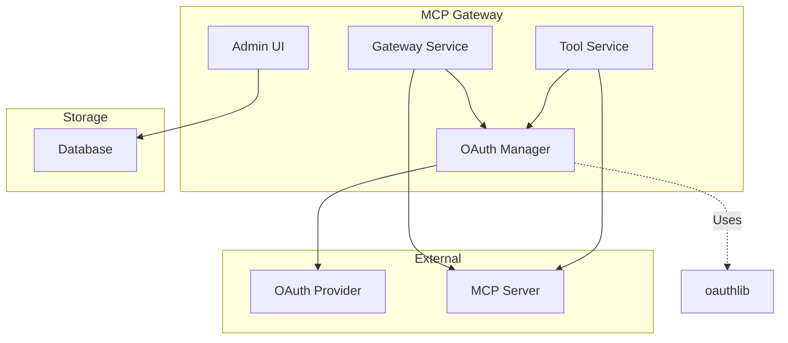
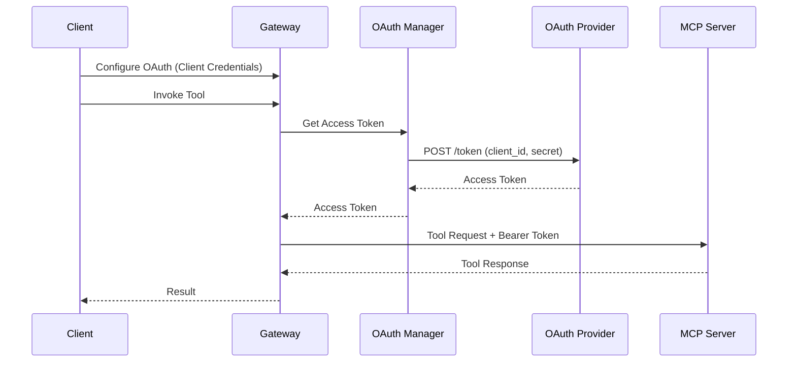
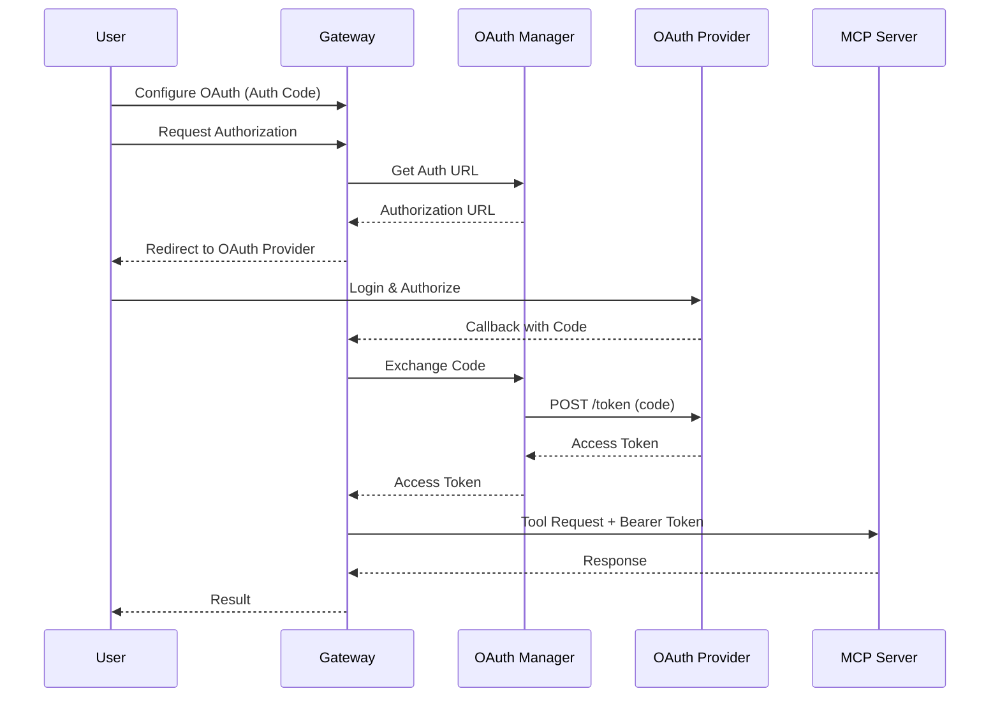

# OAuth 2.0 Integration Design for MCP Gateway

**Version**: 1.0
**Status**: Draft
**Date**: December 2024

## Executive Summary

This document outlines the design for integrating OAuth 2.0 authentication into the MCP Gateway, enabling agents to perform actions on behalf of users without requiring personal access tokens (PATs). The implementation will use the `oauthlib` library and support Client Credentials and Authorization Code flows following OAuth 2.0 best practices.

## Motivation

Current limitations:
- Personal Access Tokens (PATs) provide broad access with security risks
- Manual token management across multiple services
- No native support for delegated authorization with scoped permissions

OAuth 2.0 provides:
- Standardized authentication flows
- Scoped access control
- Temporary access without storing user credentials
- Industry-standard security practices

## Architecture Overview



## Database Schema

### Modified Gateway Table

```sql
ALTER TABLE gateways
ADD COLUMN oauth_config JSON;

-- OAuth config structure:
{
  "grant_type": "client_credentials|authorization_code",
  "client_id": "string",
  "client_secret": "encrypted_string",
  "authorization_url": "string",
  "token_url": "string",
  "redirect_uri": "string",
  "scopes": ["scope1", "scope2"]
}
```

## Core Components

### 1. OAuth Manager Service

**Location**: `mcpgateway/services/oauth_manager.py`

```python
from oauthlib.oauth2 import BackendApplicationClient, WebApplicationClient
from requests_oauthlib import OAuth2Session
from typing import Optional, Dict, Any

class OAuthManager:
    """Manages OAuth 2.0 authentication flows."""

    async def get_access_token(
        self,
        credentials: Dict[str, Any]
    ) -> str:
        """Get access token based on grant type."""
        if credentials['grant_type'] == 'client_credentials':
            return await self._client_credentials_flow(credentials)
        elif credentials['grant_type'] == 'authorization_code':
            return await self._authorization_code_flow(credentials)
        else:
            raise ValueError(f"Unsupported grant type: {credentials['grant_type']}")

    async def _client_credentials_flow(
        self,
        credentials: Dict[str, Any]
    ) -> str:
        """Machine-to-machine authentication."""
        client = BackendApplicationClient(client_id=credentials['client_id'])
        oauth = OAuth2Session(client=client)

        token = oauth.fetch_token(
            token_url=credentials['token_url'],
            client_id=credentials['client_id'],
            client_secret=credentials['client_secret'],
            scope=credentials.get('scopes', [])
        )

        return token['access_token']

    async def _authorization_code_flow(
        self,
        credentials: Dict[str, Any]
    ) -> Dict[str, str]:
        """User delegation flow - returns authorization URL."""
        oauth = OAuth2Session(
            credentials['client_id'],
            redirect_uri=credentials['redirect_uri'],
            scope=credentials.get('scopes', [])
        )

        authorization_url, state = oauth.authorization_url(
            credentials['authorization_url']
        )

        return {
            'authorization_url': authorization_url,
            'state': state
        }

    async def exchange_code_for_token(
        self,
        credentials: Dict[str, Any],
        code: str,
        state: str
    ) -> str:
        """Exchange authorization code for access token."""
        oauth = OAuth2Session(
            credentials['client_id'],
            state=state,
            redirect_uri=credentials['redirect_uri']
        )

        token = oauth.fetch_token(
            credentials['token_url'],
            client_secret=credentials['client_secret'],
            authorization_response=f"{credentials['redirect_uri']}?code={code}&state={state}"
        )

        return token['access_token']
```

### 2. Admin UI OAuth Configuration

```html
<div id="oauth-config" class="auth-config">
  <h4>OAuth 2.0 Configuration</h4>

  <div class="form-group">
    <label>Grant Type</label>
    <select name="oauth_grant_type" class="form-control">
      <option value="client_credentials">Client Credentials (M2M)</option>
      <option value="authorization_code">Authorization Code (User)</option>
    </select>
  </div>

  <div class="form-group">
    <label>Client ID</label>
    <input type="text" name="oauth_client_id" class="form-control" required>
  </div>

  <div class="form-group">
    <label>Client Secret</label>
    <input type="password" name="oauth_client_secret" class="form-control" required>
  </div>

  <div class="form-group">
    <label>Token URL</label>
    <input type="url" name="oauth_token_url" class="form-control" required>
  </div>

  <div class="form-group auth-code-only">
    <label>Authorization URL</label>
    <input type="url" name="oauth_authorization_url" class="form-control">
  </div>

  <div class="form-group auth-code-only">
    <label>Redirect URI</label>
    <input type="url" name="oauth_redirect_uri" class="form-control">
  </div>

  <div class="form-group">
    <label>Scopes (space-separated)</label>
    <input type="text" name="oauth_scopes" class="form-control">
  </div>
</div>
```

## Implementation Details

### Gateway Service Integration

**File**: `mcpgateway/services/gateway_service.py`

```python
async def _initialize_gateway(
    self,
    url: str,
    authentication: Optional[Dict[str, str]] = None,
    transport: str = "SSE"
) -> tuple:
    """Initialize gateway with OAuth support."""

    headers = {}

    if authentication and authentication.get('type') == 'oauth':
        # Get OAuth credentials from database
        gateway = await self._get_gateway(authentication['gateway_id'])
        oauth_config = gateway.oauth_config

        # Get access token
        access_token = await self.oauth_manager.get_access_token(oauth_config)
        headers = {'Authorization': f'Bearer {access_token}'}
    else:
        # Existing authentication logic
        headers = decode_auth(authentication)

    # Connect to MCP server
    return await self._connect_to_gateway(url, headers, transport)
```

### Tool Service Integration

**File**: `mcpgateway/services/tool_service.py`

```python
async def invoke_tool(
    self,
    db: Session,
    name: str,
    arguments: Dict[str, Any]
) -> ToolResult:
    """Invoke tool with OAuth support."""

    tool = await self.get_tool_by_name(db, name)
    headers = {}

    if tool.gateway and tool.gateway.auth_type == 'oauth':
        # Get fresh access token for each request
        oauth_config = tool.gateway.oauth_config
        access_token = await self.oauth_manager.get_access_token(oauth_config)
        headers = {'Authorization': f'Bearer {access_token}'}
    else:
        # Existing authentication
        headers = self._get_tool_headers(tool)

    # Execute tool
    return await self._execute_tool(tool, arguments, headers)
```

## OAuth Flow Sequences

### Client Credentials Flow (M2M)



### Authorization Code Flow



## Security Considerations

1. **Token Storage**: Access tokens are never stored - requested fresh for each operation
2. **Secret Encryption**: Client secrets encrypted using `AUTH_ENCRYPTION_SECRET`
3. **HTTPS Required**: All OAuth endpoints must use HTTPS
4. **Scope Validation**: Request minimum required scopes
5. **Error Handling**: Comprehensive error handling for OAuth failures

## Configuration

### Environment Variables

```env
# OAuth Configuration
OAUTH_REQUEST_TIMEOUT=30        # OAuth request timeout in seconds
OAUTH_MAX_RETRIES=3            # Max retries for token requests

# Encryption
AUTH_ENCRYPTION_SECRET=your-secret-key  # For encrypting client secrets
```

### Example Gateway Configuration

```json
{
  "name": "GitHub MCP",
  "url": "https://github-mcp.example.com/sse",
  "auth_type": "oauth",
  "oauth_config": {
    "grant_type": "authorization_code",
    "client_id": "your_github_app_id",
    "client_secret": "your_github_app_secret",
    "authorization_url": "https://github.com/login/oauth/authorize",
    "token_url": "https://github.com/login/oauth/access_token",
    "redirect_uri": "https://gateway.example.com/oauth/callback",
    "scopes": ["repo", "read:user"]
  }
}
```

## Implementation Phases

### Phase 1: Core OAuth Support (Week 1)
- Implement OAuth Manager
- Add database schema changes
- Client Credentials flow

### Phase 2: UI Integration (Week 2)
- Admin UI OAuth configuration
- Authorization Code flow
- OAuth callback endpoint

### Phase 3: Testing & Documentation (Week 3)
- Integration tests
- Security review
- User documentation

## Dependencies

```toml
# Add to pyproject.toml
dependencies = [
    "oauthlib>=3.2.2",
    "requests-oauthlib>=1.3.1",
    "cryptography>=41.0.0",  # For secret encryption
]
```

## Testing

### Unit Tests

```python
async def test_client_credentials_flow():
    oauth_manager = OAuthManager()
    credentials = {
        "grant_type": "client_credentials",
        "client_id": "test_client",
        "client_secret": "test_secret",
        "token_url": "https://oauth.example.com/token"
    }

    token = await oauth_manager.get_access_token(credentials)
    assert token is not None
    assert isinstance(token, str)

async def test_tool_invocation_with_oauth():
    tool_service = ToolService(oauth_manager)
    result = await tool_service.invoke_tool(
        db=db,
        name="github_create_issue",
        arguments={"title": "Test Issue"}
    )
    assert result.success
```

## Future Enhancements

1. **OAuth Provider Templates**: Pre-configured settings for common providers
2. **Token Refresh**: Support refresh tokens for long-lived access
3. **PKCE Support**: Add PKCE for public clients
4. **Multiple OAuth Configs**: Support different OAuth configs per tool

## Conclusion

This OAuth 2.0 integration provides secure, standards-based authentication for MCP Gateway without the complexity of token caching. By requesting fresh tokens for each operation, we ensure simplicity while maintaining security. The implementation follows OAuth 2.0 best practices and enables seamless integration with various OAuth providers.
