# Plugin Framework Architecture

The MCP Context Forge Gateway implements a comprehensive, platform-agnostic plugin framework for AI safety middleware, security processing, and extensible gateway capabilities. This document provides a detailed architectural overview of the plugin system implementation, focusing on both **self-contained plugins** (running in-process) and **external/remote plugins** (as MCP servers) through a unified, reusable interface.

## Overview

The plugin framework is designed as a **standalone, platform-agnostic ecosystem** that can be embedded in any application requiring extensible middleware processing. It enables both **self-contained plugins** (running in-process) and **external plugin integrations** (remote MCP servers) through a unified interface. This hybrid approach balances performance, security, and operational requirements while providing maximum flexibility for deployment across different environments and platforms.

### Key Design Principles

- **Platform Agnostic**: Framework can be integrated into any Python application
- **Protocol Neutral**: Supports multiple transport mechanisms (HTTP, WebSocket, STDIO, SSE)
- **MCP Native**: Remote plugins are fully compliant MCP servers
- **Security First**: Comprehensive timeout protection, input validation, and isolation
- **Production Ready**: Built for high-throughput, low-latency enterprise environments

## Architecture Components

The plugin framework is built around a modular, extensible architecture that supports multiple deployment patterns and integration scenarios.

### Core Framework Structure

```
mcpgateway/plugins/framework/
├── base.py              # Plugin base classes and PluginRef
├── models.py            # Pydantic models for all plugin types
├── manager.py           # PluginManager singleton with lifecycle management
├── registry.py          # Plugin instance registry and discovery
├── constants.py         # Framework constants and enums
├── errors.py            # Plugin-specific exception types
├── utils.py             # Utility functions for plugin operations
├── loader/
│   ├── config.py        # Configuration loading and validation
│   └── plugin.py        # Dynamic plugin loading and instantiation
└── external/
    └── mcp/             # MCP external service integration
        ├── client.py    # MCP client for external plugin communication
        └── server/      # MCP server runtime for plugin hosting
            ├── server.py    # MCP server implementation
            └── runtime.py   # Plugin runtime management
```

### Plugin Types and Deployment Patterns

The framework supports three distinct plugin deployment patterns:

#### 1. **Self-Contained Plugins** (In-Process)
- Execute within the main application process
- Written in Python and extend the base `Plugin` class
- Fastest execution with shared memory access
- Examples: regex filters, simple transforms, validation

#### 2. **External Plugins** (Remote MCP Servers)
- Standalone MCP servers implementing plugin logic
- Can be written in any language (Python, TypeScript, Go, Rust, etc.)
- Communicate via MCP protocol (HTTP, WebSocket, STDIO)
- Examples: LlamaGuard, OpenAI Moderation, custom AI services

#### 3. **Hybrid Plugins** (Platform Integration)
- Combine self-contained and external patterns
- Self-contained wrapper that orchestrates external services
- Enables complex workflows and service composition

## Plugin System Architecture

The plugin framework implements a sophisticated execution pipeline designed for enterprise-grade performance, security, and reliability.

### Architectural Overview

```mermaid
flowchart TB
    subgraph "Request Lifecycle"
        Client["🧑‍💻 Client Request"] --> Gateway["🌐 MCP Gateway"]
        Gateway --> PM["🔌 Plugin Manager"]
        PM --> Pipeline["⚡ Execution Pipeline"]
        Pipeline --> Response["📤 Response"]
    end

    subgraph "Plugin Manager Components"
        PM --> Registry["📋 Plugin Registry"]
        PM --> Config["⚙️ Configuration Loader"]
        PM --> Executor["🔄 Plugin Executor"]
        PM --> Context["📊 Context Manager"]
    end

    subgraph "Plugin Types"
        SelfContained["📦 Self-Contained\\n(In-Process)"]
        External["🌍 External/Remote\\n(MCP Servers)"]
        Hybrid["🔗 Hybrid\\n(Orchestration)"]
    end

    subgraph "Hook Points"
        PPF["🔍 prompt_pre_fetch"]
        PPO["✅ prompt_post_fetch"]
        TPI["🛠️ tool_pre_invoke"]
        TPO["✅ tool_post_invoke"]
        RPF["📄 resource_pre_fetch"]
        RPO["✅ resource_post_fetch"]
    end

    subgraph "External Integration"
        MCP["📡 MCP Protocol"]
        HTTP["🌐 HTTP/REST"]
        WS["⚡ WebSocket"]
        STDIO["💻 STDIO"]
        SSE["📡 Server-Sent Events"]
    end

    Registry --> SelfContained
    Registry --> External
    Registry --> Hybrid

    Executor --> PPF
    Executor --> PPO
    Executor --> TPI
    Executor --> TPO
    Executor --> RPF
    Executor --> RPO

    External --> MCP
    MCP --> HTTP
    MCP --> WS
    MCP --> STDIO
    MCP --> SSE

    style Client fill:#e1f5fe
    style Gateway fill:#f3e5f5
    style PM fill:#fff3e0
    style SelfContained fill:#e8f5e8
    style External fill:#fff8e1
    style Hybrid fill:#fce4ec
```



### 1. Base Plugin Classes

```python
class Plugin:
    """Base plugin for self-contained, in-process plugins"""

    def __init__(self, config: PluginConfig):
        self._config = config

    async def prompt_pre_fetch(self, payload: PromptPrehookPayload,
                              context: PluginContext) -> PromptPrehookResult:
        """Process prompts before template rendering"""
        raise NotImplementedError

    async def prompt_post_fetch(self, payload: PromptPosthookPayload,
                               context: PluginContext) -> PromptPosthookResult:
        """Process prompts after template rendering"""
        raise NotImplementedError

    async def tool_pre_invoke(self, payload: ToolPreInvokePayload,
                             context: PluginContext) -> ToolPreInvokeResult:
        """Process tool calls before execution"""
        raise NotImplementedError

    async def tool_post_invoke(self, payload: ToolPostInvokePayload,
                              context: PluginContext) -> ToolPostInvokeResult:
        """Process tool results after execution"""
        raise NotImplementedError

    async def resource_pre_fetch(self, payload: ResourcePreFetchPayload,
                                context: PluginContext) -> ResourcePreFetchResult:
        """Process resource requests before fetching"""
        raise NotImplementedError

    async def resource_post_fetch(self, payload: ResourcePostFetchPayload,
                                 context: PluginContext) -> ResourcePostFetchResult:
        """Process resource content after fetching"""
        raise NotImplementedError
```

### 2. Plugin Reference System

```python
class PluginRef:
    """Plugin reference with UUID tracking for lifecycle management"""

    def __init__(self, plugin: Plugin):
        self._plugin = plugin
        self._uuid = uuid.uuid4()  # Unique instance identifier

    @property
    def plugin(self) -> Plugin:
        return self._plugin

    @property
    def uuid(self) -> str:
        return self._uuid.hex
```

## Hook System

### Available Hook Points

The framework provides six primary hook points covering the complete MCP request/response lifecycle:

```python
class HookType(str, Enum):
    PROMPT_PRE_FETCH = "prompt_pre_fetch"     # Before prompt retrieval and rendering
    PROMPT_POST_FETCH = "prompt_post_fetch"   # After prompt template rendering
    TOOL_PRE_INVOKE = "tool_pre_invoke"       # Before tool execution
    TOOL_POST_INVOKE = "tool_post_invoke"     # After tool execution
    RESOURCE_PRE_FETCH = "resource_pre_fetch" # Before resource fetching
    RESOURCE_POST_FETCH = "resource_post_fetch" # After resource content retrieval
```

### Hook Execution Flow


## Plugin Execution Model

### Priority-Based Sequential Execution

```python
class PluginExecutor(Generic[T]):
    """Executes plugins in priority order with timeout protection"""

    async def execute(self, plugins: list[PluginRef], payload: T,
                     global_context: GlobalContext, ...) -> tuple[PluginResult[T], PluginContextTable]:
        for plugin in sorted_plugins_by_priority:
            # Check if plugin conditions match current context
            if plugin.conditions and not matches_conditions(payload, plugin.conditions, global_context):
                continue

            try:
                # Execute with timeout protection
                result = await asyncio.wait_for(
                    plugin_execution(plugin, payload, context),
                    timeout=self.timeout
                )

                # Handle result based on plugin mode
                if not result.continue_processing:
                    if plugin.mode == PluginMode.ENFORCE:
                        return block_request_with_violation(result)
                    elif plugin.mode == PluginMode.PERMISSIVE:
                        log_warning_and_continue(result)

                # Apply payload modifications for next plugin
                if result.modified_payload:
                    payload = result.modified_payload

            except asyncio.TimeoutError:
                handle_plugin_timeout(plugin)
            except Exception as e:
                handle_plugin_error(plugin, e)
```

### Plugin Modes

```python
class PluginMode(str, Enum):
    ENFORCE = "enforce"      # Block requests that violate plugin rules
    PERMISSIVE = "permissive"  # Log violations but allow requests to continue
    DISABLED = "disabled"    # Plugin is loaded but not executed
```

## Configuration System

### Plugin Configuration Schema

```yaml
# plugins/config.yaml
plugins:
  - name: "PIIFilterPlugin"
    kind: "plugins.pii_filter.pii_filter.PIIFilterPlugin"
    description: "Detects and masks Personally Identifiable Information"
    version: "0.1.0"
    author: "Security Team"
    hooks: ["prompt_pre_fetch", "prompt_post_fetch", "tool_pre_invoke", "tool_post_invoke"]
    tags: ["security", "pii", "compliance", "filter"]
    mode: "enforce"  # enforce | permissive | disabled
    priority: 50     # Lower number = higher priority (runs first)
    conditions:
      - server_ids: ["prod-server"]  # Apply only to specific servers
        tenant_ids: ["enterprise"]   # Apply only to specific tenants
        tools: ["sensitive-tool"]    # Apply only to specific tools
        prompts: ["user-prompt"]     # Apply only to specific prompts
    config:
      # Plugin-specific configuration
      detect_ssn: true
      detect_credit_card: true
      mask_strategy: "partial"
      redaction_text: "[PII_REDACTED]"
```

### Configuration Models

```python
class PluginConfig(BaseModel):
    name: str                                    # Unique plugin identifier
    kind: str                                    # Plugin class path or "external"
    description: Optional[str] = None            # Human-readable description
    version: Optional[str] = None                # Plugin version
    hooks: Optional[list[HookType]] = None       # Hook points to register
    tags: Optional[list[str]] = None             # Searchable tags
    mode: PluginMode = PluginMode.ENFORCE        # Execution mode
    priority: Optional[int] = None               # Execution priority (lower = higher)
    conditions: Optional[list[PluginCondition]] = None  # Conditional execution rules
    config: Optional[dict[str, Any]] = None      # Plugin-specific settings
    mcp: Optional[MCPConfig] = None              # External service configuration

class PluginCondition(BaseModel):
    server_ids: Optional[set[str]] = None        # Target server IDs
    tenant_ids: Optional[set[str]] = None        # Target tenant IDs
    tools: Optional[set[str]] = None             # Target tool names
    prompts: Optional[set[str]] = None           # Target prompt names
    resources: Optional[set[str]] = None         # Target resource URIs
    user_patterns: Optional[list[str]] = None    # User pattern matching
    content_types: Optional[list[str]] = None    # Content type filtering
```

## Context Management

### Plugin Context System

```python
class GlobalContext(BaseModel):
    """Shared context across all plugins in a request"""
    request_id: str                  # Unique request identifier
    user: Optional[str] = None       # User making the request
    tenant_id: Optional[str] = None  # Tenant context
    server_id: Optional[str] = None  # Virtual server context

class PluginContext(GlobalContext):
    """Per-plugin context with state management"""
    state: dict[str, Any] = {}       # Cross-plugin shared state
    metadata: dict[str, Any] = {}    # Plugin execution metadata

    def get_state(self, key: str, default: Any = None) -> Any:
        """Get value from shared state"""
        return self.state.get(key, default)

    def set_state(self, key: str, value: Any) -> None:
        """Set value in shared state"""
        self.state[key] = value
```

### Context Lifecycle Management

```python
class PluginManager:
    # Context cleanup tracking
    _context_store: Dict[str, Tuple[PluginContextTable, float]] = {}
    _last_cleanup: float = 0

    async def _cleanup_old_contexts(self) -> None:
        """Remove contexts older than CONTEXT_MAX_AGE to prevent memory leaks"""
        current_time = time.time()

        if current_time - self._last_cleanup < CONTEXT_CLEANUP_INTERVAL:
            return

        # Find and remove expired contexts
        expired_keys = [
            key for key, (_, timestamp) in self._context_store.items()
            if current_time - timestamp > CONTEXT_MAX_AGE
        ]

        for key in expired_keys:
            del self._context_store[key]
```

## Plugin Manager

### Singleton Architecture

```python
class PluginManager:
    """Singleton plugin manager for lifecycle management"""

    __shared_state: dict[Any, Any] = {}  # Singleton state sharing

    def __init__(self, config: str = "", timeout: int = DEFAULT_PLUGIN_TIMEOUT):
        self.__dict__ = self.__shared_state  # Share state across instances

        if config:
            self._config = ConfigLoader.load_config(config)

        # Initialize executors with timeout
        self._pre_prompt_executor = PluginExecutor[PromptPrehookPayload](timeout)
        self._post_prompt_executor = PluginExecutor[PromptPosthookPayload](timeout)
        # ... other executors

    async def initialize(self) -> None:
        """Load and initialize all configured plugins"""
        plugins = self._config.plugins if self._config else []

        for plugin_config in plugins:
            if plugin_config.mode != PluginMode.DISABLED:
                plugin = await self._loader.load_and_instantiate_plugin(plugin_config)
                self._registry.register(plugin)

    async def shutdown(self) -> None:
        """Shutdown all plugins and cleanup resources"""
        await self._registry.shutdown()
        self._context_store.clear()
        self._initialized = False
```

### Hook Execution Methods

```python
async def prompt_pre_fetch(
    self,
    payload: PromptPrehookPayload,
    global_context: GlobalContext,
    local_contexts: Optional[PluginContextTable] = None,
) -> tuple[PromptPrehookResult, PluginContextTable | None]:
    """Execute pre-fetch hooks before prompt retrieval"""

    # Cleanup old contexts periodically
    await self._cleanup_old_contexts()

    # Get plugins registered for this hook
    plugins = self._registry.get_plugins_for_hook(HookType.PROMPT_PRE_FETCH)

    # Execute plugins with timeout protection
    result = await self._pre_prompt_executor.execute(
        plugins, payload, global_context,
        pre_prompt_fetch, pre_prompt_matches, local_contexts
    )

    # Store contexts for potential reuse in post-fetch
    if result[1]:
        self._context_store[global_context.request_id] = (result[1], time.time())

    return result
```

## Security and Protection

### Timeout Protection

```python
class PluginExecutor:
    async def _execute_with_timeout(self, plugin: PluginRef,
                                   plugin_run: Callable, payload: T,
                                   context: PluginContext) -> PluginResult[T]:
        """Execute plugin with timeout protection"""
        return await asyncio.wait_for(
            plugin_run(plugin, payload, context),
            timeout=self.timeout  # Default 30 seconds
        )
```

### Payload Size Validation

```python
def _validate_payload_size(self, payload: Any) -> None:
    """Validate that payload doesn't exceed size limits"""
    if hasattr(payload, "args") and payload.args:
        total_size = sum(len(str(v)) for v in payload.args.values())
        if total_size > MAX_PAYLOAD_SIZE:  # 1MB limit
            raise PayloadSizeError(f"Payload size {total_size} exceeds limit")
```

### Error Isolation

```python
async def execute(self, plugins: list[PluginRef], ...) -> tuple[PluginResult[T], PluginContextTable]:
    for plugin in plugins:
        try:
            result = await self._execute_with_timeout(plugin, ...)
            # Process result...

        except asyncio.TimeoutError:
            logger.error(f"Plugin {plugin.name} timed out after {self.timeout}s")
            if plugin.mode == PluginMode.ENFORCE:
                return create_timeout_violation()

        except Exception as e:
            logger.error(f"Plugin {plugin.name} failed: {str(e)}", exc_info=True)
            if plugin.mode == PluginMode.ENFORCE:
                return create_error_violation(e)
            # In permissive mode, continue with next plugin
```

## External Service Integration

### MCP External Plugin Support

```python
class MCPConfig(BaseModel):
    """Configuration for external MCP plugin services"""
    proto: TransportType                    # STDIO, SSE, or STREAMABLEHTTP
    url: Optional[str] = None              # Service URL for HTTP transports
    script: Optional[str] = None           # Script path for STDIO transport

    @field_validator("url")
    @classmethod
    def validate_url(cls, url: str | None) -> str | None:
        if url:
            return SecurityValidator.validate_url(url)
        return url
```

### External Service Authentication

```python
class ExternalServiceAuth(BaseModel):
    """Authentication configuration for external services"""
    type: str  # "bearer", "basic", "api_key", "custom_header"
    token: Optional[str] = None
    username: Optional[str] = None
    password: Optional[str] = None
    api_key: Optional[str] = None
    header_name: Optional[str] = None
    header_value: Optional[str] = None
```

## Plugin Types

### Built-in Plugin Examples

#### 1. PII Filter Plugin (Self-Contained)

```python
class PIIFilterPlugin(Plugin):
    """Detects and masks Personally Identifiable Information"""

    async def prompt_pre_fetch(self, payload: PromptPrehookPayload,
                              context: PluginContext) -> PromptPrehookResult:
        pii_patterns = self._load_pii_patterns()
        violations = []

        for arg_name, arg_value in payload.args.items():
            detected_pii = self._scan_for_pii(arg_value, pii_patterns)
            if detected_pii:
                if self.config.get("block_on_detection", False):
                    violation = PluginViolation(
                        reason="PII detected in prompt arguments",
                        description=f"Found {len(detected_pii)} PII items in {arg_name}",
                        code="PII_DETECTED",
                        details={"field": arg_name, "types": detected_pii}
                    )
                    return PluginResult(
                        continue_processing=False,
                        violation=violation
                    )

                # Apply masking
                masked_value = self._apply_masking(arg_value, detected_pii)
                payload.args[arg_name] = masked_value

        return PluginResult(
            continue_processing=True,
            modified_payload=payload,
            metadata={"pii_detections": len(violations)}
        )
```

#### 2. Resource Filter Plugin (Security)

```python
class ResourceFilterPlugin(Plugin):
    """Validates and filters resource requests"""

    async def resource_pre_fetch(self, payload: ResourcePreFetchPayload,
                                context: PluginContext) -> ResourcePreFetchResult:
        uri_parts = urlparse(payload.uri)

        # Protocol validation
        allowed_protocols = self.config.get("allowed_protocols", ["http", "https"])
        if uri_parts.scheme not in allowed_protocols:
            return PluginResult(
                continue_processing=False,
                violation=PluginViolation(
                    reason="Blocked protocol",
                    description=f"Protocol '{uri_parts.scheme}' not in allowed list",
                    code="PROTOCOL_BLOCKED",
                    details={"protocol": uri_parts.scheme, "uri": payload.uri}
                )
            )

        # Domain validation
        blocked_domains = self.config.get("blocked_domains", [])
        if uri_parts.netloc in blocked_domains:
            return PluginResult(
                continue_processing=False,
                violation=PluginViolation(
                    reason="Blocked domain",
                    description=f"Domain '{uri_parts.netloc}' is in blocked list",
                    code="DOMAIN_BLOCKED",
                    details={"domain": uri_parts.netloc}
                )
            )

        return PluginResult(continue_processing=True)

    async def resource_post_fetch(self, payload: ResourcePostFetchPayload,
                                 context: PluginContext) -> ResourcePostFetchResult:
        content = payload.content

        # Size validation
        max_size = self.config.get("max_content_size", 1048576)  # 1MB default
        if hasattr(content, 'text') and len(content.text) > max_size:
            return PluginResult(
                continue_processing=False,
                violation=PluginViolation(
                    reason="Content too large",
                    description=f"Content size {len(content.text)} exceeds limit {max_size}",
                    code="CONTENT_SIZE_EXCEEDED",
                    details={"size": len(content.text), "limit": max_size}
                )
            )

        # Content filtering
        if hasattr(content, 'text'):
            filtered_text = self._apply_content_filters(content.text)
            if filtered_text != content.text:
                content.text = filtered_text
                return PluginResult(
                    continue_processing=True,
                    modified_payload=payload,
                    metadata={"content_filtered": True}
                )

        return PluginResult(continue_processing=True)
```

## Performance Considerations

### Resource Management

- **Memory Usage:** Base framework overhead ~5MB, scales linearly with active plugins
- **CPU Impact:** Self-contained plugins add <1ms latency per hook
- **Context Cleanup:** Automatic cleanup every 5 minutes, contexts expire after 1 hour
- **Timeout Protection:** Default 30-second timeout per plugin prevents hangs

### Optimization Strategies

```python
# Configuration constants for performance tuning
DEFAULT_PLUGIN_TIMEOUT = 30      # seconds
MAX_PAYLOAD_SIZE = 1_000_000     # 1MB
CONTEXT_CLEANUP_INTERVAL = 300   # 5 minutes
CONTEXT_MAX_AGE = 3600          # 1 hour

# Parallel execution within priority bands (future enhancement)
class PluginSettings(BaseModel):
    parallel_execution_within_band: bool = False  # Execute same-priority plugins in parallel
    plugin_timeout: int = 30                      # Per-plugin timeout
    fail_on_plugin_error: bool = False           # Continue on plugin failures
```

## Testing and Development

### Plugin Development Workflow

1. **Create Plugin Class:** Extend `Plugin` base class
2. **Implement Hook Methods:** Override required hook methods
3. **Define Configuration Schema:** Create plugin-specific config structure
4. **Add Plugin Manifest:** Create `plugin-manifest.yaml` with metadata
5. **Write Tests:** Comprehensive unit and integration tests
6. **Register Plugin:** Add to `plugins/config.yaml`

### Testing Framework Integration

```python
# Example plugin test
class TestPIIFilterPlugin:
    async def test_pii_detection_and_masking(self):
        config = PluginConfig(
            name="test_pii",
            kind="plugins.pii_filter.pii_filter.PIIFilterPlugin",
            hooks=[HookType.PROMPT_PRE_FETCH],
            config={"detect_ssn": True, "mask_strategy": "partial"}
        )

        plugin = PIIFilterPlugin(config)
        payload = PromptPrehookPayload(
            name="test",
            args={"user_input": "My SSN is 123-45-6789"}
        )
        context = PluginContext(request_id="test-123")

        result = await plugin.prompt_pre_fetch(payload, context)

        assert result.continue_processing
        assert "XXX-XX-6789" in result.modified_payload.args["user_input"]
```

## Future Extensions

### Planned Hook Points

```python
# Server lifecycle hooks
SERVER_PRE_REGISTER = "server_pre_register"    # Server attestation and validation
SERVER_POST_REGISTER = "server_post_register"  # Post-registration processing

# Authentication hooks
AUTH_PRE_CHECK = "auth_pre_check"              # Custom authentication logic
AUTH_POST_CHECK = "auth_post_check"            # Post-authentication processing

# Federation hooks
FEDERATION_PRE_SYNC = "federation_pre_sync"    # Pre-federation validation
FEDERATION_POST_SYNC = "federation_post_sync"  # Post-federation processing
```

### External Service Integrations

#### Current Integrations

- ✅ **LlamaGuard:** Content safety classification and filtering
- ✅ **OpenAI Moderation API:** Commercial content moderation
- ✅ **Custom MCP Servers:** Any language, any protocol

#### Planned Integrations (Phase 2-3)

- 🔄 **HashiCorp Vault:** Secret management for plugin configurations
- 🔄 **Open Policy Agent (OPA):** Policy-as-code enforcement engine
- 🔄 **SPIFFE/SPIRE:** Workload identity and attestation
- 📋 **AWS GuardDuty:** Cloud security monitoring integration
- 📋 **Azure Cognitive Services:** Enterprise AI services
- 📋 **Google Cloud AI:** ML model integration
- 📋 **Kubernetes Operators:** Native K8s plugin deployment
- 📋 **Istio/Envoy:** Service mesh integration

## Platform-Agnostic Design

The plugin framework is designed as a **reusable, standalone ecosystem** that can be embedded in any application requiring extensible middleware processing.

### Framework Portability

```mermaid
flowchart TD
    subgraph "Core Framework (Portable)"
        Framework["🔌 Plugin Framework\\n(Python Package)"]
        Interface["📋 Plugin Interface\\n(Language Agnostic)"]
        Protocol["📡 MCP Protocol\\n(Cross-Platform)"]
    end

    subgraph "Host Applications"
        MCPGateway["🌐 MCP Gateway\\n(Primary Use Case)"]
        WebFramework["🕷️ FastAPI/Flask App"]
        CLITool["💻 CLI Application"]
        Microservice["⚙️ Microservice"]
        DataPipeline["📊 Data Pipeline"]
    end

    Framework --> Interface
    Interface --> Protocol

    Framework --> MCPGateway
    Framework --> WebFramework
    Framework --> CLITool
    Framework --> Microservice
    Framework --> DataPipeline

    style Framework fill:#fff3e0
    style Protocol fill:#e8f5e8
    style MCPGateway fill:#e3f2fd
```



### Integration Patterns

#### Framework as Python Package

```python
# Any Python application can embed the plugin framework
from mcpgateway.plugins import PluginManager, PluginConfig

class MyApplication:
    def __init__(self):
        self.plugin_manager = PluginManager(
            config_path="/path/to/plugins.yaml",
            timeout=30
        )

    async def process_request(self, request):
        payload = RequestPayload(data=request.data)
        context = GlobalContext(request_id=request.id)

        # Pre-processing with plugins
        result, _ = await self.plugin_manager.custom_pre_hook(
            payload, context
        )

        if not result.continue_processing:
            return ErrorResponse(result.violation.description)

        # Your application logic here
        response = await self.process_business_logic(
            result.modified_payload or payload
        )

        return response
```

### Language Interoperability

The MCP-based external plugin system enables **true polyglot development**:

```yaml
# Multi-language plugin deployment
plugins:
  # Python self-contained plugin
  - name: "FastValidation"
    kind: "internal.validators.FastValidator"

  # TypeScript/Node.js plugin
  - name: "OpenAIModerationTS"
    kind: "external"
    mcp:
      proto: "STREAMABLEHTTP"
      url: "http://nodejs-plugin:3000/mcp"

  # Go plugin
  - name: "HighPerformanceFilter"
    kind: "external"
    mcp:
      proto: "STDIO"
      script: "/opt/plugins/go-filter"

  # Rust plugin
  - name: "CryptoValidator"
    kind: "external"
    mcp:
      proto: "STREAMABLEHTTP"
      url: "http://rust-plugin:8080/mcp"
```

## Remote Plugin MCP Server Integration

External plugins communicate with the gateway using the Model Context Protocol (MCP), enabling language-agnostic plugin development.

### MCP Plugin Protocol Flow


### MCP Plugin Server Tools

Remote plugin servers must implement standard MCP tools:

```python
# Standard MCP Tools for Plugin Servers
REQUIRED_TOOLS = [
    "get_plugin_config",      # Return plugin configuration
    "prompt_pre_fetch",       # Process prompt before fetching
    "prompt_post_fetch",      # Process prompt after rendering
    "tool_pre_invoke",        # Process tool before invocation
    "tool_post_invoke",       # Process tool after invocation
    "resource_pre_fetch",     # Process resource before fetching
    "resource_post_fetch",    # Process resource after fetching
]
```

### External Plugin Example (TypeScript)

```typescript
// TypeScript/Node.js external plugin example
import { MCPServer, Tool } from '@modelcontextprotocol/sdk';
import OpenAI from 'openai';

class OpenAIModerationPlugin {
  private openai: OpenAI;

  constructor() {
    this.openai = new OpenAI({
      apiKey: process.env.OPENAI_API_KEY
    });
  }

  @Tool('tool_pre_invoke')
  async handleToolPreInvoke(params: any) {
    const { payload, context } = params;

    const content = Object.values(payload.args || {})
      .filter(v => typeof v === 'string')
      .join(' ');

    if (!content.trim()) {
      return { continue_processing: true };
    }

    try {
      const moderation = await this.openai.moderations.create({
        input: content,
        model: 'text-moderation-stable'
      });

      const result = moderation.results[0];

      if (result.flagged) {
        const flaggedCategories = Object.entries(result.categories)
          .filter(([_, flagged]) => flagged)
          .map(([category, _]) => category);

        return {
          continue_processing: false,
          violation: {
            reason: 'Content policy violation',
            description: `OpenAI Moderation flagged: ${flaggedCategories.join(', ')}`,
            code: 'OPENAI_MODERATION_FLAGGED',
            details: {
              categories: result.categories,
              flagged_categories: flaggedCategories
            }
          }
        };
      }

      return {
        continue_processing: true,
        metadata: {
          openai_moderation_score: Math.max(...Object.values(result.category_scores))
        }
      };

    } catch (error) {
      return {
        continue_processing: true,
        metadata: { moderation_error: error.message }
      };
    }
  }

  @Tool('get_plugin_config')
  async getPluginConfig(params: { name: string }) {
    return {
      name: params.name,
      description: 'OpenAI Content Moderation',
      version: '1.0.0',
      hooks: ['tool_pre_invoke', 'prompt_pre_fetch'],
      tags: ['openai', 'moderation', 'content-safety'],
      mode: 'enforce',
      priority: 30
    };
  }
}

const server = new MCPServer();
const plugin = new OpenAIModerationPlugin();
server.registerPlugin(plugin);
server.listen({ transport: 'stdio' });
```

## Related Issues and References

### GitHub Issues

- **Issue #773**: [Feature] Add support for external plugins
  - ✅ **Status**: Completed
  - **Impact**: Enables polyglot plugin development and service integration

- **Issue #673**: [ARCHITECTURE] Identify Next Steps for Plugin Development
  - 🔄 **Status**: In Progress
  - **Impact**: Defines framework evolution and enterprise features

- **Issue #720**: [Feature] Add CLI for authoring and packaging plugins
  - 🔄 **Status**: In Progress
  - **Impact**: Streamlines plugin development and deployment

- **Issue #319**: [Feature Request] AI Middleware Integration / Plugin Framework
  - ✅ **Status**: Completed (Core Framework)
  - **Impact**: Enables extensible gateway capabilities and AI safety integration

### Architecture Decisions

1. **Hybrid Plugin Model**: Support both self-contained and external plugins
2. **MCP Protocol**: Enable language-agnostic plugin development
3. **Priority-Based Execution**: Sequential execution with deterministic behavior
4. **Singleton Manager**: Consistent state and resource management
5. **Context Isolation**: Per-request isolation with automatic cleanup
6. **Security First**: Timeout protection, input validation, and audit logging

---

## Summary

The MCP Context Forge plugin framework provides a **production-ready, platform-agnostic foundation** for extensible middleware processing. The architecture successfully balances:

✅ **Performance**: Sub-millisecond latency for self-contained plugins, optimized external plugin communication
✅ **Flexibility**: Support for any programming language via MCP protocol
✅ **Security**: Comprehensive protection mechanisms and compliance features
✅ **Scalability**: Horizontal scaling for self-contained, vertical scaling for external plugins
✅ **Developer Experience**: Simple APIs, comprehensive testing, and CLI tooling
✅ **Enterprise Ready**: Multi-tenant support, audit logging, and integration capabilities

The framework supports both **immediate security needs** through self-contained plugins and **future enterprise AI safety integrations** through the external plugin ecosystem. With its platform-agnostic design, the framework can be embedded in any application requiring  middleware processing capabilities.
