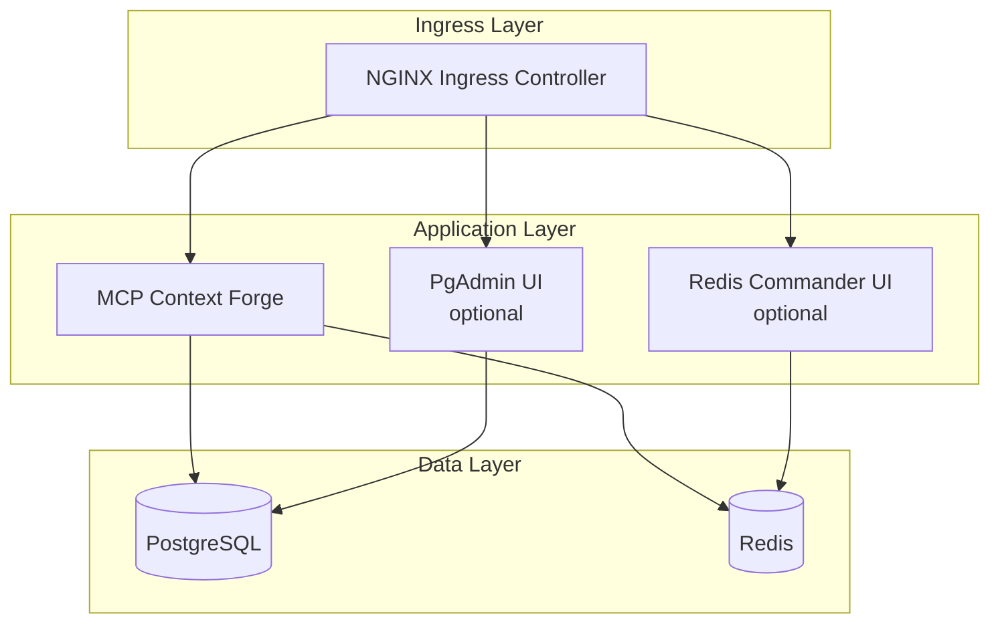

# 🚀 Deploying the MCP Gateway Stack with Helm

This guide walks you through installing, upgrading, and removing the full **MCP Gateway Stack** using Helm. The stack includes:

* 🧠 MCP Context Forge (the gateway)
* 🗄 PostgreSQL database
* ⚡ Redis cache
* 🧑‍💻 PgAdmin UI (optional)
* 🧰 Redis Commander UI (optional)

Everything is deployable via Helm on any Kubernetes cluster (Minikube, kind, EKS, AKS, GKE, OpenShift, etc.).

> 📦 Helm chart location:
> [https://github.com/IBM/mcp-context-forge/tree/main/charts/mcp-stack](https://github.com/IBM/mcp-context-forge/tree/main/charts/mcp-stack)

---

## 📋 Prerequisites

| Requirement        | Notes                                                        |
| ------------------ | ------------------------------------------------------------ |
| Kubernetes ≥ 1.23  | Local (Minikube/kind) or managed (EKS, AKS, GKE, etc.)       |
| Helm 3             | Used for installing and managing releases                    |
| kubectl            | Configured to talk to your target cluster                    |
| Ingress Controller | NGINX, Traefik, or cloud-native (or disable via values.yaml) |
| StorageClass (RWX) | Required for PostgreSQL PVC unless persistence is disabled   |

---

## 🧭 Architecture



---

## 🛠 Step 1 - Install Helm & kubectl

### macOS

```bash
brew install helm kubernetes-cli
```

### Linux

```bash
# Helm
curl -fsSL https://raw.githubusercontent.com/helm/helm/main/scripts/get-helm-3 | bash

# kubectl
curl -LO "https://dl.k8s.io/release/$(curl -sSL https://dl.k8s.io/release/stable.txt)/bin/linux/amd64/kubectl"
chmod +x kubectl
sudo mv kubectl /usr/local/bin
```

### Windows (PowerShell)

```powershell
choco install -y kubernetes-helm kubernetes-cli
```

Verify installation:

```bash
helm version
kubectl version
kubectl config get-contexts
```

---

## 📦 Step 2 - Clone and inspect the chart

```bash
git clone https://github.com/IBM/mcp-context-forge.git
cd mcp-context-forge/charts/mcp-stack
helm lint .
```

---

## 🧾 Step 3 - Customize values

Copy and modify the default `values.yaml`:

```bash
cp values.yaml my-values.yaml
```

Then edit fields such as:

```yaml
mcpContextForge:
  image:
    repository: ghcr.io/ibm/mcp-context-forge
    tag: latest

  ingress:
    enabled: true
    host: gateway.local
    className: nginx

postgres:
  credentials:
    user: admin
    password: test123

pgadmin:
  enabled: true

redisCommander:
  enabled: true
```

---

## 🚀 Step 4 - Install / Upgrade the stack

```bash
helm upgrade --install mcp-stack . \
  --namespace mcp --create-namespace \
  -f my-values.yaml \
  --wait
```

---

## ✅ Step 5 - Verify deployment

```bash
kubectl get all -n mcp
helm status mcp-stack -n mcp
```

If using Ingress:

```bash
kubectl get ingress -n mcp
curl http://gateway.local/health
```

If not using Ingress:

```bash
kubectl port-forward svc/mcp-stack-app 8080:80 -n mcp
curl http://localhost:8080/health
```

---

## 🔄 Step 6 - Upgrade & Rollback

### Upgrade (e.g. new image tag)

```bash
helm upgrade mcp-stack . -n mcp \
  --set mcpContextForge.image.tag=v1.2.3 \
  --wait
```

### Preview changes (diff plugin)

```bash
helm plugin install https://github.com/databus23/helm-diff
helm diff upgrade mcp-stack . -n mcp -f my-values.yaml
```

### Rollback

```bash
helm rollback mcp-stack 1 -n mcp
```

---

## 🧹 Step 7 - Uninstall

```bash
helm uninstall mcp-stack -n mcp
kubectl delete ns mcp  # optional cleanup
```

---

## 🧪 CI/CD: Packaging & OCI Push

```bash
helm lint .
helm package . -d dist/
helm push dist/mcp-stack-*.tgz oci://ghcr.io/<your-org>/charts
```

Used with GitOps tools like Argo CD or Flux.

---

## 🧯 Troubleshooting

| Symptom             | Command / Fix                                      |                                    |
| ------------------- | -------------------------------------------------- | ---------------------------------- |
| ImagePullBackOff    | Check pull secrets & image name                    |                                    |
| Ingress 404 / no IP | \`kubectl get svc -A                               | grep ingress\` - controller ready? |
| CrashLoopBackOff    | `kubectl logs -n mcp deploy/mcp-stack-app`         |                                    |
| Job fails           | `kubectl get jobs -n mcp && kubectl logs job/…`    |                                    |
| Invalid values      | `helm lint . && helm template . -f my-values.yaml` |                                    |

---

## 🧾 values.yaml - Common Keys

| Key                                          | Default     | Purpose                            |
| -------------------------------------------- | ----------- | ---------------------------------- |
| `mcpContextForge.image.tag`                  | `latest`    | Image version for the Gateway      |
| `mcpContextForge.ingress.enabled`            | `true`      | Enables ingress                    |
| `mcpContextForge.service.type`               | `ClusterIP` | Change to `LoadBalancer` if needed |
| `postgres.persistence.enabled`               | `true`      | Enables a persistent volume claim  |
| `pgadmin.enabled` / `redisCommander.enabled` | `false`     | Optional admin UIs                 |

See full annotations in `values.yaml`.

---

## 📚 Further Reading

* Helm: [https://helm.sh/docs/](https://helm.sh/docs/)
* Kubernetes Ingress: [https://kubernetes.io/docs/concepts/services-networking/ingress/](https://kubernetes.io/docs/concepts/services-networking/ingress/)
* Persistent Volumes: [https://kubernetes.io/docs/concepts/storage/persistent-volumes/](https://kubernetes.io/docs/concepts/storage/persistent-volumes/)
* Helm OCI Registry: [https://helm.sh/docs/topics/registries/](https://helm.sh/docs/topics/registries/)
* Argo CD: [https://argo-cd.readthedocs.io](https://argo-cd.readthedocs.io)

---

✅ You now have a production-ready Helm workflow for MCP Context Forge. It's CI-friendly, customizable, and tested across Kubernetes distributions.
