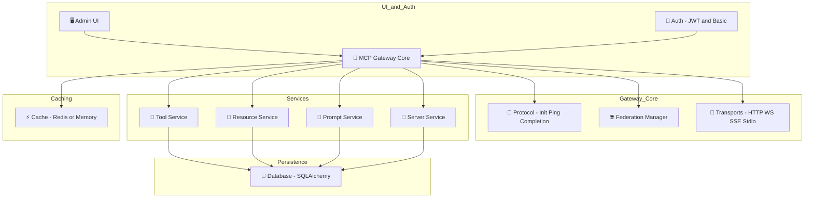

---
classification:
status: draft
owner: Mihai Criveti
---

# MCP Gateway

A flexible FastAPI-based gateway and router for **Model Context Protocol (MCP)** with support for virtual servers. It acts as a unified interface for tools, resources, prompts, virtual servers, and federated gateways - all accessible via rich multi-transport APIs and an interactive web-based Admin UI.

<!DOCTYPE html>
<html lang="en">
<head>
    <meta charset="UTF-8">
    <meta name="viewport" content="width=device-width, initial-scale=1.0">
    <title>Agentic Core</title>
    
</head>
<body>
    

        

            

                ⚡ ContextForge MCP Gateway Use Case Overview
            

            

                <!-- Left Column -->
                

                    

                        
🤖 Agent Frameworks

                        

                            
🔗 Langchain

                            
📊 Langgraph

                            
👥 crew.ai

                            
🔄 Autogen

                            
🐍 PydanticAI

                            
🤗 Huggingface Smol

                            
🐝 Agent Bee

                        

                    

                    

                        
💻 Visual Studio Code

                        

                            
🤖 GitHub Copilot

                            
🔧 Cline

                            
➡️ Continue

                        

                    

                    

                        
🔧 Other Clients

                        

                            
🌐 OpenWebUI

                            
⌨️ MCP-CLI

                        

                    

                

                <!-- Center Column -->
                

                    

                        
🌐 MCP Gateway

                        

                            
📚 MCP Registry

                            
🖥️ Virtual Servers

                            
🔐 Authorization

                            
🔑 Authentication

                            

                                
🔄 Protocol Conversion → any to any

                                
(stdio, SSE, Streamable HTTP, JSON-RPC, REST)

                            

                            
📊 Observability

                            
⏱️ Rate Limiting

                            
🔀 HA / Routing

                            
💚 Healthchecks

                            
🛠️ API / UI / CLI

                        

                    

                    

                        
🔌 Plugin Framework

                        

                            
🔒 PII Filtering

                            
🛡️ XSS Filtering

                            
📋 Open Policy Agent

                        

                    

                

                <!-- Right Column -->
                

                    

                        
🔌 MCP Servers

                        

                            
🐙 GitHub

                            
📋 Jira

                            
🎫 ServiceNow

                            
🎭 Playwright

                            
🎨 Figma

                            
📅 Monday

                            
📦 Box

                            
🌐 Internet Search

                        

                    

                    

                        
🔗 REST APIs

                        

                            
🌍 External Services

                            
☁️ Cloud Providers

                            
📊 Data Sources

                            
🏢 Enterprise Systems

                        

                    

                

            

        

    

</body>
</html>

**⚠️ Important**: MCP Gateway is not a standalone product - it is an open source component with **NO OFFICIAL SUPPORT** from IBM or its affiliates that can be integrated into your own solution architecture. If you choose to use it, you are responsible for evaluating its fit, securing the deployment, and managing its lifecycle. See [SECURITY.md](https://github.com/IBM/mcp-context-forge/blob/main/SECURITY.md) for more details, and the [roadmap](architecture/roadmap.md) for upcoming features.

---

## What it Does

- 🚪 Acts as a **gateway layer** in front of MCP servers or APIs
- 🔗 Connects and federates multiple MCP backends (auto-discovery, fail-over, merging)
- 🔄 Virtualizes REST APIs and external MCP servers as compliant tools and servers
- 🛠️ Centralizes registration and management of tools, prompts, and resources
- 📡 Exposes all endpoints over HTTP/JSON-RPC, WebSocket, Server-Sent Events (SSE), and **stdio**
- 📦 Provides a stdio wrapper (`mcpgateway-wrapper`) for terminal-based or headless MCP clients

---

## Key Features

- **Multi-Transport**: HTTP, WebSocket, SSE, Streamable HTTP and stdio with auto-negotiation
- **Federation & Health Checks**: Auto-discovery (mDNS or static), syncing, monitoring
- **Admin UI**: Real-time management (HTMX + Tailwind)
- **Tool Wrapping**: REST / CLI / local functions with JSON-Schema validation
- **Security**: JWT + Basic Auth, custom headers, rate limits, SSL control
- **Caching & Observability**: Redis/in-memory/database caching, metrics, structured logs
- **Virtual Servers**: Group tools/resources/prompts into MCP-compliant servers
- **Wrapper Mode**: `mcpgateway-wrapper` turns any remote gateway into a local stdio MCP server

For upcoming capabilities, see the [Roadmap](architecture/roadmap.md).

---

## Audience

MCP Gateway serves:

* **AI Platform Teams** building unified gateways for LLM tools & services
* **DevOps Engineers** deploying secure, observable, federated control planes
* **Open-source contributors** extending MCP tooling or adapters
* **Cloud Architects** running on Kubernetes, IBM Code Engine, AWS, Azure, or bare Docker

---

## Installation & Deployment

| Scenario                      | One-liner / CLI Snippet                                                                              | Docs                                             |
| ----------------------------- | ---------------------------------------------------------------------------------------------------- | ------------------------------------------------ |
| **Local (PyPI)**              | `pip install mcp-contextforge-gateway && mcpgateway --host 0.0.0.0 --port 4444`                      | [Quick Start](overview/quick_start.md)           |
| **Docker / Podman**           | `docker run -p 4444:4444 ghcr.io/ibm/mcp-context-forge:<tag>`                                        | [Containers](deployment/container.md)            |
| **Docker-Compose (dev)**      | `docker compose up`                                                                                  | [Compose](deployment/compose.md)                 |
| **Helm / Vanilla Kubernetes** | `helm repo add mcpgw https://IBM.github.io/mcp-context-forge && helm install mcpgw mcpgw/mcpgateway` | [Helm Chart](deployment/helm.md)                 |
| **Minikube (local k8s)**      | `make minikube`                                                                                      | [Minikube Guide](deployment/minikube.md)         |
| **OpenShift / OKD**           | `oc apply -k openshift/`                                                                             | [OpenShift](deployment/openshift.md)             |
| **Argo CD / GitOps**          | `kubectl apply -f argo.yaml`                                                                         | [Argo CD](deployment/argocd.md)                  |
| **IBM Cloud - Code Engine**   | `ibmcloud ce app create --name mcpgw --image ghcr.io/ibm/mcp-context-forge:<tag>`                    | [IBM Code Engine](deployment/ibm-code-engine.md) |
| **AWS - ECS (Fargate)**       | `aws ecs create-service --cli-input-json file://ecs.json`                                            | [AWS Guide](deployment/aws.md)                   |
| **AWS - EKS (Helm)**          | `helm install mcpgw mcpgw/mcpgateway`                                                                | [AWS Guide](deployment/aws.md)                   |
| **Google Cloud Run**          | `gcloud run deploy mcpgw --image ghcr.io/ibm/mcp-context-forge:<tag>`                                | [GCP Cloud Run](deployment/google-cloud-run.md)  |
| **Google GKE (Helm)**         | `helm install mcpgw mcpgw/mcpgateway`                                                                | [GCP Guide](deployment/google-cloud-run.md)      |
| **Azure - Container Apps**    | `az containerapp up --name mcpgw --image ghcr.io/ibm/mcp-context-forge:<tag>`                        | [Azure Guide](deployment/azure.md)               |
| **Azure - AKS (Helm)**        | `helm install mcpgw mcpgw/mcpgateway`                                                                | [Azure Guide](deployment/azure.md)               |

> **PyPI Package**: [`mcp-contextforge-gateway`](https://pypi.org/project/mcp-contextforge-gateway/)

> **OCI Image**: [`ghcr.io/ibm/mcp-context-forge:0.5.0`](https://github.com/IBM/mcp-context-forge/pkgs/container/mcp-context-forge)

---

## Get Started

Jump straight to:

* [Quick Start Guide](overview/quick_start.md)
* [Features Overview](overview/features.md)
* [Admin UI Walk-through](overview/ui.md)
* [Using the `mcpgateway-wrapper`](using/mcpgateway-wrapper.md)
* [Deployment Options](deployment/index.md)

!!! note
    Source → [https://github.com/IBM/mcp-context-forge](https://github.com/IBM/mcp-context-forge)

    Docs → [https://ibm.github.io/mcp-context-forge/](https://ibm.github.io/mcp-context-forge/)

---

## Authors and Contributors

* **Mihai Criveti** - IBM Distinguished Engineer, Agentic AI

<!-- [Download PDF](pdf/mcpgateway-docs.pdf){ .md-button } [Download DOCX](out/mcpgateway-docs.docx){ .md-button } -->
