```mermaid
graph TD
    subgraph UI_and_Auth
        UI[🖥️ Admin UI]
        Auth[🔐 Auth - JWT and Basic]
        UI --> Core
        Auth --> Core
    end

    subgraph Gateway_Core
        Core[🚪 MCP Gateway Core]
        Protocol[📡 Protocol - Init Ping Completion]
        Federation[🌐 Federation Manager]
        Transports[🔀 Transports - HTTP WS SSE Stdio]

        Core --> Protocol
        Core --> Federation
        Core --> Transports
    end

    subgraph Services
        Tools[🧰 Tool Service]
        Resources[📁 Resource Service]
        Prompts[📝 Prompt Service]
        Servers[🧩 Server Service]

        Core --> Tools
        Core --> Resources
        Core --> Prompts
        Core --> Servers
    end

    subgraph Persistence
        DB[💾 Database - SQLAlchemy]
        Tools --> DB
        Resources --> DB
        Prompts --> DB
        Servers --> DB
    end

    subgraph Caching
        Cache[⚡ Cache - Redis or Memory]
        Core --> Cache
    end
```

---
classification:
status: draft
owner: Mihai Criveti
---

# MCP Gateway

A flexible FastAPI-based gateway and router for **Model Context Protocol (MCP)** with support for virtual servers. It acts as a unified interface for tools, resources, prompts, virtual servers, and federated gateways — all accessible via rich multi-transport APIs and an interactive web-based Admin UI.

---

## What it Does

- 🚪 Acts as a **gateway layer** in front of MCP servers or APIs
- 🔗 Connects and federates multiple MCP backends (auto-discovery, fail-over, merging)
- 🔄 Virtualizes REST APIs and external MCP servers as compliant tools and servers
- 🛠️ Centralizes registration and management of tools, prompts, and resources
- 📡 Exposes all endpoints over HTTP/JSON-RPC, WebSocket, Server-Sent Events (SSE), and **stdio**
- 📦 Provides a stdio wrapper (`mcpgateway-wrapper`) for terminal-based or headless MCP clients

---

## Key Features

- **Multi-Transport**: HTTP, WebSocket, SSE, Streamable HTTP and stdio with auto-negotiation
- **Federation & Health Checks**: Auto-discovery (mDNS or static), syncing, monitoring
- **Admin UI**: Real-time management (HTMX + Tailwind)
- **Tool Wrapping**: REST / CLI / local functions with JSON-Schema validation
- **Security**: JWT + Basic Auth, custom headers, rate limits, SSL control
- **Caching & Observability**: Redis/in-memory/database caching, metrics, structured logs
- **Virtual Servers**: Group tools/resources/prompts into MCP-compliant servers
- **Wrapper Mode**: `mcpgateway-wrapper` turns any remote gateway into a local stdio MCP server

For upcoming capabilities, see the [Roadmap](architecture/roadmap.md).

---

## Audience

MCP Gateway serves:

* **AI Platform Teams** building unified gateways for LLM tools & services
* **DevOps Engineers** deploying secure, observable, federated control planes
* **Open-source contributors** extending MCP tooling or adapters
* **Cloud Architects** running on Kubernetes, IBM Code Engine, AWS, Azure, or bare Docker

---

## Installation & Deployment

| Scenario                      | One-liner / CLI Snippet                                                                              | Docs                                             |
| ----------------------------- | ---------------------------------------------------------------------------------------------------- | ------------------------------------------------ |
| **Local (PyPI)**              | `pip install mcp-contextforge-gateway && mcpgateway --host 0.0.0.0 --port 4444`                      | [Quick Start](overview/quick_start.md)           |
| **Docker / Podman**           | `docker run -p 4444:4444 ghcr.io/ibm/mcp-context-forge:<tag>`                                        | [Containers](deployment/container.md)            |
| **Docker-Compose (dev)**      | `docker compose up`                                                                                  | [Compose](deployment/compose.md)                 |
| **Helm / Vanilla Kubernetes** | `helm repo add mcpgw https://IBM.github.io/mcp-context-forge && helm install mcpgw mcpgw/mcpgateway` | [Helm Chart](deployment/helm.md)                 |
| **Minikube (local k8s)**      | `make minikube`                                                                                      | [Minikube Guide](deployment/minikube.md)         |
| **OpenShift / OKD**           | `oc apply -k openshift/`                                                                             | [OpenShift](deployment/openshift.md)             |
| **Argo CD / GitOps**          | `kubectl apply -f argo.yaml`                                                                         | [Argo CD](deployment/argocd.md)                  |
| **IBM Cloud – Code Engine**   | `ibmcloud ce app create --name mcpgw --image ghcr.io/ibm/mcp-context-forge:<tag>`                    | [IBM Code Engine](deployment/ibm-code-engine.md) |
| **AWS – ECS (Fargate)**       | `aws ecs create-service --cli-input-json file://ecs.json`                                            | [AWS Guide](deployment/aws.md)                   |
| **AWS – EKS (Helm)**          | `helm install mcpgw mcpgw/mcpgateway`                                                                | [AWS Guide](deployment/aws.md)                   |
| **Google Cloud Run**          | `gcloud run deploy mcpgw --image ghcr.io/ibm/mcp-context-forge:<tag>`                                | [GCP Cloud Run](deployment/google-cloud-run.md)  |
| **Google GKE (Helm)**         | `helm install mcpgw mcpgw/mcpgateway`                                                                | [GCP Guide](deployment/google-cloud-run.md)      |
| **Azure – Container Apps**    | `az containerapp up --name mcpgw --image ghcr.io/ibm/mcp-context-forge:<tag>`                        | [Azure Guide](deployment/azure.md)               |
| **Azure – AKS (Helm)**        | `helm install mcpgw mcpgw/mcpgateway`                                                                | [Azure Guide](deployment/azure.md)               |

> **PyPI Package**: [`mcp-contextforge-gateway`](https://pypi.org/project/mcp-contextforge-gateway/)

> **OCI Image**: [`ghcr.io/ibm/mcp-context-forge:0.2.0`](https://github.com/IBM/mcp-context-forge/pkgs/container/mcp-context-forge)

---

## Get Started

Jump straight to:

* [Quick Start Guide](overview/quick_start.md)
* [Features Overview](overview/features.md)
* [Admin UI Walk-through](overview/ui.md)
* [Using the `mcpgateway-wrapper`](using/mcpgateway-wrapper.md)
* [Deployment Options](deployment/index.md)

!!! note
    Source → [https://github.com/IBM/mcp-context-forge](https://github.com/IBM/mcp-context-forge)

    Docs → [https://ibm.github.io/mcp-context-forge/](https://ibm.github.io/mcp-context-forge/)

---

## Authors and Contributors

* **Mihai Criveti** – IBM Distinguished Engineer, Agentic AI

<!-- [Download PDF](pdf/mcpgateway-docs.pdf){ .md-button } [Download DOCX](out/mcpgateway-docs.docx){ .md-button } -->
