---
classification:
status: draft
owner: Mihai Criveti
---

# MCP Gateway

A flexible FastAPI-based gateway and router for **Model Context Protocol (MCP)** with support for virtual servers. It acts as a unified interface for tools, resources, prompts, virtual servers, and federated gateways — all accessible via rich multi-transport APIs and an interactive web-based Admin UI.

---

## What it Does

- 🚪 Acts as a **gateway layer** in front of MCP servers or APIs
- 🔗 Connects and federates multiple MCP backends (auto-discovery, failover, merging)
- 🔄 Adapts any REST API into an MCP-compliant tool or server
- 🛠️ Centralizes registration and management of tools, prompts, and resources
- 📡 Exposes all endpoints over HTTP/JSON-RPC, WebSocket, Server-Sent Events (SSE), and stdio

---

## Key Features

- **Multi-Transport Support**: HTTP, WebSocket, SSE, and stdio support with auto-negotiation
- **Federation & Health Checks**: Auto-discovery, syncing, and monitoring of peer gateways
- **Admin UI**: Visual management of servers, tools, prompts, and resources (HTMX + Tailwind)
- **Tool Wrapping**: Expose REST, CLI, or local functions as JSON-RPC tools
- **Security**: JWT and Basic Auth, rate limits, SSL validation
- **Caching & Observability**: In-memory or Redis/database-backed LRU+TTL caching, structured logs

```mermaid
graph TD
    subgraph UI_and_Auth
        UI[🖥️ Admin UI]
        Auth[🔐 Auth - JWT and Basic]
        UI --> Core
        Auth --> Core
    end

    subgraph Gateway_Core
        Core[🚪 MCP Gateway Core]
        Protocol[📡 Protocol - Init Ping Completion]
        Federation[🌐 Federation Manager]
        Transports[🔀 Transports - HTTP WS SSE Stdio]

        Core --> Protocol
        Core --> Federation
        Core --> Transports
    end

    subgraph Services
        Tools[🧰 Tool Service]
        Resources[📁 Resource Service]
        Prompts[📝 Prompt Service]
        Servers[🧩 Server Service]

        Core --> Tools
        Core --> Resources
        Core --> Prompts
        Core --> Servers
    end

    subgraph Persistence
        DB[💾 Database - SQLAlchemy]
        Tools --> DB
        Resources --> DB
        Prompts --> DB
        Servers --> DB
    end

    subgraph Caching
        Cache[⚡ Cache - Redis or Memory]
        Core --> Cache
    end
```

---

## Audience

MCP Gateway is designed for:

- **AI Platform Teams** that want to securely expose a variety of tools and models behind a consistent protocol
- **DevOps Engineers** looking for self-hostable control planes
- **Open-source contributors** building agents, clients, and adapters against MCP
- **Cloud Architects** deploying on Kubernetes, IBM Code Engine, AWS, or Azure

---

## Get Started

Check out the [Quick Start](overview/index.md) for installation and usage, or go straight to:

- [Features Overview](overview/features.md)
- [Admin UI Walkthrough](overview/ui.md)
- [Deployment Options](deployment/index.md)
- [Using the `mcpgateway-wrapper`](using/mcpgateway-wrapper.md)

!!! note "The latest version can always be found here: https://pages.github.com/ibm/mcp-context-forge/"

<!-- [Download PDF](pdf/mcpgateway-docs.pdf){ .md-button } [Download DOCX](out/mcpgateway-docs.docx){ .md-button } -->

## Authors and Contributors

- Mihai Criveti - IBM Distinguished Engineer, Agentic AI
