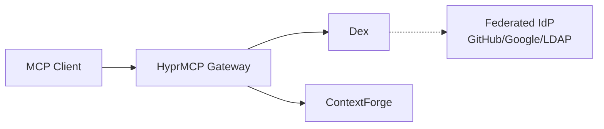

# Dynamic Client Registration (DCR)

Dynamic Client Registration (DCR) is an OAuth 2.0 extension that enables automatic client registration without manual configuration. This guide explains how to configure and use DCR with MCP Gateway for streamable HTTP servers.

## Overview

DCR solves a common authentication challenge in distributed MCP deployments:
- **Traditional OAuth2** requires pre-configured client credentials for each MCP server
- **With DCR**, MCP clients can automatically register themselves as OAuth2 clients

## What is Dynamic Client Registration?

Dynamic Client Registration is defined in [RFC 7591](https://tools.ietf.org/html/rfc7591) as a protocol that allows OAuth 2.0 clients to register with authorization servers dynamically. In the context of MCP Gateway:

## Architecture

A simplified architecture. Please view the following guide for an in depth swimlane chart:

📖 **[Dynamic Client Registration with HyperMCP Tutorial](../tutorials/dcr-hyprmcp.md)**

## Related Documentation

- [OAuth 2.0 Integration](oauth.md) - General OAuth2 configuration
- [Proxy Authentication](../deployment/proxy-auth.md) - Using authentication proxies
- [SSO Configuration](sso.md) - Single Sign-On setup
- [Security Best Practices](securing.md) - Security guidelines
