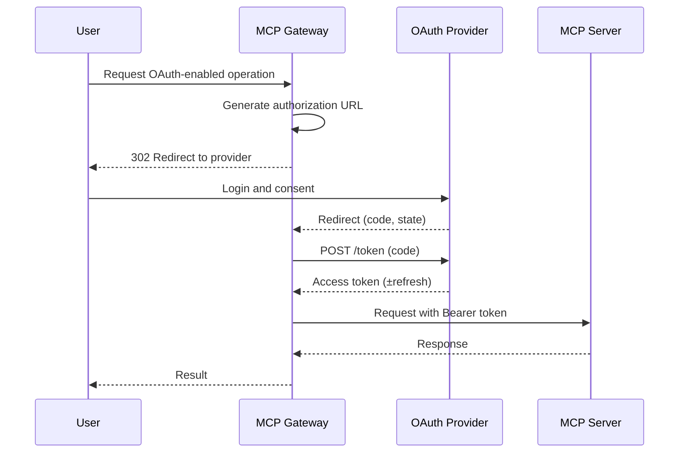

# OAuth 2.0 Integration

This guide explains how to configure and operate OAuth 2.0 authentication for MCP Gateway when connecting to MCP servers or downstream APIs on behalf of users or services.

Related design docs:
- Architecture: [oauth-design.md](../architecture/oauth-design.md)
- UI Flow: [oauth-authorization-code-ui-design.md](../architecture/oauth-authorization-code-ui-design.md)

---

## What You Get

- Client Credentials and Authorization Code flows
- Per-gateway OAuth configuration with encrypted client secrets
- Fresh tokens on demand (no caching by default)
- Optional token storage and refresh for user flows (per design)
- Admin UI support for configuring providers

!!! tip
    OAuth is configured per Gateway. Tools that route through a gateway configured for OAuth inherit the token behavior.

---

## Supported Flows

- Client Credentials (machine-to-machine)
  - Uses client ID/secret to fetch access tokens
  - Best for service integrations without user consent
- Authorization Code (user delegation)
  - Redirects the user to the provider for consent
  - Exchanges code for access token, with optional refresh tokens

See the flow details and security model in the architecture docs.

---

## Prerequisites

- An OAuth 2.0 provider (e.g., GitHub, Google, custom OIDC)
- A registered application with:
  - Client ID and Client Secret
  - Authorization URL and Token URL
  - Redirect URI pointing to the gateway callback (for Authorization Code)

---

## Environment Variables

```bash
# OAuth HTTP behavior
OAUTH_REQUEST_TIMEOUT=30      # Seconds
OAUTH_MAX_RETRIES=3           # Retries for transient failures

# Secret encryption for stored OAuth client secrets (and tokens if enabled)
AUTH_ENCRYPTION_SECRET=<strong-random-key>
```

!!! important
    Always run MCP Gateway over HTTPS when using OAuth. Never transmit client secrets or authorization codes over insecure channels.

---

## Configure a Gateway (Admin UI)

1. Open Admin UI → Gateways → New Gateway (or Edit).
2. Set Authentication type = OAuth.
3. Choose Grant Type:
   - client_credentials
   - authorization_code
4. Fill fields:
   - Client ID
   - Client Secret (stored encrypted at rest)
   - Token URL
   - Scopes (space-separated)
   - Authorization URL and Redirect URI (required for Authorization Code)
5. Save.

Field mapping follows the architecture proposal and is used by the OAuth Manager service to request tokens.

---

## Configure a Gateway (JSON/API)

Example OAuth-enabled gateway record:

```json
{
  "name": "GitHub MCP",
  "url": "https://github-mcp.example.com/sse",
  "auth_type": "oauth",
  "oauth_config": {
    "grant_type": "authorization_code",
    "client_id": "your_github_app_id",
    "client_secret": "your_github_app_secret",
    "authorization_url": "https://github.com/login/oauth/authorize",
    "token_url": "https://github.com/login/oauth/access_token",
    "redirect_uri": "https://gateway.example.com/oauth/callback",
    "scopes": ["repo", "read:user"]
  }
}
```

For Client Credentials, omit `authorization_url` and `redirect_uri` and set `grant_type` to `client_credentials`.

---

## Redirect URI and Callback

- Default callback path: `/oauth/callback`
- Your provider must whitelist the full redirect URI, e.g. `https://gateway.example.com/oauth/callback`
- The gateway handles exchanging the authorization code for an access token and applies it as `Authorization: Bearer <token>` when contacting the MCP server

Sequence (Authorization Code):



---

## Token Storage and Refresh (Optional)

By default, access tokens are fetched on-demand and not persisted. The Authorization Code UI design introduces optional storage and refresh:

- Store tokens per gateway + user
- Auto-refresh using refresh tokens when near expiry
- Encrypt tokens at rest using `AUTH_ENCRYPTION_SECRET`

If enabled in future releases, you will be able to toggle token storage and auto-refresh in the gateway's OAuth settings. See oauth-authorization-code-ui-design.md.

---

## Provider Examples

### GitHub (Authorization Code)

- Authorization URL: `https://github.com/login/oauth/authorize`
- Token URL: `https://github.com/login/oauth/access_token`
- Scopes: `repo read:user`
- Redirect URI: `https://<your-domain>/oauth/callback`

### Generic OIDC (Client Credentials)

- Token URL: `https://idp.example.com/oauth2/token`
- Scopes: provider-specific
- No redirect required

---

## Security Recommendations

- Use least-privilege scopes
- Run behind HTTPS only (including callback)
- Rotate client secrets and avoid plaintext storage
- Restrict who can create/modify OAuth-configured gateways
- Monitor token fetch errors and rate limits from providers

See also: [securing.md](./securing.md) for general hardening guidance and [proxy.md](./proxy.md) for fronting the gateway with an auth proxy.

---

## Troubleshooting

- 401 from MCP after OAuth: verify scopes and that token is attached as `Authorization: Bearer` by the gateway
- Provider denies callback: check exact Redirect URI match and HTTPS
- Invalid client: confirm Client ID/Secret and application registration
- State mismatch: ensure a single round-trip and correct domain/cookies
- Timeouts: increase `OAUTH_REQUEST_TIMEOUT` or investigate provider availability

---

## FAQ

- Can I use PKCE? Not yet; planned as a future enhancement.
- Can I configure per-tool OAuth? Roadmap considers multiple OAuth configs per tool; current design is per-gateway.
- Do you cache tokens? Default is no caching; tokens are fetched per operation. Optional storage/refresh is planned per the UI design.
