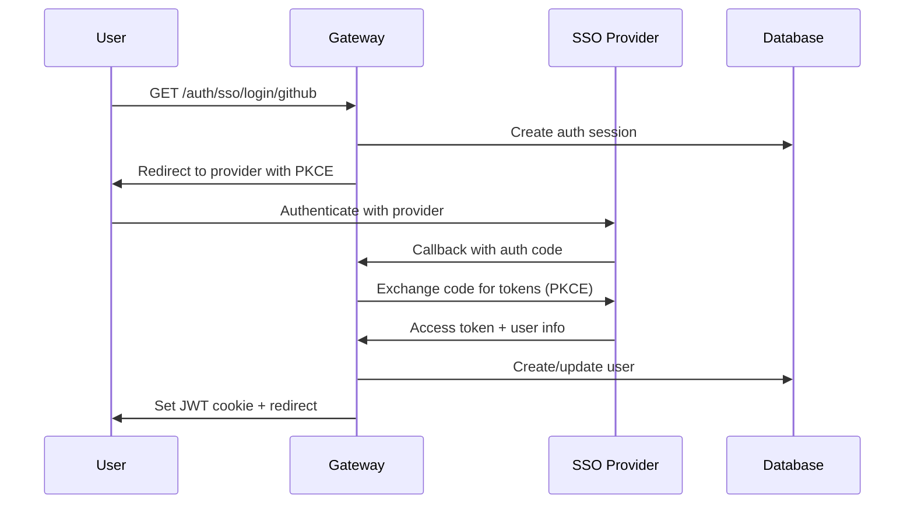

# Single Sign-On (SSO) Authentication

MCP Gateway supports enterprise Single Sign-On authentication through OAuth2 and OpenID Connect (OIDC) providers. This enables seamless integration with existing identity providers while maintaining backward compatibility with local authentication.

## Overview

The SSO system provides:

- **Multi-Provider Support**: GitHub, Google, IBM Security Verify, and Okta
- **Hybrid Authentication**: SSO alongside preserved local admin authentication
- **Automatic User Provisioning**: Creates users on first SSO login
- **Security Best Practices**: PKCE, CSRF protection, encrypted secrets
- **Team Integration**: Automatic team assignment and inheritance
- **Admin Management**: Full CRUD API for provider configuration

## Architecture

### Authentication Flows



### Database Schema

**SSOProvider Table**:
- Provider configuration (OAuth endpoints, client credentials)
- Encrypted client secrets using Fernet encryption
- Trusted domains and team mapping rules

**SSOAuthSession Table**:
- Temporary session tracking during OAuth flow
- CSRF state parameters and PKCE verifiers
- 10-minute expiration for security

## Supported Providers

### GitHub OAuth

Perfect for developer-focused organizations with GitHub repositories.

**Features**:
- GitHub organization mapping to teams
- Repository access integration
- Developer-friendly onboarding

### Google OAuth/OIDC

Ideal for Google Workspace organizations.

**Features**:
- Google Workspace domain verification
- GSuite organization mapping
- Professional email verification

### IBM Security Verify

Enterprise-grade identity provider with advanced security features.

**Features**:
- Enterprise SSO compliance
- Advanced user attributes
- Corporate directory integration

### Okta

Popular enterprise identity provider with extensive integrations.

**Features**:
- Enterprise directory synchronization
- Multi-factor authentication support
- Custom user attributes

## Quick Start

### 1. Enable SSO

Set the master SSO switch in your environment:

```bash
# Enable SSO system
SSO_ENABLED=true

# Optional: Keep local admin authentication (recommended)
SSO_PRESERVE_ADMIN_AUTH=true
```

### 2. Configure GitHub OAuth (Example)

#### Register OAuth App

1. Go to GitHub → Settings → Developer settings → OAuth Apps
2. Click "New OAuth App"
3. Set **Authorization callback URL**: `https://your-gateway.com/auth/sso/callback/github`
4. Note the **Client ID** and **Client Secret**

#### Environment Configuration

```bash
# GitHub OAuth Configuration
SSO_GITHUB_ENABLED=true
SSO_GITHUB_CLIENT_ID=your-github-client-id
SSO_GITHUB_CLIENT_SECRET=your-github-client-secret

# Optional: Auto-create users and trusted domains
SSO_AUTO_CREATE_USERS=true
SSO_TRUSTED_DOMAINS=["yourcompany.com", "github.com"]
```

#### Start Gateway

```bash
# Restart gateway to load SSO configuration
make dev
# or
docker-compose restart gateway
```

### 3. Test SSO Flow

#### List Available Providers

```bash
curl -X GET http://localhost:8000/auth/sso/providers
```

Response:
```json
[
  {
    "id": "github",
    "name": "github",
    "display_name": "GitHub"
  }
]
```

#### Initiate SSO Login

```bash
curl -X GET "http://localhost:8000/auth/sso/login/github?redirect_uri=https://yourapp.com/callback"
```

Response:
```json
{
  "authorization_url": "https://github.com/login/oauth/authorize?client_id=...",
  "state": "csrf-protection-token"
}
```

## Provider Configuration

### GitHub OAuth Setup

#### 1. Create OAuth App

1. **GitHub Settings** → **Developer settings** → **OAuth Apps**
2. **New OAuth App**:
   - **Application name**: `MCP Gateway - YourOrg`
   - **Homepage URL**: `https://your-gateway.com`
   - **Authorization callback URL**: `https://your-gateway.com/auth/sso/callback/github`

#### 2. Environment Variables

```bash
# GitHub OAuth Configuration
SSO_GITHUB_ENABLED=true
SSO_GITHUB_CLIENT_ID=Iv1.a1b2c3d4e5f6g7h8
SSO_GITHUB_CLIENT_SECRET=1234567890abcdef1234567890abcdef12345678

# Organization-based team mapping (optional)
GITHUB_ORG_TEAM_MAPPING={"your-github-org": "developers-team-id"}
```

#### 3. Team Mapping (Advanced)

Map GitHub organizations to Gateway teams:

```json
{
  "team_mapping": {
    "your-github-org": {
      "team_id": "dev-team-uuid",
      "role": "member"
    },
    "admin-github-org": {
      "team_id": "admin-team-uuid",
      "role": "owner"
    }
  }
}
```

### Google OAuth Setup

#### 1. Google Cloud Console Setup

1. **Google Cloud Console** → **APIs & Services** → **Credentials**
2. **Create Credentials** → **OAuth client ID**
3. **Application type**: Web application
4. **Authorized redirect URIs**: `https://your-gateway.com/auth/sso/callback/google`

#### 2. Environment Variables

```bash
# Google OAuth Configuration
SSO_GOOGLE_ENABLED=true
SSO_GOOGLE_CLIENT_ID=123456789012-abcdefghijklmnop.apps.googleusercontent.com
SSO_GOOGLE_CLIENT_SECRET=GOCSPX-1234567890abcdefghijklmnop

# Google Workspace domain restrictions
SSO_TRUSTED_DOMAINS=["yourcompany.com"]
```

### IBM Security Verify Setup

#### 1. IBM Security Verify Configuration

1. **IBM Security Verify Admin Console** → **Applications**
2. **Add application** → **Custom Application**
3. **Sign-on** → **Open ID Connect**
4. **Redirect URI**: `https://your-gateway.com/auth/sso/callback/ibm_verify`

#### 2. Environment Variables

```bash
# IBM Security Verify OIDC Configuration
SSO_IBM_VERIFY_ENABLED=true
SSO_IBM_VERIFY_CLIENT_ID=your-client-id
SSO_IBM_VERIFY_CLIENT_SECRET=your-client-secret
SSO_IBM_VERIFY_ISSUER=https://your-tenant.verify.ibm.com/oidc/endpoint/default
```

### Okta Setup

#### 1. Okta Admin Console

1. **Applications** → **Create App Integration**
2. **OIDC - OpenID Connect** → **Web Application**
3. **Sign-in redirect URIs**: `https://your-gateway.com/auth/sso/callback/okta`

#### 2. Environment Variables

```bash
# Okta OIDC Configuration
SSO_OKTA_ENABLED=true
SSO_OKTA_CLIENT_ID=0oa1b2c3d4e5f6g7h8i9
SSO_OKTA_CLIENT_SECRET=1234567890abcdef1234567890abcdef12345678
SSO_OKTA_ISSUER=https://your-company.okta.com
```

## Advanced Configuration

### Trusted Domains

Restrict SSO access to specific email domains:

```bash
# JSON array of trusted domains
SSO_TRUSTED_DOMAINS=["yourcompany.com", "partner.org", "contractor.net"]
```

Only users with email addresses from these domains can authenticate via SSO.

### Auto User Creation

Control automatic user provisioning:

```bash
# Enable automatic user creation (default: true)
SSO_AUTO_CREATE_USERS=true

# Disable to manually approve SSO users
SSO_AUTO_CREATE_USERS=false
```

### Team Mapping Rules

Configure automatic team assignment based on SSO provider attributes:

```json
{
  "team_mapping": {
    "github_org_name": {
      "team_id": "uuid-of-gateway-team",
      "role": "member",
      "conditions": {
        "email_domain": "company.com"
      }
    },
    "google_workspace_domain": {
      "team_id": "uuid-of-workspace-team",
      "role": "owner",
      "conditions": {
        "email_verified": true
      }
    }
  }
}
```

## API Reference

### Public Endpoints

#### List Available Providers

```http
GET /auth/sso/providers
```

Response:
```json
[
  {
    "id": "github",
    "name": "github",
    "display_name": "GitHub"
  }
]
```

#### Initiate SSO Login

```http
GET /auth/sso/login/{provider_id}?redirect_uri={callback_url}&scopes={oauth_scopes}
```

Parameters:
- `provider_id`: Provider identifier (`github`, `google`, `ibm_verify`, `okta`)
- `redirect_uri`: Callback URL after authentication
- `scopes`: Optional space-separated OAuth scopes

Response:
```json
{
  "authorization_url": "https://provider.com/oauth/authorize?...",
  "state": "csrf-protection-token"
}
```

#### Handle SSO Callback

```http
GET /auth/sso/callback/{provider_id}?code={auth_code}&state={csrf_token}
```

This endpoint is called by the SSO provider after user authentication.

Response:
```json
{
  "access_token": "jwt-session-token",
  "token_type": "bearer",
  "expires_in": 604800,
  "user": {
    "email": "user@example.com",
    "full_name": "John Doe",
    "provider": "github"
  }
}
```

### Admin Endpoints

All admin endpoints require `admin.sso_providers` permissions.

#### Create SSO Provider

```http
POST /auth/sso/admin/providers
Authorization: Bearer <admin-jwt-token>
Content-Type: application/json

{
  "id": "custom_provider",
  "name": "custom_provider",
  "display_name": "Custom Provider",
  "provider_type": "oidc",
  "client_id": "client-id",
  "client_secret": "client-secret",
  "authorization_url": "https://provider.com/oauth/authorize",
  "token_url": "https://provider.com/oauth/token",
  "userinfo_url": "https://provider.com/oauth/userinfo",
  "issuer": "https://provider.com",
  "scope": "openid profile email",
  "trusted_domains": ["company.com"],
  "auto_create_users": true
}
```

#### List All Providers

```http
GET /auth/sso/admin/providers
Authorization: Bearer <admin-jwt-token>
```

#### Update Provider

```http
PUT /auth/sso/admin/providers/{provider_id}
Authorization: Bearer <admin-jwt-token>
Content-Type: application/json

{
  "display_name": "Updated Provider Name",
  "is_enabled": false
}
```

#### Delete Provider

```http
DELETE /auth/sso/admin/providers/{provider_id}
Authorization: Bearer <admin-jwt-token>
```

## Security Considerations

### Client Secret Encryption

Client secrets are encrypted using Fernet (AES 128) before database storage:

```python
# Automatic encryption in SSOService
provider_data["client_secret_encrypted"] = self._encrypt_secret(client_secret)
```

### PKCE Protection

All OAuth flows use PKCE (Proof Key for Code Exchange) for enhanced security:

```python
# Automatic PKCE generation
code_verifier, code_challenge = self.generate_pkce_challenge()
```

### CSRF Protection

OAuth state parameters prevent cross-site request forgery:

```python
# Cryptographically secure state generation
state = secrets.token_urlsafe(32)
```

### Session Security

- **HTTP-only cookies** prevent XSS attacks
- **Secure flag** for HTTPS deployments
- **SameSite=Lax** protection
- **10-minute OAuth session** expiration

## Troubleshooting

### Common Issues

#### SSO Endpoints Return 404

**Problem**: SSO routes not available
**Solution**: Ensure `SSO_ENABLED=true` and restart gateway

```bash
# Check SSO status
curl -I http://localhost:8000/auth/sso/providers
# Should return 200 if enabled, 404 if disabled
```

#### OAuth Callback Errors

**Problem**: Invalid redirect URI
**Solution**: Verify callback URL matches provider configuration exactly

```bash
# Correct format
https://your-gateway.com/auth/sso/callback/github

# Common mistakes
https://your-gateway.com/auth/sso/callback/github/  # Extra slash
http://your-gateway.com/auth/sso/callback/github   # HTTP instead of HTTPS
```

#### User Creation Fails

**Problem**: Email domain not trusted
**Solution**: Add domain to trusted domains list

```bash
SSO_TRUSTED_DOMAINS=["company.com", "contractor.org"]
```

### Debug Mode

Enable verbose SSO logging:

```bash
LOG_LEVEL=DEBUG
SSO_DEBUG=true
```

Check logs for detailed OAuth flow information:

```bash
tail -f logs/gateway.log | grep -i sso
```

### Health Checks

Verify SSO provider connectivity:

```bash
# Test provider endpoints
curl -I https://github.com/login/oauth/authorize
curl -I https://github.com/login/oauth/access_token
curl -I https://api.github.com/user
```

## Migration Guide

### From Local Auth Only

1. **Enable SSO** alongside existing authentication:
   ```bash
   SSO_ENABLED=true
   SSO_PRESERVE_ADMIN_AUTH=true  # Keep local admin login
   ```

2. **Configure first provider** (e.g., GitHub)

3. **Test SSO flow** with test users

4. **Gradually migrate** production users

5. **Optional**: Disable local auth after full migration

### Adding New Providers

1. **Implement provider-specific** user info normalization in `SSOService._normalize_user_info`

2. **Add environment variables** in `config.py`

3. **Update bootstrap utilities** in `sso_bootstrap.py`

4. **Test integration** thoroughly

## Best Practices

### Production Deployment

1. **Use HTTPS** for all SSO callbacks
2. **Secure client secrets** in vault/secret management
3. **Monitor failed authentications**
4. **Regular secret rotation**
5. **Audit SSO access logs**

### User Experience

1. **Clear provider labeling** (GitHub, Google, etc.)
2. **Graceful error handling** for auth failures
3. **Fallback to local auth** if SSO unavailable
4. **User session management**

### Security Hardening

1. **Restrict trusted domains** to organization emails
2. **Enable audit logging** for admin operations
3. **Regular provider configuration** reviews
4. **Monitor unusual auth patterns**

## Integration Examples

### Frontend Integration

```javascript
// Check available SSO providers
const providers = await fetch('/auth/sso/providers').then(r => r.json());

// Initiate SSO login
const redirectUrl = `${window.location.origin}/dashboard`;
const ssoResponse = await fetch(
  `/auth/sso/login/github?redirect_uri=${encodeURIComponent(redirectUrl)}`
).then(r => r.json());

// Redirect user to SSO provider
window.location.href = ssoResponse.authorization_url;
```

### CLI Integration

```bash
#!/bin/bash
# CLI SSO authentication helper

GATEWAY_URL="https://your-gateway.com"
PROVIDER="github"

# Get authorization URL
AUTH_RESPONSE=$(curl -s "$GATEWAY_URL/auth/sso/login/$PROVIDER?redirect_uri=urn:ietf:wg:oauth:2.0:oob")
AUTH_URL=$(echo "$AUTH_RESPONSE" | jq -r '.authorization_url')

echo "Open this URL in your browser:"
echo "$AUTH_URL"

echo "Enter the authorization code:"
read -r AUTH_CODE

# Exchange code for token (manual callback simulation)
# Note: In practice, this would be handled by the callback endpoint
```

### API Client Integration

```python
import requests
import webbrowser
from urllib.parse import urlparse, parse_qs

# SSO authentication for API clients
class SSOAuthenticator:
    def __init__(self, gateway_url, provider):
        self.gateway_url = gateway_url
        self.provider = provider

    def authenticate(self):
        # Get authorization URL
        response = requests.get(
            f"{self.gateway_url}/auth/sso/login/{self.provider}",
            params={"redirect_uri": "http://localhost:8080/callback"}
        )
        auth_data = response.json()

        # Open browser for user authentication
        webbrowser.open(auth_data["authorization_url"])

        # Wait for callback (implement callback server)
        # Return JWT token for API access
        return self.handle_callback()
```

## Related Documentation

- [Authentication Overview](../manage/securing.md)
- [Team Management](../manage/teams.md)
- [RBAC Configuration](../manage/rbac.md)
- [Environment Variables](../deployment/index.md#environment-variables)
- [Security Best Practices](../architecture/security-features.md)
