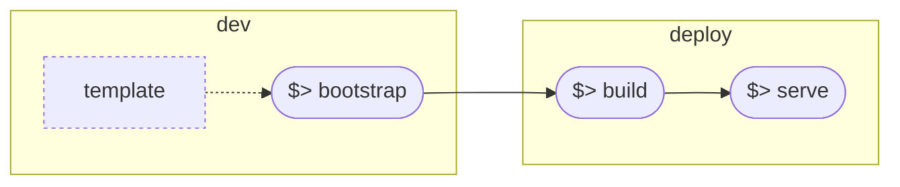

# Plugin Lifecycle

The plugin framework includes CLI tools to help you create, test, and deploy your plugins.

## Development Flow



### Bootstrap

Creating a new plugin for Context Forge only takes a few minutes!

Using the `mcpplugins` tool (installed with Context Forge),

```bash
mcpplugins bootstrap --destination your/plugin/dir
```

The interactive prompt you guide you to enter plugin metadata, and will boostrap a complete plugin project for you including everything you need to kick the tires writing your new plugin.

For a full list of options, check:

```bash
mcpplugins bootstrap --help
```

!!! tip
        When prompted for the choosing the plugin type, select `external` to create standalone plugins (with their own lock files and dependency trees).
        Select `native` if you want to create a plugin that embeds and gets loaded directly into the gateway environment.


The examples under the `plugins` directory in the gateway repository serve as a guide of how to develop and test `native` plugins.

The following instructions apply to `external` plugins. First, change directory to work with your newly bootstrapped plugin:

```bash
cd your/plugin/dir
cp .env.template .env
```

### Configuration

There are two main configuration files for your project.

```bash
./resources
    /plugins/config.yaml # configuration for your plugin and the plugin loader
    /runtime/config.yaml # configuration for the plugin server runtime
```

Inspect those two files and get familiar with them. There are many options you can customize, depending on your use case.

### Dependencies

Plugins are Python packages with dependencies managed by `uv`. Just like the gateway, you can add, lock, lint, and ensure that best practices are followed when creating your plugins. To ensure compatibility with the gateway linters, we do not directly install them in the template. Instead, please install the gateway package with the dev extras, which will include all required linters.

### Test

To run all unit tests for your plugins:

```bash
make test
```

### Build

To build a container image (runtime) containing a standardized plugin server, run:

```bash
make build
```

### Serve

To start the plugin server:

```bash
make start
```

By default, this will start a Streamable HTTP MCP server on `http://localhost:8000/mcp`.

You can run `mcp inspector` to check your new server (note, it requires `npm`):

```bash
npx @modelcontextprotocol/inspector
```

## Gateway Integration

Let's assume you have boostrapped the following plugin (`resources/plugins/config.yaml`) with default runtime (`resources/runtime/config.yaml`) options:

```yaml
plugins:
  - name: "MyFilter"
    kind: "myfilter.plugin.MyFilter"
    description: "A filter plugin"
    version: "0.1.0"
    author: "Frederico Araujo"
    hooks: ["prompt_pre_fetch", "prompt_post_fetch", "tool_pre_invoke", "tool_post_invoke"]
    tags: ["plugin"]
    mode: "enforce"  # enforce | permissive | disabled
    priority: 150
    conditions:
      # Apply to specific tools/servers
      - server_ids: []  # Apply to all servers
        tenant_ids: []  # Apply to all tenants
    config:
      # Plugin config dict passed to the plugin constructor

# Plugin directories to scan
plugin_dirs:
  - "myfilter"

# Global plugin settings
plugin_settings:
  parallel_execution_within_band: true
  plugin_timeout: 30
  fail_on_plugin_error: false
  enable_plugin_api: true
  plugin_health_check_interval: 60
```

To integrate this plugin with the gateway, all you need to do is copying the following configuration under the `plugins` list in the gateway's `plugins/config.yaml` file:

```yaml
plugins:
  # External Filter Plugin
  - name: "MyFilter"
    kind: "external"
    priority: 10 # adjust the priority
    mcp:
      proto: STREAMABLEHTTP
      url: http://localhost:8000/mcp
```

Then, start the gateway:

```bash
make serve
```

!!! note
        `PLUGINS_ENABLED=true` should be set in your gateway `.env` file.
